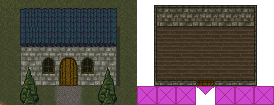

{
  published: "2023-04-03 19:45",
  tags: ["arq", "devlog"],
  prefix: "Arq Devlog"
}
# #10: Interiors

In [devlog #6](devlog-6.md) I added some tiles for creating buildings. I've made it possible to enter those buildings:

<figure>
<video src="../images/arq/interiors.webm" autoplay loop></video>
<figcaption>Entering and exiting buildings.</figcaption>
</figure>

I implemented this by adding an &ldquo;inside&rdquo;-flag to a player's position and a &ldquo;door&rdquo; property to tiles. If a tile is a door, standing on it will flip the inside-flag.
The world map now consists of four layers:

* Exterior
* Exterior objects
* Interior
* Interior objects

The object layers are for placing transparent tiles on top of the background (e.g. trees). The renderer switches between the interior layers and exterior layers based on whether the player's position in inside or outside.

<figure>

<figcaption>Exterior layers on the left, interior layers on the right. The purple X-tiles block movement and the purple arrow tile is a door tile.</figcaption>
</figure>

I use [Tiled](https://www.mapeditor.org/) to make the world map and manage the tile set. So far it has worked pretty well and has the option of saving both maps and tile sets to JSON that I can easily load both in the backend and frontend.
