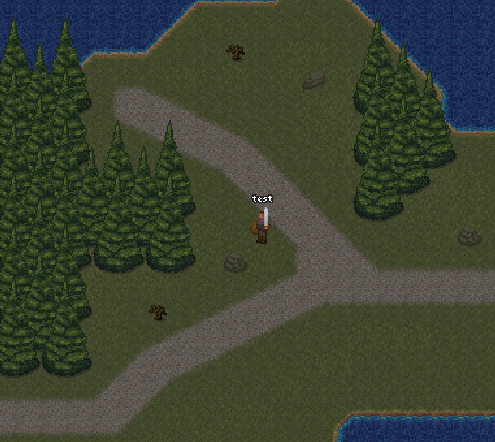
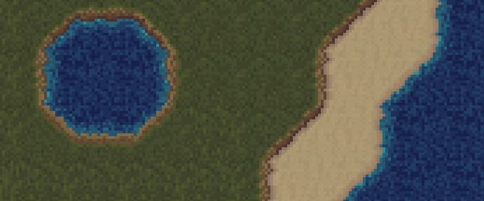
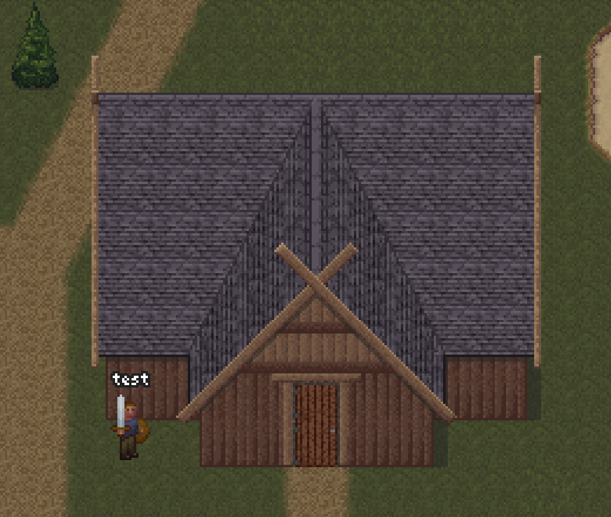

{
  published: "2023-04-26 21:00",
  tags: ["arq", "devlog"],
  prefix: "Arq Devlog"
}
# #11: Various graphical updates

I went back and redesigned some of the tile transitions I presented in [devlog #4](devlog-4.md):

<figure>

<figcaption>Diagonal paths.</figcaption>
</figure>

First of all, paths can now be diagonal, in fact there are now 16 different angles. I also added a direct transition from grass to water and tried to add some depth to it. I did the same thing with the transition between grass and sand. It should make the map look a bit more 3-dimensional:

<figure>

<figcaption>New transitions between grass, sand, and water.</figcaption>
</figure>

I also tried my hand at drawing some more buildings. I recently made this one inspired by medieval Scandinavian architecture:

<figure>

<figcaption>New building.</figcaption>
</figure>

I'm still experimenting with color palettes.
