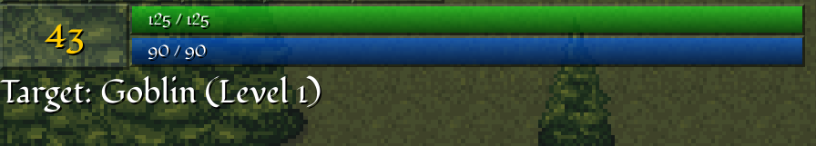
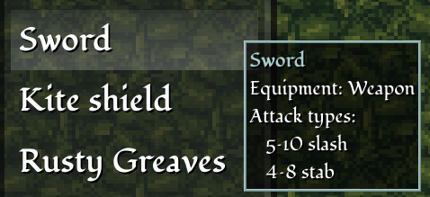

{
  published: "2023-06-13 22:38",
  tags: ["arq", "devlog"],
  prefix: "Arq Devlog"
}
# #12: Mobs, combat, and various other game mechanics

Since devlog #11 I've been working on various game mechanics. I'm slowly making progress but there's just so much to do. I was thinking of splitting this into multiple devlogs, but in an effort to get an update out I'm just going to go ahead and dump some screenshots and videos to showcase some of the mechanics I've implemented.

At this point I've managed to implement most of the mechanics necessary for a basic hack and slash dungeon crawl type game. So far a character consists of:

* Player level and XP
* Attributes: Strength, endurance, spirit
* Derived attributes: Health (based on endurance), energy (based on spirit)
* Skills: Blades, magic, archery, staves, spears, etc. Each skill has level and XP
* Abilities: Slash, stab, magic missile, etc.
* Equipment: Weapon, shield, various armor pieces, etc.

<figure>

<figcaption>Player level, health bar, energy bar, and current target.</figcaption>
</figure>

Abilities can be assigned to the number keys and are used when attacking mobs. Different abilities have different requirements. The &ldquo;Slash&rdquo; abilitiy for instance requires a weapon that can deal slash damage, such as a sword:

<figure>

<figcaption>Sword stats.</figcaption>
</figure>

<figure>
<video src="../images/arq/melee.webm" autoplay loop></video>
<figcaption>Fighting a goblin using the slash and stab abilities with a sword.</figcaption>
</figure>

It's probably clear at this point that I'm not using any of the fonts I described in [devlog #7](./devlog-7.md). I tried to use them initially but was just not satisfied with how they looked. Instead I looked through Google Fonts and ended up using [Fondamento](https://fonts.google.com/specimen/Fondamento) which I think looks good and fits the game well. It's also easy to read, even at small sizes.

Aside from melee I've also implemented archery and magic:

<figure>
<video src="../images/arq/archery.webm" autoplay loop></video>
<figcaption>Using bow and arrow.</figcaption>
</figure>

<figure>
<video src="../images/arq/magic.webm" autoplay loop></video>
<figcaption>Using magic.</figcaption>
</figure>

Some mobs are aggressive and will attack the player on sight:

<figure>
<video src="../images/arq/demon.webm" autoplay loop></video>
<figcaption>Fighting an aggressive demon.</figcaption>
</figure>
