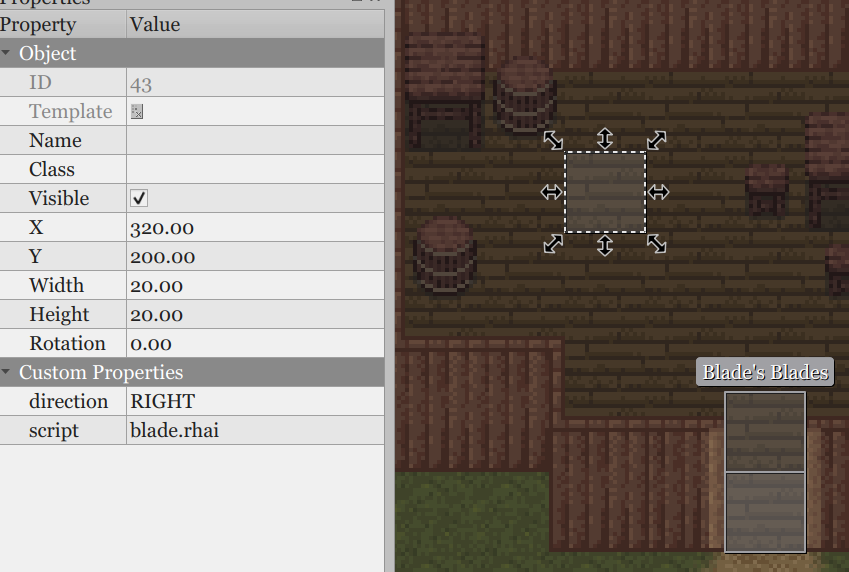
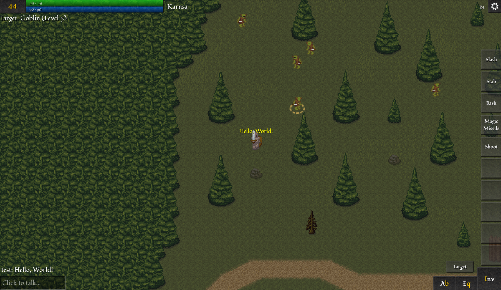

{
  published: "2023-07-16 15:38",
  tags: ["arq", "devlog"],
  prefix: "Arq Devlog"
}
# #13: NPCs, scripting, and UI

I already had a working scripting and NPC system before the previous devlog, but since then I've further extended it. The following video shows the player interacting with an NPC in order to purchase an item:

<figure>
<video src="../images/arq/npcs.webm" autoplay loop></video>
<figcaption>Walking into the village of Karnsa to buy a longsword from an NPC.</figcaption>
</figure>

NPCs are essentially mobs, but with a script file attached that is used to control their behaviour. To script NPCs I use [Rhai](https://rhai.rs/), which is a scripting language for Rust. I considered a number of different options including Lua and rolling my own (I made a Lisp for scripting in [MUG](../pages/things/mug.md)), but I ended up choosing Rhai because of how close it is to Rust both syntactically and semantically. So far I haven't regretted that decision, and it has been relatively easy to create an API for use in scripts.

To create an NPC I first create a rectangle object on the &ldquo;areas&rdquo;-layer in my map file in [Tiled](https://www.mapeditor.org). I use the areas-layer for various things, like spawning mobs in a certain area, but each object can also have a reference to a script file:

<figure>

<figcaption>The object for the NPC called blade.</figcaption>
</figure>

The script can use the various properties of the area, including its position, and this is used to spawn an NPC:

```rust
// Called once when the server starts:
fn init() {
    // Spawns a mob of type "human3" and saves a reference:
    this.mob = SCRIPT.create_mob("human3", SCRIPT.area.x, SCRIPT.area.y);
    this.mob.name = "Blade";
    this.mob.direction = SCRIPT.direction;
    this.mob.protect = true;
    // This sets up an item shop:
    this.shop = SCRIPT.create_item_shop("Blade's blades");
    this.shop.add_item("longsword", 5, 400);
    // ...
}

// Called when a player starts a conversation with a mob controlled by this script:
fn talk(player, mob) {
    player.tell_with_options(mob.name, "Hi, can I help you?", [
        // ...
        "I would like to buy a weapon",
        // ...
    ], "init", mob);
}

// Called when a player makes a choice in a conversation:
fn talk(player, mob, state, choice) {
    switch state {
        "init" => switch choice {
            // ...
            2 => {
                this.shop.open(player, mob);
            }
            // ...
        }
        _ => { }
    }
}
```

There's still some work to be done with the scripting API, but so far it's possible to implement dialog trees as well as saving and loading variables stored on the player (a very basic questing system is already in place). I've also implemented various shop screens:

* Item shops: Like the above. The NPC has a predetermined set of items for sale.
* Ability shop: Buy abilities instead of items.
* Skill trainer: Buy skill levels with money and skill points.
* Bank: Deposit and withdraw money.
* Merchant: The NPC will buy certain types of items from the player and also sell previously bought items to the player.

You may also have noticed from the above video that the system described in [devlog #10](./devlog-10.md) is no more. Instead of a separate layer for building interiors, everything that can be interacted with is now on the same layer. An additional &ldquo;roof&rdquo;-layer has been added to draw the roofs of buildings when the player is outside. Additionally doors can now be opened and closed. In fact doors are technically NPCs/mobs and can be scripted as such (and yes, you &ldquo;talk&rdquo; to the door to open it).

In other news, I've also spent some time polishing the UI and placing the various UI elements in sensible locations. So here's (for the first time) a screenshot of Arq's UI in its entirety: 

<figure>

<figcaption>The current GUI.</figcaption>
</figure>

In the top left corner of the screen the player's current level is shown (clicking on the number opens the character sheet). The health and energy bars are shown to the right of the level. The name of the current zone is displayed to the right of that. Below the level the current target is shown if any. Active status effects are also listed below the level (&ldquo;Encumbered&rdquo; is the only status effect currently implemented).

The chat log and message input are in the bottom left corner, while buttons for the Abilities, Equipment, and Inventory screens are in the bottom right corner.

On the right side of the screen is the hotbar with 10 slots for quick access to abilities (also mapped to the number keys).

The center is still the 21&times;21 tiles closest to the player, but I've added a display mode (shown in the screenshot) that extends the number of rendered tiles to the left and right (on widescreen, top and bottom in portrait).
