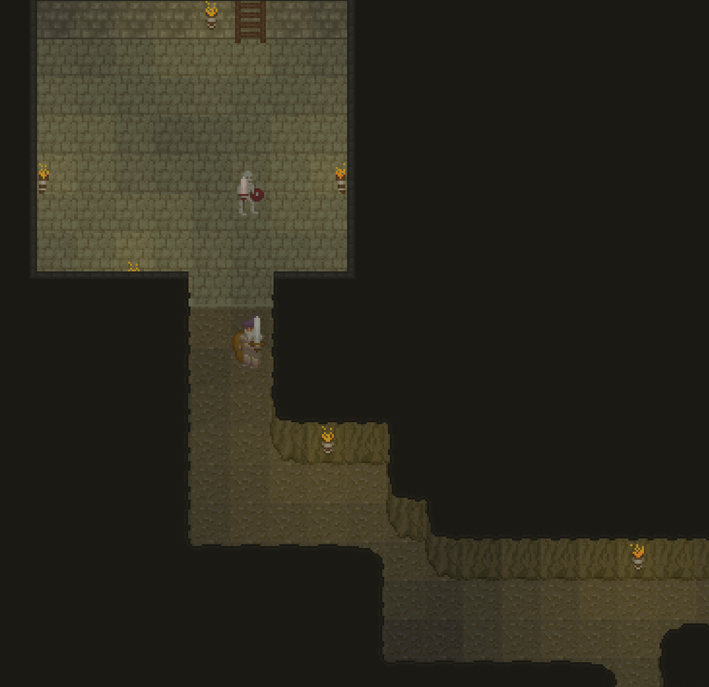
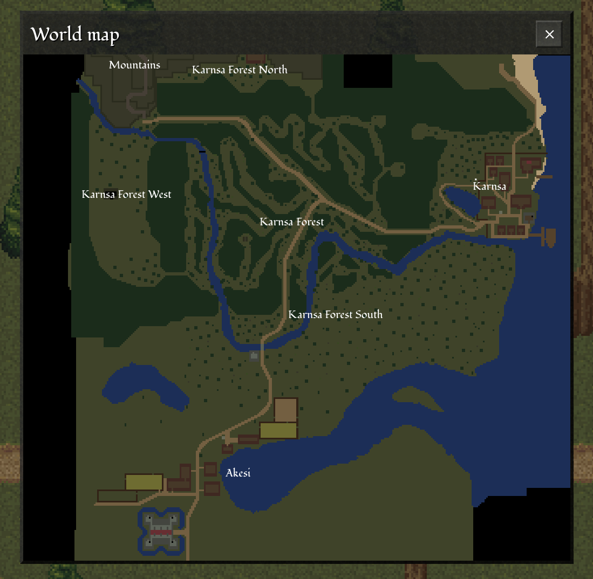
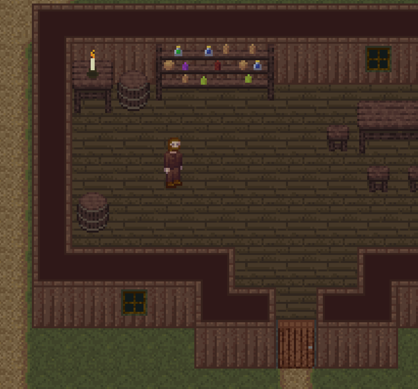
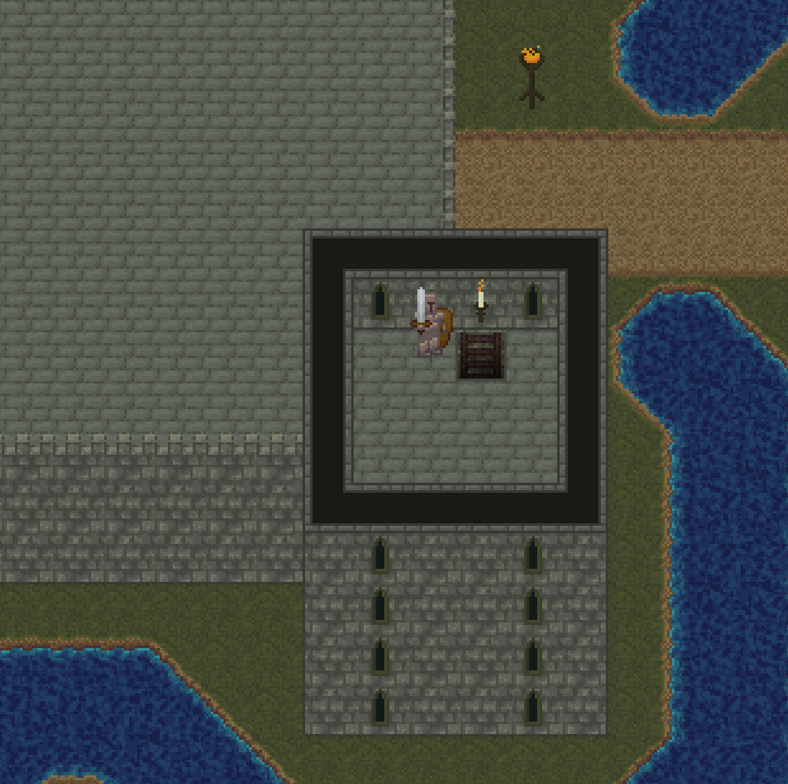

{
  published: "2024-03-17 15:15",
  tags: ["arq", "devlog"],
  prefix: "Arq Devlog"
}
# #14: Various updates

It's been a while since my last update but I'm still working on Arq. I'm at a point where I could probably start focusing on expanding the map, adding NPCs, quests, items, etc. but there are still a few systems that I would like to polish or reimplement before I start using them. I'd also like to get back into writing more detailed devlogs, but this one is pretty much just a rough overview of a few of the things I've worked on since the last one. There's also some technical challenges I've had to spent some time on &ndash; I'll try to cover those in a future devlog.

## Ability icons and particle effects

The following video shows a number of new features I've implemented on the frontend since the last devlog:

<figure>
<video src="../images/arq/abilities.webm" autoplay loop></video>
<figcaption>New ability icons, cooldown animation and particle effects.</figcaption>
</figure>

First of all abilities now have icons and there's a cooldown animation when an ability is used (the cooldown duration depends on the ability).

I've also implemented a simple 2D particle system and worked on replacing the existing effect animations with particle effects.

## Dynamic lighting

I worked a bit on creating a simple dynamic lighting system as well:

<figure>

<figcaption>Dynamic lighting in an underground cave.</figcaption>
</figure>

It's currently tile based, but I'm not sure if I'm going to keep it that way. I've also experimented with a day/night cycle but so far I haven't been satisfied with the results.

## World map

I've expanded the world map a bit and also implemented a map window:

<figure>

<figcaption>In-game world map with pan and zoom.</figcaption>
</figure>

## Walls 

In [devlog #13](./devlog-13.md) I briefly mentioned how I had changed how buildings and building interiors work. Well, I've changed it again. This time I spent a lot of time experimenting with different approaches to wall tiles, and I've ended up replacing the thin walls with much thicker walls:

<figure>

<figcaption>Thicker walls.</figcaption>
</figure>

This mostly serves to simplify things like collision detection and dynamic lighting, but also simplifies map making. Additionally I've removed the roof-layer so building interiors are now visible from the outside (at least for now). I did kind of like the roofs, but they didn't add anything to the gameplay.

Instead I've added a z-coordinate to still allow buildings and dungeons to have multiple floors. The player can move between different levels using ladders and stairs. The following castle has five floors:

<figure>

<figcaption>Ground floor of castle.</figcaption>
</figure>

The upper floors are only shown after climbing the ladders:

<figure>

<figcaption>Castle seen from the top floor of one of its towers.</figcaption>
</figure>

