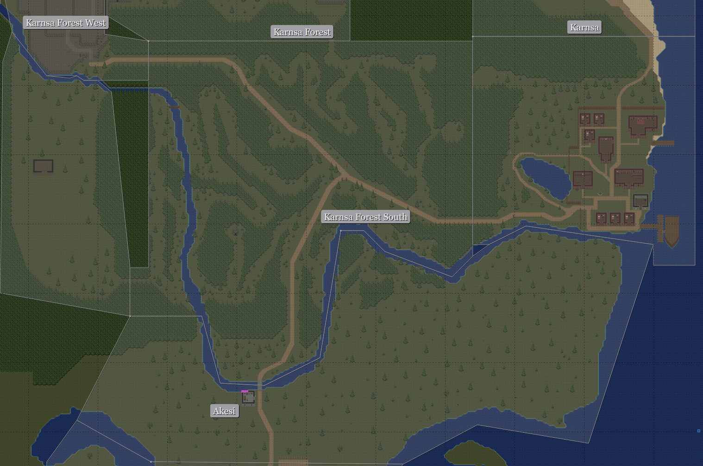

{
  published: "2024-04-07 12:15",
  tags: ["arq", "devlog"],
  prefix: "Arq Devlog"
}
# #15: Chunks and path finding

Since the previous devlog I've rewritten most of the server code. There were several issues with the previous design that were starting to become more problematic. All the way back in [the first devlog](./devlog-1.md) I mentioned that I'm building the server using Rust with Actix, and that is still true. Actix provides a framework for using the [Actor Model](https://en.wikipedia.org/wiki/Actor_model) for developing concurrent applications. Designing a system around actors and message passing makes it relatively straightforward to scale the system across multiple threads and potentially even across multiple servers.

## Zones (The old system)

Previously the server consisted of a few large actors called &ldquo;zones&rdquo;, and all players, NPCs, mobs, etc. would be assigned to a specific zone based on their position in the world. All mob code, scripts, and execution of player actions would run synchronously inside the zone actor. This did make it easy to do things like path finding within the zone, since all necessary information was readily available inside the actor.

<figure>

<figcaption>How zones were previously laid out around the Karnsa Forest area.</figcaption>
</figure>

There were several issues with this approach. The first problem was the border between zones. When a player moved to another zone, the player character would be transferred to the new zone actor. In the absence of other players or mobs this process was pretty much seamless. But with mobs and players around, the transfer was be pretty obvious as any mob or player in the old zone would instantly vanish and any mob or player in the new zone would appear out of thin air. If you were being chased by a mob, that mob would also stop the chase since mobs couldn't be transferred between zones. I thought a lot about this limitation in my initial map design, and I tried to make the corridors between zones as narrow as possible. This is especially noticeable in the &ldquo;Karnsa Forest&rdquo; zone in the map above. One idea I did consider was to make the zone border even more obvious &ndash; like with a shimmering magic barrier or something &ndash; and come up with an in-game explanation for them. Ideally though, I wanted to make some sort of smooth transition between zones where mobs and players in both zones would continue to be visible.

Another issue was that while in a zone, a player would receive updates for all other players and mobs in a zone. For big zones that was quite a lot of unnecessary data being sent to the player as well as information that the player shouldn't necessarily have access to. This would probably have been easier to fix than the zone border issue, but at this point the zone actor had grown quite a bit in complexity and was in dire need of a major refactor.

## Chunks (The new system)

Instead of adding to the complexity of the massive zone actor by attempting to fix both issues, I instead wanted to experiment with a completely different design from scratch. This new design divides the world into equally sized chunks and consists of a lot more actors:

* Each online player is an actor in charge of the player's data
* Each chunk is an actor and owns the position of all entities (including players) within the chunk.
* Each [area](./devlog-13.md) is an actor in charge of the mobs and entities spawned by the area or the area's script
* Other actors created on-demand to handle shared objects like merchant NPCs, containers, etc.

When a player logs in, a player actor is spawned which adds itself to a chunk. Additionally it attaches observers to the four closest chunks. Whenever the player wants to move, this is handled by sending a &ldquo;please let me move&rdquo;-message to the current chunk, which then performs collision detection and possibly transfers ownership to another chunk if the destination is outside of the current chunk. The following video shows a demonstration of this chunk system configured with very small chunks (the real system currently uses 30&times;30 tile chunks):

<figure>
<video src="../images/arq/chunks.webm" autoplay loop></video>
<figcaption>Demo of chunk system with small 5&times;5 tile chunks. Closest four chunks are highlighted in green.</figcaption>
</figure>

While getting this basic movement system working didn't take a lot of time, it did take a lot of time to pretty much reimplement all other systems to work with actors and message passing. But I'm happy to say that a lot of the systems are now a lot better structured and easy to maintain and extend than they were before.

## Path finding

As a result of the rewrite, some changes had to be made to the various uses of path finding on the backend. First of all &ndash; to simplify the backend &ndash; I've moved all player path finding to the frontend. Previously when using an ability on a target, the server would move the player into range automatically using a cheap ad hoc path finding algorithm. The same thing happened when attempting to talk to an NPC that wasn't in range. Both of these cases are now handled on the frontend instead using [the same A* pathfinding algorithm](https://en.wikipedia.org/wiki/A*_search_algorithm) that is used when clicking on the map to move.

Mobs would also previously use A* as part of their path finding, however with the chunk system in place this no longer seemed practical. That's because A* computes the entire path from start to finish in one go and needs access to all map and collision data &ndash; something that isn't readily available to the mob and has to be fetched from one or more chunks asynchronously. It can also quickly become quite computationally expensive. So I looked at [maze-solving algorithms](https://en.wikipedia.org/wiki/Maze-solving_algorithm) instead, since they can be used to find a path (although not necessarily the shortest) one step at a time. My initial attempt at a wall-following algorithm wasn't exactly successful:
 
<figure>
<video src="../images/arq/pathfindfail.webm" autoplay loop></video>
<figcaption>Initial failed attempt at using a maze-solving algorithm for path finding.</figcaption>
</figure>

After several iterations however I've come up with something that does work pretty well though.
It consists of three states: chase, follow left wall, and follow right wall. When the mob has acquired a target it initially starts out in chase mode, which with every move simply seeks to lower either the x-distance or the y-distance to the target.
When an obstacle is encountered, the mob randomly select a direction perpendicular (left or right) to its current direction, and then transitions to the follow left state or the follow right state based on the direction (e.g. if it turned left it continues following the right wall).
When in the wall following state, the algorithm first checks if it's possible to turn towards the wall, and if not then sequentially checks every direction turning away from the wall (e.g. clockwise if following the left wall). To get out of the wall following state, an additional check is implemented that first checks if following the current direction decreases the distance to the target. If it does, the mob first checks if it can continue in that direction, if it can it switches back to chase mode and if not it keeps following the current wall.

For the most part this works pretty well. There are a few cases where the mob can get stuck for a bit, or takes the long way around an obstacle, so it's not perfect, but I think it's good enough for now.
