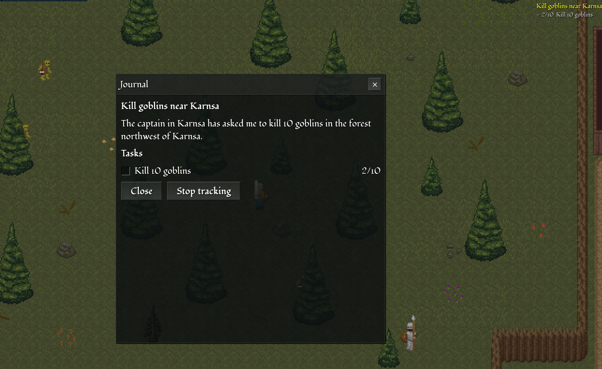
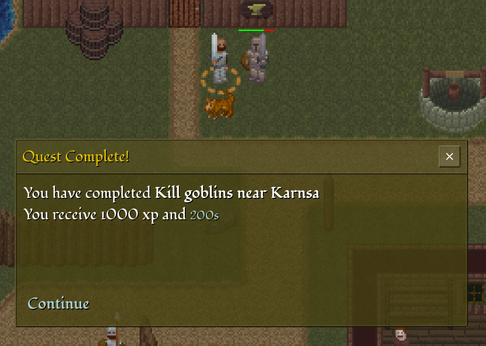
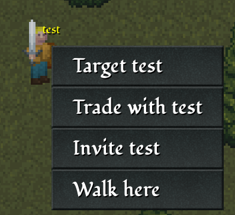
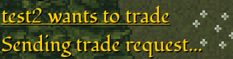
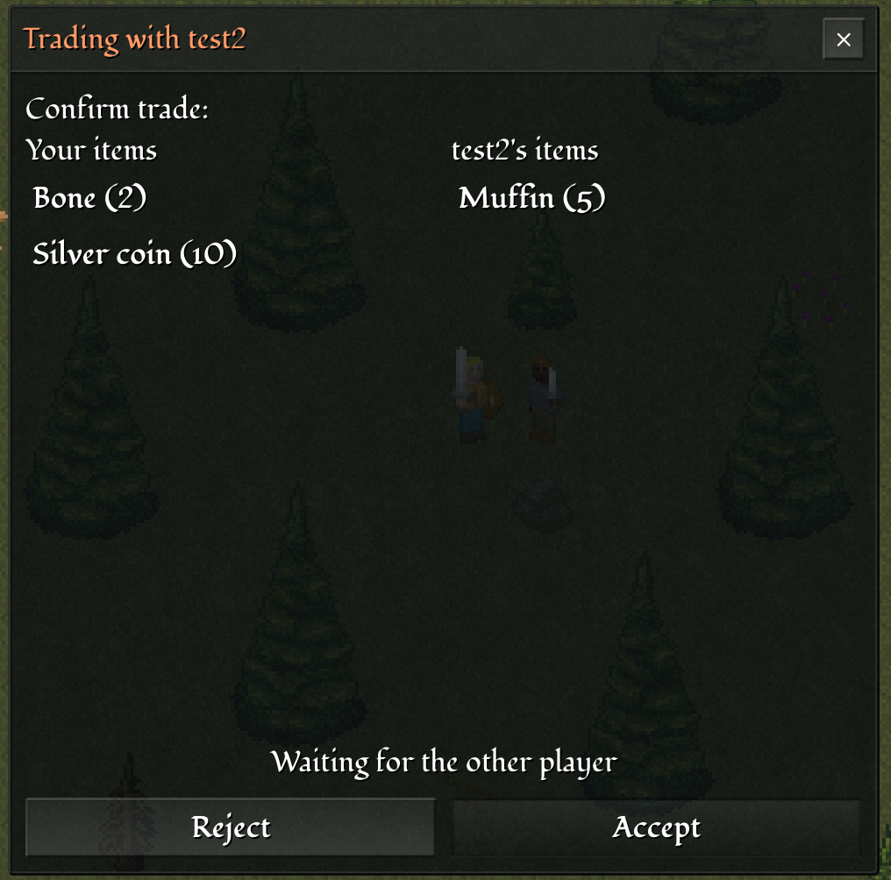
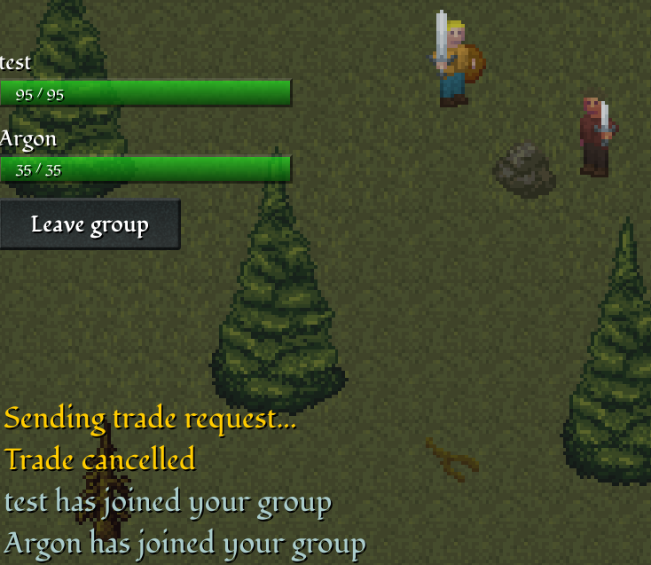
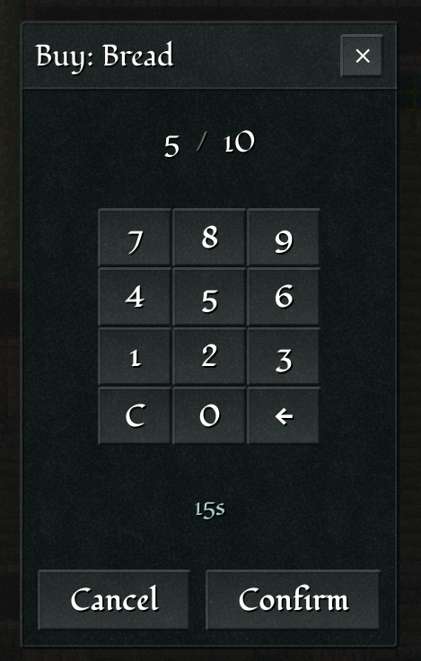

{
  published: "2024-11-24 15:00",
  tags: ["arq", "devlog"],
  prefix: "Arq Devlog"
}
# #16: Quests, trade, and groups

To be honest, I haven't spent much time on Arq in the past few months. Instead, I've spent time on [Classic Stylesheets 2.0](https://github.com/nielssp/classic-stylesheets/releases/tag/v2.0) and [notes on ray casting](../published/notes-on-raycasting.md). This is just a short update outlining some of the functionality I have worked on since the previous devlog.

## Quests

There's now a quest journal to keep track of active and completed quests:

<figure>

<figcaption>Quest journal and progress tracker.</figcation>
</figure>

A quest consists of a list of tasks and a list of log entries. Tasks and log entries are unlocked via the scripting system. The example quest shown in the screenshot above has the following tasks and log entires (defined in a TOML file):

```toml
name = 'Kill goblins near Karnsa'

[tasks.kill]
description = 'Kill 10 goblins'
quantity = 10
mob_type = 'goblin'
unlocks = 'return'
log = 'done'

[tasks.return]
description = 'Return to the captain'

[log]
init = 'The captain in Karnsa has asked me to kill 10 goblins in the forest northwest of Karnsa.'
done = 'I have killed 10 goblins and should return to the captain in Karnsa for my reward.'
```

The script for an NPC can then check for the state of the quest and possibly unlock new tasks, or mark the quest as complete.


<figure>

<figcaption>Quest completion.</figcation>
</figure>

## Trade and groups

I've also implemented a player trade system somewhat similar to the one found in Old School RuneScape. It's accessed by right clicking on another player:

<figure>

<figcaption>Player context menu.</figcation>
</figure>

An incoming trade request is shown in the chat log and clicking on it will open the trade dialog for each player:

<figure>

<figcaption>Trade request in chat log.</figcation>
</figure>

The first screen of the trade dialog allows each player to select items to trade. Then when both players click &ldquo;Read&rdquo;, the item selection is locked and the confirmation screen is shown:

<figure>

<figcaption>Trade confirmation dialog.</figcation>
</figure>

The trade is finalized when both players have accepted the trade shown on the confirmation screen. 

The other new option in the player context menu is the &ldquo;Invite&rdquo; option which invites the other player to your group:

<figure>

<figcaption>Player grouping system. Health of other group members are shown above the chat log.</figcation>
</figure>

The grouping system is still pretty basic, but it does interact with another new system: instances. Instances allow areas of the map to be marked with an instance ID. Whenever a player enters such an area, a new private *instance* of the world is created. If two players are in the same group, then they'll enter the same instance. This could be useful for dungeons etc.

## UI adjustments

Various minor changes have been made to the UI. In particular, the look of dialogs have been changed to provide better contrast. The quantity selection dialog has also been updated with a calculator-like array of buttons instead of the previous range slider component:

<figure>

<figcaption>New number input dialog.</figcation>
</figure>
