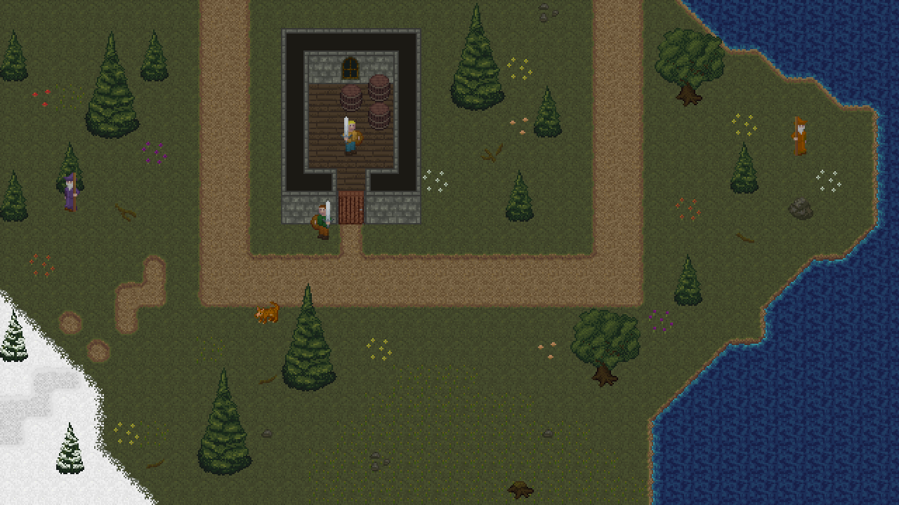

{
  published: "2024-11-24 17:00",
  tags: ["arq", "devlog"],
  prefix: "Arq Devlog"
}
# #17: An art style conundrum

There are many approaches to 2D pixel art. My original vision for Arq was that the art style should be simple so that I could focus more on other problems like world-building and game mechanics. One of my initial sources of inspiration was some screenshots I saw of an old and (to me) obscure 2D MMORPG called [Dransik](https://dransik.com/). So I'm not sure exactly how I ended up with the complexity of today's tile set. But I guess once you've created one [noisy tile](./devlog-4.md), every subsequent tile and sprite also needs a certain level of detail or noise. And when you then want to combine multiple detailed tiles, you need a large number of transition tiles.

After recently coming across a game called [Moonring](https://dene.itch.io/moonring), which has simple but beautiful pixel art that uses only a small number of colors, I couldn't get the idea out of my head that I had failed to properly consider the option of going with simpler graphics.

So I spent some time creating a small tile set from scratch that I think is closer to my original vision. The palette is limited to a small number of colors (only 11 colors are used in the image below), and I've used black as a global background color which allows different tiles to be placed next to each other without transition tiles and without creating sharp edges. I also lowered the tile size to 16&times;16 pixels (the existing tiles are 20&times;20, although I'm not entirely sure why).

<figure>

<figcaption>8-bit style alternative to the current art style.</figcation>
</figure>

Compare that to the same scene recreated using Arq's current tile set and sprites:

<figure>

<figcaption>Current art style.</figcation>
</figure>

The snow tiles were made for the above picture, so they're a bit rushed. The only reason I included snow tiles in the 8-bit style tile set was because of how ridiculously easy they were to make (i.e., take the existing tiles and turn the colored pixels white). And that's just one example of how much easier it is to create art when the art style is simpler. With the simpler art style, it would be feasible to maintain snow-variants of most outside tiles, so it would be possible to implement mechanics like changing seasons with snow in the winter. That's simply not realistic with the current art style.

Additionally, the simpler style of wall tiles allows windows to be placed on the left and right sides of buildings instead of just on the front and back walls. Without transition tiles (and especially diagonal transition tiles) it's also clearer where the tile boundaries are.

One thing I think would be harder in the simpler art style is equipment variation. It's always been important to me that a player's equipment is proudly displayed on their sprite. But with a smaller number of pixels and a limited set of colors, it might be harder to create a lot of distinct weapons and sets of armor. I'm just guessing, though, and it's certainly not illegal to add new colors if necessary.

I'm not sure what the conclusion is. When comparing the pictures side by side, I like both styles. But it's a bit scary how little time I spent creating the 8-bit style tile set compared to how long I've spent on the tiles in the other picture. If I were to switch tile sets, though, I would pretty much need to recreate the map from scratch. I'm also not sure the current UI would fit the more pixel-y look, so that would also have to be redesigned.

I might branch out and create a minimal version of the game using 8-bit style graphics just to get a feel for how they would work in the game.
