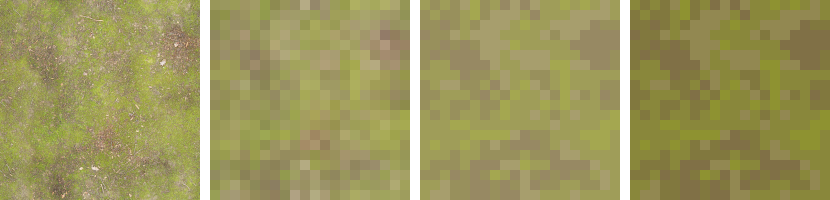
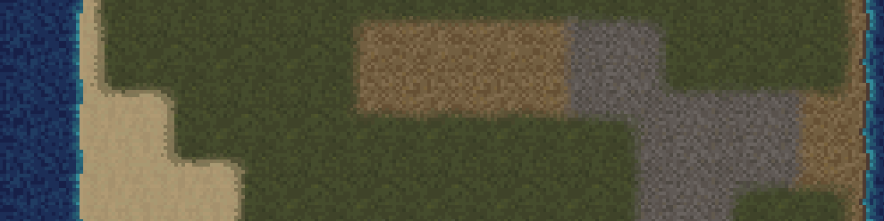
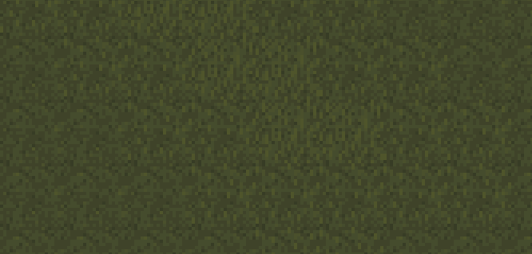

{
  published: "2023-03-28 22:23",
  tags: ["arq", "devlog"],
  prefix: "Arq Devlog"
}
# #4: Tiles and transitions

My initial tileset consisted of a few different tiles that I created many years ago for a similar project using Microsoft Paint.
There are many different approaches to pixel art, and many different ways to limit the palette and resolution to get a distinct look.
For Arq, I'm trying to create a sort of &ldquo;realistic&rdquo; look with noisy/detailed textures rather than bright solidly coloured textures common in other 2D RPGs.
To make textures like that I've been using a shortcut where I find a high resolution texture, then scale it down to 20&times;20 and reduce the number of colors.
This keeps some of the detail and noisiness, while still fitting well with other pixel art.

I've used this method with various public domain textures from https://ambientcg.com. Here's an example of how I may use one of the textures:

<figure>

<figcaption>1) <a href="https://ambientcg.com/view?id=Ground037">Original texture</a>, 2) scaled to 20&times;20 pixels, 3) palette reduced to 5 colors, 4) brightness/contrast adjusted.</figcaption>
</figure>

The texture above is probably a bit too rough to use because of the big patches of dirt, but you get the idea. Often it's also necessary to further adjust the textures for instance to remove unwanted line patterns or to make them tile better.

I also made a simple template for easily creating transition tiles. Here's a screenshot of some of the new textures and transitions in-game:

<figure>

<figcaption>Grass, sand, dirt, gravel, and transitions.</figcaption>
</figure>

Additionally I made some grass variations to make the map a bit more interesting:

<figure>

<figcaption>Grass variations.</figcaption>
</figure>
