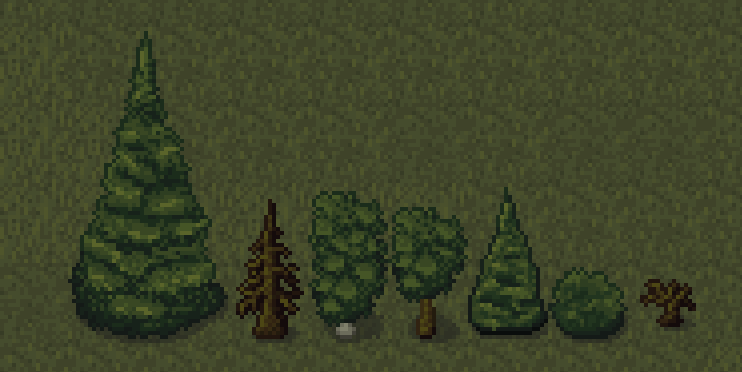
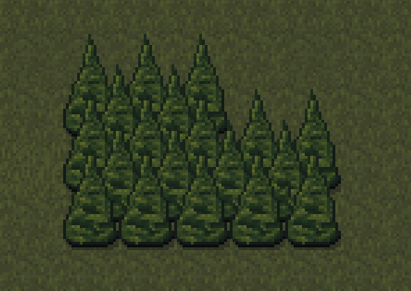

{
  published: "2023-03-30 17:40",
  tags: ["arq", "devlog"],
  prefix: "Arq Devlog"
}
# #5: Trees!

A world consisting of only grass and dirt would be a bit boring, so I drew some trees.
Unlike with the surface tiles, I don't think there's any real shortcuts to doing this. I did spend a lot of time looking at pictures of trees for reference though.

<figure>

<figcaption>Various different types of trees.</figcaption>
</figure>

I also experimented with making &ldquo;supertiles&rdquo; of dense forest that can be used to wall off different parts of the map: 

<figure>

<figcaption>&ldquo;Wall&rdquo; of trees.</figcaption>
</figure>

