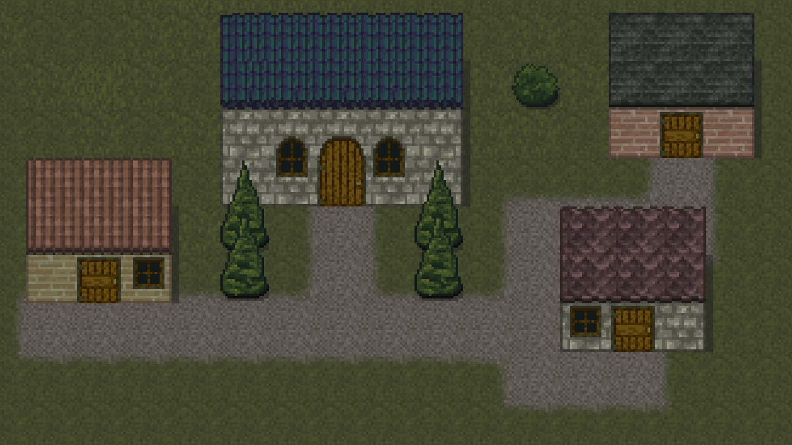

{
  published: "2023-03-31 18:00",
  tags: ["arq", "devlog"],
  prefix: "Arq Devlog"
}
# #6: Buildings

I made some tiles for making buildings (using the same technique as in [devlog #4](devlog-4.md) to create some of the textures):

<figure>

<figcaption>Various buildings.</figcaption>
</figure>

I made a number of different variations for roofing and walls and I'll probably make more once I start actually building the world.
