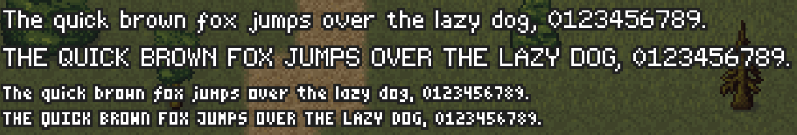
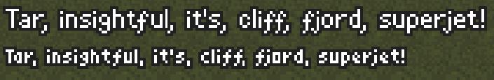

{
  published: "2023-04-01 09:45",
  tags: ["arq", "devlog"],
  prefix: "Arq Devlog"
}
# #7: Bitmap fonts

Currently the game is a 420&times;420 pixel canvas, so to draw text that isn't blurry because of antialiasing I designed two small bitmap fonts (one is 5&times;9, the other 3&times;6):

<figure>

<figcaption>The two fonts rendered with a black outline.</figcaption>
</figure>

Both fonts are proportional (glyphs don't occupy the same amount of horizontal space) and I even added some simple [kerning](https://en.wikipedia.org/wiki/Kerning) rules (e.g. if &ldquo;T&rdquo; is followed by an &ldquo;e&rdquo;, subtract one pixel from the space between them):

<figure>

<figcaption>Examples of kerning: &ldquo;Ta&rdquo;, &ldquo;r,&rdquo;, &ldquo;tf&rdquo;, &ldquo;t'&rdquo;, &ldquo;ff&rdquo;, &ldquo;fj&rdquo;, and &ldquo;rj&rdquo;.</figcaption>
</figure>

Currently the two fonts only support the [Basic Latin Unicode Block](https://en.wikipedia.org/wiki/Basic_Latin_(Unicode_block)) (ASCII), and I'm not sure if I need to support more.
For numbers and player names ASCII is probably fine.

Although I'm happy with the way both fonts turned out, an alternative I'm considering (which would also add full Unicode support) is to render text on top of the canvas with HTML elements instead of inside the canvas. When rendering at native resolution it shouldn't necessarily look too jarring next to the low resolution graphics:

<figure>

<figcaption>The 3&times;6 font next to Tahoma rendered at much higher resolution.</figcaption>
</figure>

I'm not sure what's best. My plan with the rest of the interface is that it's going to be implemented with HTML elements and CSS rather than drawn onto the canvas, so maybe the low resolution pixel fonts are going to look too jarring next to the other fonts used in the UI. In any case, designing bitmap fonts was still a pretty fun exercise.

