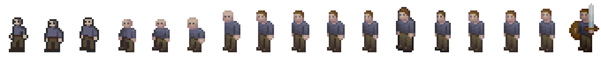
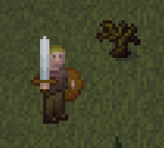

{
  published: "2023-04-02 12:20",
  tags: ["arq", "devlog"],
  prefix: "Arq Devlog"
}
# #8: Player character design iterations

I spent some time redesigning the player character and went through a lot of iterations before I ended up with a shape that I'm happy with:

<figure>

<figcaption>Player character design iterations.</figcaption>
</figure>

Drawing pixel art for Arq is definitely a learning experience, and I'm still very far from being a skilled pixel artist. One of the requirements I have for the player character is that parts of the sprite can be replaced to show what type of armor the character is wearing etc.

<figure>

<figcaption>New player character in-game with sword and shield.</figcaption>
</figure>

It should also be possible to animate different parts of the sprite separately. For now I'm sticking with the simple jumping animation instead of a detailed walking animation though.
