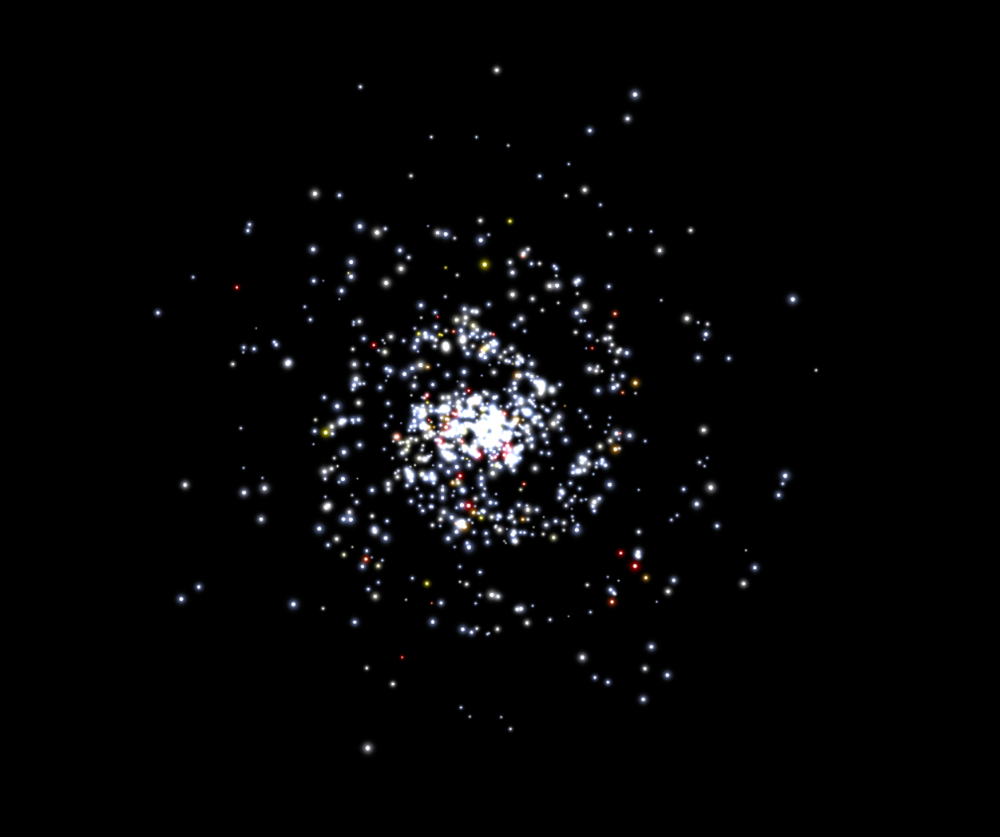

{
  published: "2022-05-14 18:19",
  tags: ["mug", "devlog"]
}
# MUG Devlog #1: Background and Motivation

This is the first of hopefully many devlogs chronicling the development of MUG. My goal with these devlogs is to discuss the various technical and design challenges that I come across while developing MUG.
I also want to keep them relatively short but frequent to make it less likely for me to get stuck.

MUG (Multi-User Galaxy) is a name I've used for several personal projects in the past. The first few attempts were multiplayer real-time 4X strategy games played in the browser on a large zoomable map of a randomly generated galaxy consisting of thousands of stars. At one point it was partially inspired by [Master of Orion](https://en.wikipedia.org/wiki/Master_of_Orion) (and [Ascendancy](https://en.wikipedia.org/wiki/Ascendancy_(video_game))), but I couldn't quite figure out how to balance it as a multiplayer game.

The reason I wanted it to be real-time was because I didn't want to put a limit on how many moves you'd be able to make per day. That way &ndash; in theory &ndash; you'd be able to spend as much or as little time as you wanted in-game. I'm not sure if that could work in practice. For instance, what would prevent another player from invading all your planets while you were sleeping? So I kind of gave up on the strategy angle and instead turned towards the tried-and-true MMORPG genre (if I do at some point revisit the multiplayer space strategy genre, it will probably be turn-based with simultaneous execution of turns once a day and be heavily inspired by Master of Orion).

One useful thing I did get out of the early attempts was a zoomable star map that I've reused and improved several times since then:

<figure>

<figcaption>Randomly generated spiral galaxy from earlier iteration.</figcaption>
</figure>

I started working on the current iteration of MUG (the name isn't necessarily final) at the end of July 2021. This time around it's more true to its name (derived from MUD &ndash; Multi-User Dungeon) in that it's a multiplayer RPG in space. It's still a browser game, but instead of being about controlling a vast galactic empire, it's about exploring the galaxy in your spaceship and occasionally shooting things.

At this point I have implemented a lot of the basic game mechanics, but I still have a lot of work ahead of me (including the overwhelming task of worldbuilding). In future devlogs I hope to go into details about all the development I've already done, as well as try to better explain what kind of game MUG will be.
