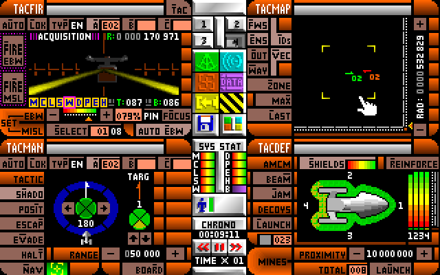

{
  published: "2022-05-26 10:06",
  tags: ["mug", "devlog"]
}
# MUG Devlog #2: Vision and Goals

In the previous devlog I tried to explain how I started working on MUG without actually saying much about what MUG is. In this devlog I'll attempt to explain what type of game I envision MUG to be.

First and foremost MUG is a multiplayer [&ldquo;space trading and combat game&rdquo;](https://en.wikipedia.org/wiki/Space_flight_simulation_game#Space_trading_and_combat_game). The player takes the role of a captain in command of a small spaceship. The goal is to make money by completing various jobs and missions, and by trading and transporting goods between planets. A classic example of such a game is [Elite](https://en.wikipedia.org/wiki/Elite_(video_game)), but there are many other examples as well. MUG's gameplay differs from Elite in a number of ways:

* Text-based, not in the walls-of-text sense, but in the sense that the there isn't a primary graphical view. There are graphical components though, like the star map.
* The player doesn't directly control the spaceship. Instead, the player gives commands such as &ldquo;Land on planet X&rdquo;, &ldquo;Intercept ship Y&rdquo;, etc.
* Browser-based and mobile-first design.

Regarding the UI, I recently came across an old game series for DOS called [Rules of Engagement](https://en.wikipedia.org/wiki/Rules_of_Engagement_(video_game)). The GUIs for both Rules of Engagement and Rules Engagement 2 are very similar to what I have in mind for MUG. Unlike a lot of games, the main view isn't from a player perspective in 3d space or a top-down view onto a 2d playing field. Instead the screen is filled with controls and information for commanding your ship (and other ships in the fleet). The different views can be switched out depending on what you're doing, probably similar to how [glass cockpits](https://en.wikipedia.org/wiki/Glass_cockpit) function in modern aircraft (and real spacecraft).

<figure>

<figcaption>Space battle in Rules of Engagement 2.</figcaption>
</figure>

With that in mind I'm in some ways going for a more realistic approach to the interface. Often in movies and on TV, they'll have ships right next to each other, whereas I'd think that with futuristic targeting systems you'd be able to fire at ships many kilometers away (if not hundreds of kilometers away), so there wouldn't be anything interesting to see &ldquo;out the window&rdquo;. That being said, extreme realism is not one of my primary goals, instead my main focus is to create a UI that makes it easy to get a quick situational overview without having to get too immersed.
