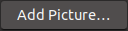

# Buttons

## Xerox Alto (1973)

The above button is from the Neptune file manager, the only Alto program I found that had actual buttons.

## Xerox Star (1981)

## Apple Lisa (1983)

## Apple Macintosh (1984)

## Workbench 1.0 (1985)

## Windows 1.0 (1985)

## GEOS (1986)

## OS/2 (1987)

## Windows 2.0 (1987)

## OPEN LOOK (1988)

## Motif (1989)

## NeXTSTEP (1989)

## Workbench 2.0 (1990)

## GeoWorks (1990)

## ViewMAX (1990)

## Windows 3.0 (1990)

## ViewMAX 2 (1991)

## OS/2 2.0 (1992)

## Common Desktop Environment (1993)

## System 7.5 (1995)

## Microsoft Bob (1995)

## Windows 95 (1995)

## OS/2 Warp 4 (1996)

## Mac OS 8 (1997)

## KDE 1 (1999)

## Windows 2000 (2000)

## GNOME 1.2 (2000)

## KDE 2 (2000)

## Mac OS X 10.0 (2001)

## Windows XP (2001)

## KDE 3.0 (2002)

## Haiku (2002)

## KDE 3.1 (2003)

## KDE 3.2 (2004)

## Ubuntu 4.10 (2004)

## Ubuntu 5.04 (2005)

## GNOME 2.12 (2005)

## Ubuntu 6.06 (2006)

## Windows Vista (2006)

## KDE 4 (2008)

## GNOME 2.22 (2008)

## GNOME 3.0 (2011)

## GNOME 3.4 (2012)

## Windows 8 (2012)

## KDE 5 (2014)

## Windows 10 (2015)

## macOS Catalina (2019)

## Ubuntu 20.04 (2020)

## Notes

Alto emulator:  [Salto](http://www.bitsavers.org/bits/Xerox/Alto/simulator/salto/)

Star emulator: [Darkstar](https://github.com/livingcomputermuseum/Darkstar)

Lisa emulator: [lisaem](https://lisa.sunder.net/)

Focus-states only included for buttons that receive focus when they are clicked.

