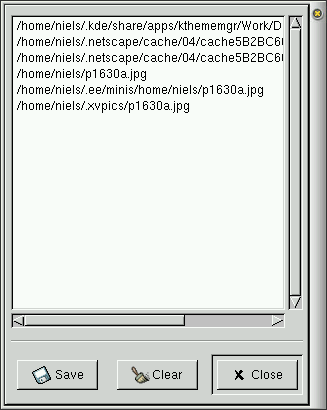

# GNOME 1.2
GNOME 1.2 was released on 25 May 2000. It was included in Slackware Linux 7.1.

[Official GNOME 1.2 press release](https://www.gnome.org/press/2000/05/gnome-1-2-bongo-gnome-unleashed/).

## Startup

### Login screen
<figure>

<figcaption>gdm 2.0</figcaption>
</figure>

### Splash screen
<figure>

</figure>

### First run
The help browser, home directory, and <q>Gnome Hints</q> are shown.

<figure>

</figure>

## Desktop
The desktop has a few things in common with KDE, but compared with KDE 1 it seems a lot more customizable; all panel elements can be moved around freely and several types of new panels can be added. The menu in the second screenshot below shows some of the applets that can be added to a panel.

<figure>

<figcaption>1) Desktop with&nbsp; 2) Desktop with added <q>menu panel</q> and <q>Add to panel</q> menu</figcaption>
</figure>

### Main menu

<figure>

</figure>

### Run

The Run-dialog can be opened from the main menu. There doesn't seem to be a default key binding for it.

<figure>

<figcaption>The title bar is on the side for some reason</figcaption>
</figure>

### Lock screen

There is a lock screen (or at least there's a button for it on the default panel), but I couldn't get it to work. It appears to use xscreensaver for screensavers and lock screen, but `xscreensaver-command -lock` returns <q>locking not enabled</q>.

### Help

The GNOME help system provides access to HTML help files for all GNOME programs. It also displays man-pages.

<figure>

<figcaption>gnome-help-browser 0.4: 1) Welcome page&nbsp; 2) Man-page for <q>man</q></figcaption>
</figure>

### About

The closest thing to an about dialog is <q>System Information</q>. It doesn't include a version number though.

<figure>

</figure>

## Utilities

### File manager

<figure>

<figcaption>gmc 4.5.50: GNOME Midnight Commander.</figcaption>
</figure>

#### Feature: Open with

It's possible to right click on a file to open it with a specific application. MIME type associations can be changed in the settings.

<figure>

</figure>

### File search

<figure>

<figcaption>gsearchtool 1.2.0</figcaption>
</figure>

### Terminal

<figure>

<figcaption>gnome-terminal 1.2.1.</figcaption>
</figure>

### Text editor

<figure>

<figcaption>gedit 0.5.1: A simple text editor.</figcaption>
</figure>

### Code editor

This version of gedit doesn't seem to provide much help in terms of editing code.

### Web browser
At first glance GNOME doesn't come with its own web browser. Netscape runs as it did on KDE:

<figure>

<figcaption>Netscape Communicator 4.73.</figcaption>
</figure>

I did, however, discover that the help browser can also be used as a web browser:

<figure>

</figure>

## Graphics

### Image viewer

<figure>

<figcaption>ee 0.3.11: Electric Eyes</figcaption>
</figure>

### Image manipulation

Since GNOME is based on GTK+ (originally the <q>GIMP toolkit</q>) it makes sense that it includes GIMP.

<figure>

<figcaption>GIMP 1.0.4 in all its multi-window glory</figcaption>
</figure>

## Office applications

### Email

GNOME 1.2 doesn't have its own email client, but Netscape Communicator includes one.

### Address book

GnomeCard is the address book. It doesn't seem to have any integration with other applications.

<figure>

<figcaption>gnomecard 1.2.0</figcaption>
</figure>

### Calendar

<figure>

<figcaption>gnomecal 1.2.0</figcaption>
</figure>

### Calculator

<figure>

<figcaption>gcalc 1.2.0</figcaption>
</figure>

### Word processor

No word processor.

### Spreadsheets

<figure>

<figcaption>gnumeric 0.54</figcaption>
</figure>

### Presentations

No presentations.

## Media applications

### Music player

<figure>

<figcaption>qgmpeg 0.6.3: A front-end for various audio players. Has playlist support.</figcaption>
</figure>

### Sound recorder

<figure>

<figcaption>grecord 1.2.0: Plays/records WAV.</figcaption>
</figure>

### Video player

No video player.

### CD player

<figure>

<figcaption>gtcd 1.2.0</figcaption>
</figure>

## Settings

GNOME comes with a control panel called <q>GNOME Control Center</q> that provides access to all GNOME settings dialogs.

<figure>

<figcaption>gnomecc 1.2.0: GNOME Control Center</figcaption>
</figure>

### Wallpaper

<figure>

</figure>

### Appearance

The <q>Theme selector</q> makes it possible to switch between a number of preinstalled GTK+ themes, but unlike in KDE 1 there is no easy way to change the colors. Similarly the window manager Sawfish also comes preinstalled with a small number of themes.

<figure>

<figcaption>1) GTK+ theme selector&nbsp; 2) Window manager (Sawfish) theme selector</figcaption>
</figure>

### Theme

Other than the above there are no additional theme settings.

### Screensaver

<figure>

</figure>

### Display

No display settings.

### Keyboard

No keyboard layout settings.

<figure>

</figure>

### Mouse

<figure>

</figure>

### Time and date

No time and date settings.

### I18n

No i18n settings.

### Accessibility

No accessibility settings.

### Power management

No power management settings.

### File associations

No file association settings.

### Network

No network settings.

### Removable media

No removable media settings.

### Printers

No printer settings.

### Sound

<figure>

</figure>

### Login screen

No login screen settings.

## System

### Users

No user management.

### Task manager

<figure>

<figcaption>gtop 1.0.9</figcaption>
</figure>

## Dialogs

### Color

<figure>

</figure>

### Font

<figure>

</figure>

### Open

<figure>

</figure>