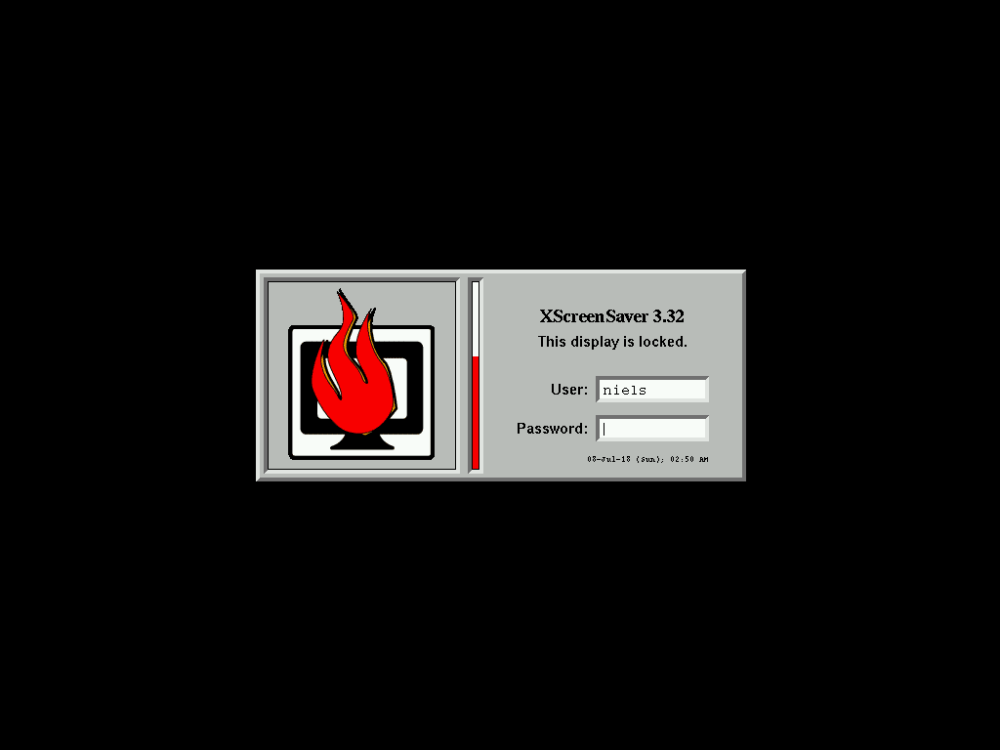
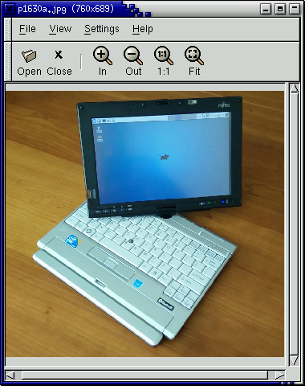
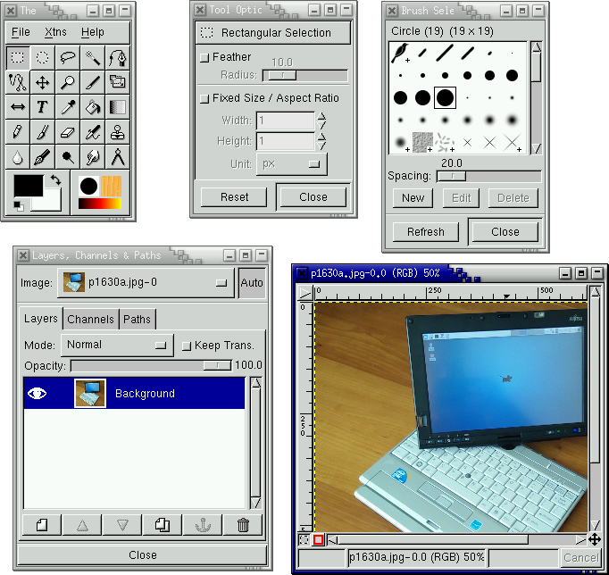
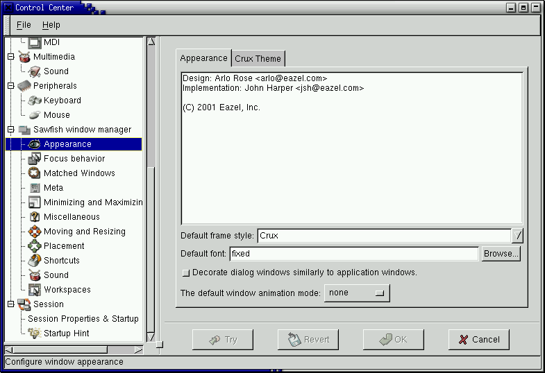
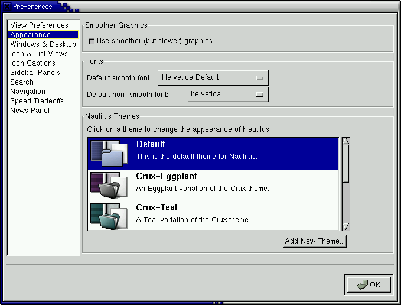
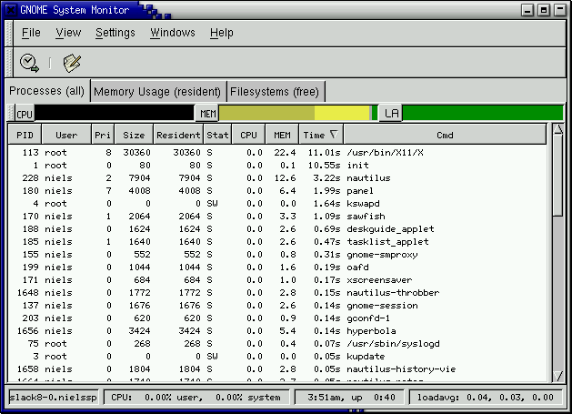

# GNOME 1.4
GNOME 1.4 was released on 2 April 2001. It was included in Slackware Linux 8.0.

[Official GNOME 1.4 press release](https://www.gnome.org/press/2001/04/gnome-1-4-released-desktop-environment-boasts-power-stability-polish-and-integration/).

## Startup

### Login screen
<figure>

<figcaption>gdm</figcaption>
</figure>

### Splash screen
<figure>

</figure>

### First run
<q>Gnome Hints</q> and the setup wizard for Nautilus are shown.

<figure>

</figure>

## Desktop

<figure>

<figcaption>Desktop with Nautilus file manager.</figcaption>
</figure>

### Main menu

<figure>

</figure>

### Run

The Run-dialog can be opened by pressing Alt+F2.

<figure>

</figure>

### Lock screen

<figure>

<figcaption>xscreensaver 3.32</figcaption>
</figure>

### Help

The GNOME help system provides access to HTML help files for all GNOME programs. It also displays man-pages.

<figure>

<figcaption>gnome-help-browser 1.4.0.4: 1) Welcome page&nbsp; 2) Man-page for <q>man</q></figcaption>
</figure>

### About

The closest thing to an about dialog is <q>System Information</q>. It doesn't include a version number though.

<figure>

</figure>

## Utilities

### File manager

GNOME 1.4 now comes with Nautilus, a file manager originally developed by a software company called [Eazel](https://en.wikipedia.org/wiki/Eazel).

<figure>

<figcaption>nautilus 1.0.3.</figcaption>
</figure>

#### Feature: Open with

<figure>

</figure>

### File search

<figure>

<figcaption>gsearchtool 1.4.0.1</figcaption>
</figure>

### Terminal

<figure>

<figcaption>gnome-terminal 1.4.0.4.</figcaption>
</figure>

### Text editor

<figure>

<figcaption>gedit 0.9.6</figcaption>
</figure>

### Code editor

<figure>

<figcaption>gvim 5.8</figcaption>
</figure>

### Web browser

<figure>

<figcaption>galeon 0.11.0</figcaption>
</figure>

## Graphics

### Image viewer

<figure>

<figcaption>ee 0.3.12: Electric Eyes</figcaption>
</figure>

<figure>

<figcaption>eog 0.6: Eye of GNOME</figcaption>
</figure>

### Image manipulation

<figure>

<figcaption>GIMP 1.2.1</figcaption>
</figure>

## Office applications

### Email

GNOME 1.4 doesn't have its own email client.

### Address book

GnomeCard is the address book. It doesn't seem to have any integration with other applications.

<figure>

<figcaption>gnomecard 1.4.0</figcaption>
</figure>

### Calendar

<figure>

<figcaption>gnomecal 1.4.0</figcaption>
</figure>

### Calculator

<figure>

<figcaption>gcalc 1.4.0.1</figcaption>
</figure>

### Word processor

<figure>

<figcaption>abiword</figcaption>
</figure>

### Spreadsheets

<figure>

<figcaption>gnumeric 0.65</figcaption>
</figure>

### Presentations

No presentations.

## Media applications

### Music player

<figure>

<figcaption>qgmpeg 0.6.3: A front-end for various audio players. Has playlist support.</figcaption>
</figure>

### Sound recorder

<figure>

<figcaption>grecord 1.2.3: Plays/records WAV.</figcaption>
</figure>

### Video player

No video player.

### CD player

<figure>

<figcaption>gtcd 1.2.3</figcaption>
</figure>

## Settings

GNOME comes with a control panel called <q>GNOME Control Center</q> that provides access to all GNOME settings dialogs.

<figure>

<figcaption>gnomecc 1.4.0.1: GNOME Control Center</figcaption>
</figure>

### Wallpaper

<figure>

</figure>

### Appearance

The <q>Theme selector</q> makes it possible to switch between a number of preinstalled GTK+ themes, but unlike in KDE 1 there is no easy way to change the colors. Similarly the window manager Sawfish also comes preinstalled with a small number of themes. The file manager Nautilus also comes with its own themes.

<figure>

<figcaption>1) GTK+ theme selector&nbsp; 2) Window manager (Sawfish) theme selector 3) Nautilus themes</figcaption>
</figure>

### Theme

Other than the above there are no additional theme settings.

### Screensaver

<figure>

</figure>

### Display

No display settings.

### Keyboard

No keyboard layout settings.

<figure>

</figure>

### Mouse

<figure>

</figure>

### Time and date

No time and date settings.

### I18n

No i18n settings.

### Accessibility

No accessibility settings.

### Power management

No power management settings.

### File associations

<figure>

</figure>

### Network

No network settings.

### Removable media

No removable media settings.

### Printers

<figure>

</figure>

### Sound

<figure>

</figure>

### Login screen

<figure>

<figcaption>gdmconfig 2.2.2.1</figcaption>
</figure>

## System

### Users

No user management.

### Task manager

<figure>

<figcaption>gtop 1.0.13</figcaption>
</figure>

## Dialogs

### Color

<figure>

</figure>

### Font

<figure>

</figure>

### Open

<figure>

</figure>