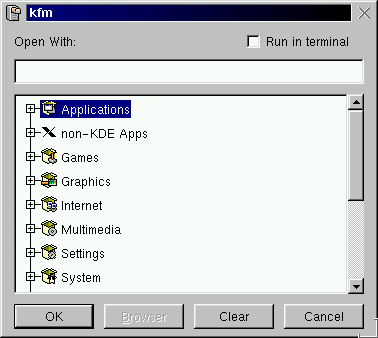
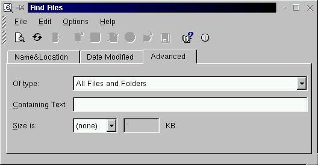
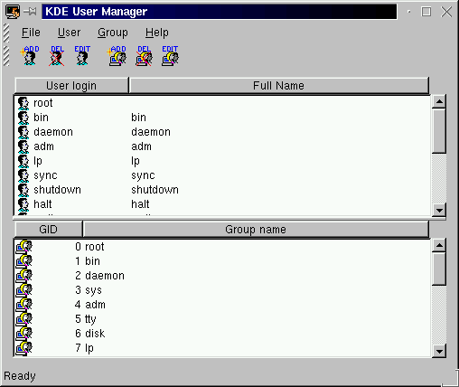

# KDE 1.1.2
KDE 1.1.2 was released on 13 September 1999. It was included in Slackware Linux 7.1.

[K Desktop Environment 1 on Wikipedia](https://en.wikipedia.org/wiki/K_Desktop_Environment_1).

## Login screen
<figure>

<figcaption>Groovy!</figcaption>
</figure>

## Splash screen
No splash screen.

## First run
The first time you log in you're informed that the <q>Desktop</q>-directory is being created. That's it. No additional configuration or setup required.

<figure>

</figure>

## Desktop
Like later KDE versions, the KDE 1 desktop feels a bit like Windows, but interestingly, in this version the task bar (placed on the top of the screen by default) isn't part of the main panel like in later versions. The bottom panel contains the clock, system tray, workspace switcher (with tiny <q>Logout</q> and <q>Lock screen</q> buttons), and a customizable number of menus and shortcut icons. Everything except for the system tray and clock (which are fixed to the right side of the panel) can be moved around freely. The panel can be hidden to either the left or right side using the arrows in which case icons for the main menu, window list, and disk navigator appear on the left side of the task bar.

<figure>

<figcaption>1) Desktop with file manager&nbsp; 2) Desktop with hidden main panel</figcaption>
</figure>

## Main menu

<figure>

</figure>

## Run

Pressing Alt-F2 opens the Run-dialog.

<figure>

</figure>

## Lock screen

<figure>

</figure>

## File manager

<figure>

<figcaption>kfm 1.167.2.21: The KDE file manager.</figcaption>
</figure>

### Feature: Open with

It's possible to right click on a file to open it with a specific application, however it doesn't seem to be possible to change file associations at all.

<figure>

</figure>

## Terminal

<figure>

<figcaption>konsole 0.9.11: The KDE terminal.</figcaption>
</figure>

## Web browser

<figure>

<figcaption>kfm 1.167.2.21: Also a web browser.</figcaption>
</figure>

Even though it's not a KDE application and doesn't use Qt, Netscape also has an icon on the panel by default (and otherwise resides in the <q>non-KDE Apps</q>-menu).

<figure>

<figcaption>Netscape Communicator 4.73.</figcaption>
</figure>

## Text editor

<figure>

<figcaption>kedit 1.2.2: A simple text editor.</figcaption>
</figure>

## Code editor

<figure>

<figcaption>kwrite 0.98: A slightly more advanced text editor.</figcaption>
</figure>

## Image viewer

<figure>

<figcaption>kview 1.8: An image viewer.</figcaption>
</figure>

## Image manipulation

<figure>

<figcaption>kpaint 0.4.3</figcaption>
</figure>

## Office applications

### Email

<figure>

<figcaption>kmail 1.0.28: Inbox.</figcaption>
</figure>

<figure>

<figcaption>kmail composer.</figcaption>
</figure>

### Address book

KMail has a built-in <q>Addressbook Manager</q> but it only contains email addresses:

<figure>

<figcaption>kmail's address book</figcaption>
</figure>

An actual address book (e.g. name, address, organization, phone etc.) is provided by <q>kab</q>, and it's possible to open the KMail Composer directly from kab.

<figure>

<figcaption>kab 1.0: The actual address book.</figcaption>
</figure>

### Calendar

<figure>

<figcaption>korganizer 1.1.1</figcaption>
</figure>

### Calculator

<figure>

<figcaption>kcalc 1.2.7</figcaption>
</figure>

### Word processor

No word processor.

### Spreadsheets

No spreadsheets.

### Presentations

No presentations.

## Media applications

### Music player

<figure>

<figcaption>kmedia 1.0: Only plays WAV.</figcaption>
</figure>

### Sound recorder

No sound recorder.

### Video player

No video player.

### CD player

<figure>

<figcaption>kscd 1.2.7</figcaption>
</figure>

## Help

The KDE help system provides access to HTML help files for all KDE programs. It also displays man-pages.

<figure>

<figcaption>kdehelp 0.7: 1) Welcome page&nbsp; 2) Man-page for <q>man</q></figcaption>
</figure>

## File search

<figure>

<figcaption>kfind 0.4.1</figcaption>
</figure>

## Settings

KDE comes with a control panel called <q>KDE Control Center</q> that provides access to all KDE settings dialogs. Each settings dialog can also be opened individually from the KDE main menu (in which case the Control Center sidebar and menubar won't be visible).

<figure>

<figcaption>kcontrol 1.0: The KDE Control Center</figcaption>
</figure>

### Wallpaper

<figure>

</figure>

### Appearance

<figure>

</figure>

### Theme

<figure>

</figure>

### Screensaver

<figure>

</figure>

### Display

No display settings.

### Keyboard

<figure>

</figure>

<figure>

</figure>

### Mouse

<figure>

</figure>

### Time and date

No time and date settings.

### I18n

<figure>

</figure>

### Accessibility

No accessibility settings.

### Power management

No power management settings.

### File associations

No file association settings.

### Network

No network settings.

### Removable media

No removable media settings.

### Printers

<figure>

<figcaption>HP LaserJet Control Panel</figcaption>
</figure>

<figure>

<figcaption>klpq: Printer queue for BSD, PPR, LPRNG spooling systems.</figcaption>
</figure>

### Sound

<figure>

</figure>

### Login screen

<figure>

</figure>

## System

### Users

<figure>

<figcaption>kuser 1.0</figcaption>
</figure>

### Task manager

<figure>

<figcaption>ktop 1.0.1</figcaption>
</figure>

<figure>

<figcaption>kpm 1.3k6</figcaption>
</figure>

## Dialogs

### Color

<figure>

</figure>

### Font

<figure>

</figure>

### Open

<figure>

</figure>