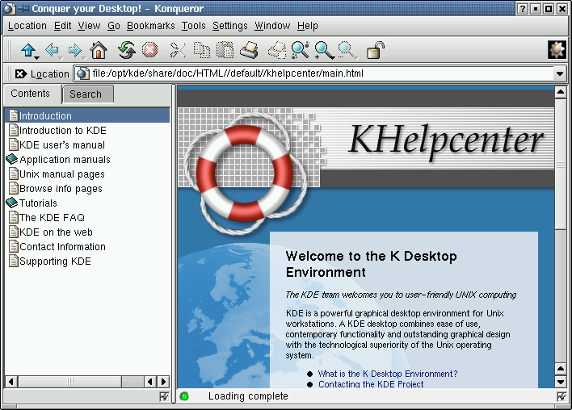
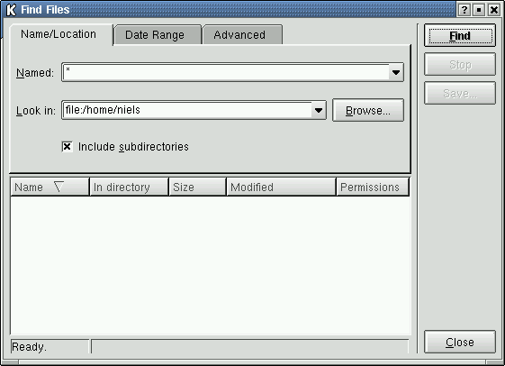
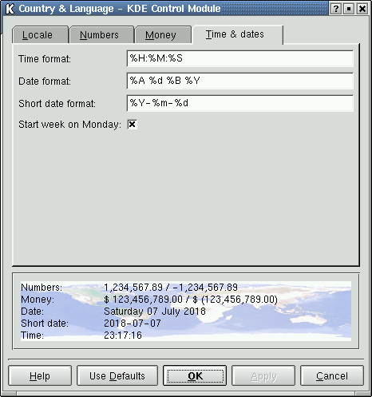
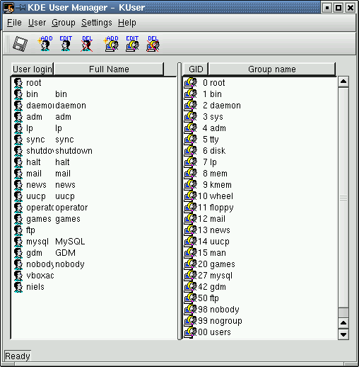

# KDE 2.1.2
KDE 2.1.2 was released on 30 September 2001. It was included in Slackware Linux 8.0.

[K Desktop Environment 2 on Wikipedia](https://en.wikipedia.org/wiki/K_Desktop_Environment_2).

## Startup

### Login screen
<figure>

<figcaption>KDM</figcaption>
</figure>

### Splash screen
<figure>

</figure>

### First run

<figure>

</figure>

## Desktop

<figure>

</figure>

### Main menu

<figure>

</figure>

### Run

Pressing Alt-F2 opens the Run-dialog.

<figure>

</figure>

### Lock screen

<figure>

</figure>

### Help

The KDE help center is now accessed using Konqueror. It still displays man-pages.

<figure>

<figcaption>konqueror 2.1.1: 1) Welcome page&nbsp; 2) Man-page for &ldquo;man&rdquo;</figcaption>
</figure>

### About

A simple &ldquo;About KDE&rdquo; dialog can be accessed from the &ldquo;Help&rdquo;-menu of most KDE applications.

<figure>

</figure>

## Utilities

### File manager

<figure>

<figcaption>konqueror 2.1.1: The new KDE file manager and web browser.</figcaption>
</figure>

#### Feature: Open with

<figure>

</figure>

### File search

<figure>

<figcaption>kfind 2.0</figcaption>
</figure>

### Terminal

<figure>

<figcaption>konsole 1.0.1: The KDE terminal.</figcaption>
</figure>

### Text editor

<figure>

<figcaption>kedit 1.3: A simple text editor.</figcaption>
</figure>

### Code editor

<figure>

<figcaption>kwrite 2.0: A slightly more advanced text editor.</figcaption>
</figure>

### Web browser

<figure>

<figcaption>konqueror 2.1.1</figcaption>
</figure>

## Graphics

### Image viewer

<figure>

<figcaption>kview 1.9: An image viewer.</figcaption>
</figure>

### Image manipulation

<figure>

<figcaption>kpaint 0.5.1</figcaption>
</figure>

## Office applications

### Email

<figure>

<figcaption>kmail 1.2: Inbox.</figcaption>
</figure>

<figure>

<figcaption>kmail composer.</figcaption>
</figure>

### Address book

KMail has a built-in &ldquo;Addressbook Manager&rdquo; but it only contains email addresses:

<figure>

<figcaption>kmail's address book</figcaption>
</figure>

An actual address book (e.g. name, address, organization, phone etc.) is provided by &ldquo;kab&rdquo;, and it's possible to open the KMail Composer directly from kab.

<figure>

<figcaption>kab 2.0: The actual address book.</figcaption>
</figure>

### Calendar

<figure>

<figcaption>korganizer 2.1</figcaption>
</figure>

### Calculator

<figure>

<figcaption>kcalc 1.3.0</figcaption>
</figure>

### Word processor

<figure>

<figcaption>kword 1.0</figcaption>
</figure>

### Spreadsheets

<figure>

<figcaption>kspread 1.0</figcaption>
</figure>

### Presentations

<figure>

<figcaption>kpresenter 1.0</figcaption>
</figure>

## Media applications

### Music player

<figure>

<figcaption>noatun 1.0.1: Plays several music formats.</figcaption>
</figure>

### Sound recorder

No sound recorder.

### Video player

<figure>

<figcaption>aktion 1.99</figcaption>
</figure>

### CD player

<figure>

<figcaption>kscd 1.3.0</figcaption>
</figure>

## Settings

KDE comes with a control panel called &ldquo;KDE Control Center&rdquo; that provides access to all KDE settings dialogs. Each settings dialog can also be opened individually from the KDE main menu (in which case the Control Center sidebar and menubar won't be visible).

<figure>

<figcaption>kcontrol 2.0: The KDE Control Center</figcaption>
</figure>

### Wallpaper

<figure>

</figure>

### Appearance

<figure>

</figure>

### Theme

Themes are collections of color schemes, icons, wallpapers, sounds, window style, etc.

<figure>

</figure>

### Screensaver

<figure>

</figure>

### Display

No display settings.

### Keyboard

<figure>

</figure>

<figure>

</figure>

### Mouse

<figure>

</figure>

### Time and date

No time and date settings.

### I18n

<figure>

</figure>

### Accessibility

<figure>

</figure>

### Power management

<figure>

<figcaption>Display energy saving</figcaption>
</figure>

### File associations

<figure>

<figcaption>Display energy saving</figcaption>
</figure>

### Network

No network settings.

### Removable media

No removable media settings.

### Printers

<figure>

<figcaption>HP LaserJet Control Panel</figcaption>
</figure>

<figure>

<figcaption>klpq: Printer queue for BSD, PPR, LPRNG spooling systems.</figcaption>
</figure>

### Sound

<figure>

</figure>

### Login screen

<figure>

</figure>

## System

### Users

<figure>

<figcaption>kuser 1.0</figcaption>
</figure>

### Task manager

<figure>

<figcaption>ksysguard 1.1.0</figcaption>
</figure>

<figure>

<figcaption>kpm 1.3k6</figcaption>
</figure>

## Dialogs

### Color

<figure>

</figure>

### Font

<figure>

</figure>

### Open

<figure>

</figure>