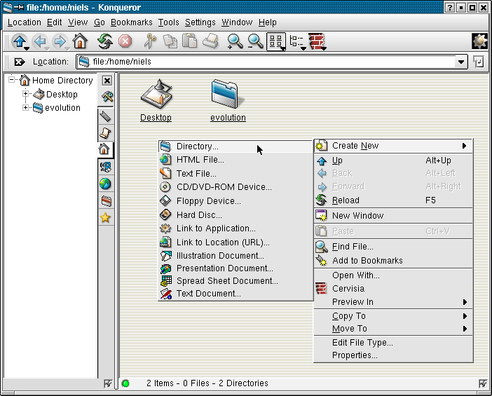

{
  toc_depth: 2,
}
# KDE 3.0.1
KDE 3.0.1 was released on 22 May 2002. It was included in Slackware Linux 8.1.

[K Desktop Environment 3 on Wikipedia](https://en.wikipedia.org/wiki/K_Desktop_Environment_3).

<h2 data-toc-ignore>Contents</h2>
<!--toc-->

## Startup

### Login screen
<figure>

<figcaption>KDM</figcaption>
</figure>

### Splash screen
<figure>

</figure>

### First run

<figure>

</figure>

## Desktop

<figure>

</figure>

### Main menu

<figure>

</figure>

### Run

Pressing Alt-F2 opens the Run-dialog.

<figure>

</figure>

### Lock screen

<figure>

</figure>

### Help

The KDE HelpCenter is now its own thing and no longer displays man-pages.

<figure>

<figcaption>khelpcenter 0.8</figcaption>
</figure>

### About

A simple &ldquo;About KDE&rdquo; dialog can be accessed from the &ldquo;Help&rdquo;-menu of most KDE applications.

<figure>

</figure>

## Utilities

### File manager

<figure>

<figcaption>konqueror 3.0.1: The KDE file manager and web browser.</figcaption>
</figure>

#### Feature: Open with

<figure>

</figure>

### File search

<figure>

<figcaption>kfind 2.0</figcaption>
</figure>

### Terminal

<figure>

<figcaption>konsole 1.1.1: The KDE terminal.</figcaption>
</figure>

### Text editor

<figure>

<figcaption>kedit 1.3: A simple text editor.</figcaption>
</figure>

### Code editor

<figure>

<figcaption>kate 2.0: KDE Advanced Text Editor.</figcaption>
</figure>

<figure>

<figcaption>kwrite 4.0: A simpler alternative to Kate.</figcaption>
</figure>

### Web browser

<figure>

<figcaption>konqueror 3.0.1</figcaption>
</figure>

## Graphics

### Image viewer

<figure>

<figcaption>kview 1.9.2: An image viewer.</figcaption>
</figure>

### Image manipulation

<figure>

<figcaption>kpaint 0.6.2</figcaption>
</figure>

## Office applications

### Email

<figure>

<figcaption>kmail 1.4.1: Inbox.</figcaption>
</figure>

<figure>

<figcaption>kmail composer.</figcaption>
</figure>

### Address book

KMail now integrates with KAddressBook.

<figure>

<figcaption>kaddressbook 3.0: The address book.</figcaption>
</figure>

<figure>

<figcaption>KAddressBook entry editor.</figcaption>
</figure>

### Calendar

<figure>

<figcaption>korganizer 3.0.1</figcaption>
</figure>

### Calculator

<figure>

<figcaption>kcalc 1.3.1</figcaption>
</figure>

### Word processor

<figure>

<figcaption>kword 1.1.1</figcaption>
</figure>

### Spreadsheets

<figure>

<figcaption>kspread 1.1.1</figcaption>
</figure>

### Presentations

<figure>

<figcaption>kpresenter 1.1.1</figcaption>
</figure>

## Media applications

### Music player

<figure>

<figcaption>noatun 2.0.0: Plays several music formats.</figcaption>
</figure>

### Sound recorder

No sound recorder.

### Video player

<figure>

<figcaption>aktion 1.99</figcaption>
</figure>

### CD player

<figure>

<figcaption>kscd 1.3.3</figcaption>
</figure>

## Settings

KDE comes with a control panel called &ldquo;KDE Control Center&rdquo; that provides access to all KDE settings dialogs. Each settings dialog can also be opened individually from the KDE main menu (in which case the Control Center sidebar and menubar won't be visible).

<figure>

<figcaption>kcontrol 3.0.1: The KDE Control Center</figcaption>
</figure>

### Wallpaper

<figure>

</figure>

### Appearance

<figure>

</figure>

<figure>

</figure>

### Theme

Themes are collections of color schemes, icons, wallpapers, sounds, window style, etc.

<figure>

</figure>

### Screensaver

<figure>

</figure>

### Display

No display settings.

### Keyboard

<figure>

</figure>

<figure>

</figure>

### Mouse

<figure>

</figure>

### Time and date

<figure>

</figure>

### I18n

<figure>

</figure>

### Accessibility

<figure>

</figure>

### Power management

<figure>

</figure>

### File associations

<figure>

</figure>

### Network

<figure>

</figure>

### Removable media

No removable media settings.

### Printers

<figure>

</figure>

### Sound

<figure>

</figure>

### Login screen

<figure>

</figure>

## System

### Users

<figure>

<figcaption>kuser 1.0</figcaption>
</figure>

### Task manager

<figure>

<figcaption>ksysguard 1.2.0</figcaption>
</figure>

## Dialogs

### Color

<figure>

</figure>

### Font

<figure>

</figure>

### Open

<figure>

</figure>
