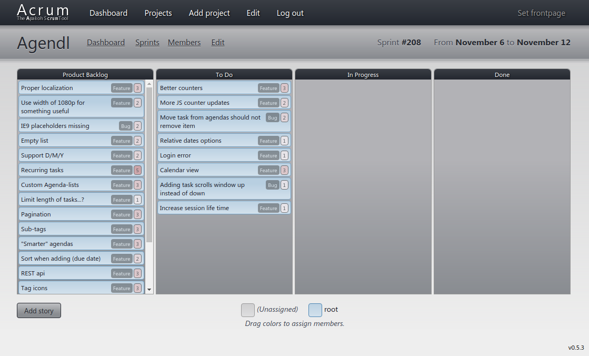

# Acrum
A web application – using [PeanutCMS](bs:/things/peanutcms) as the underlying framework – I developed in 2013 while at university. Used for a couple of semester projects.

<figure>

<figcaption>Acrum displaying Kanban board for <a href="bs:/things/agendl">Agendl</a>.</figcaption>
</figure>