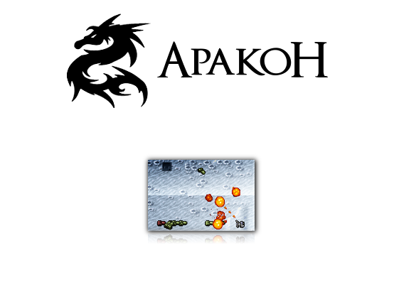
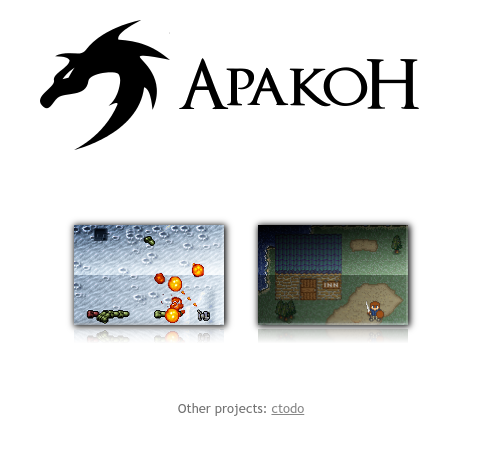
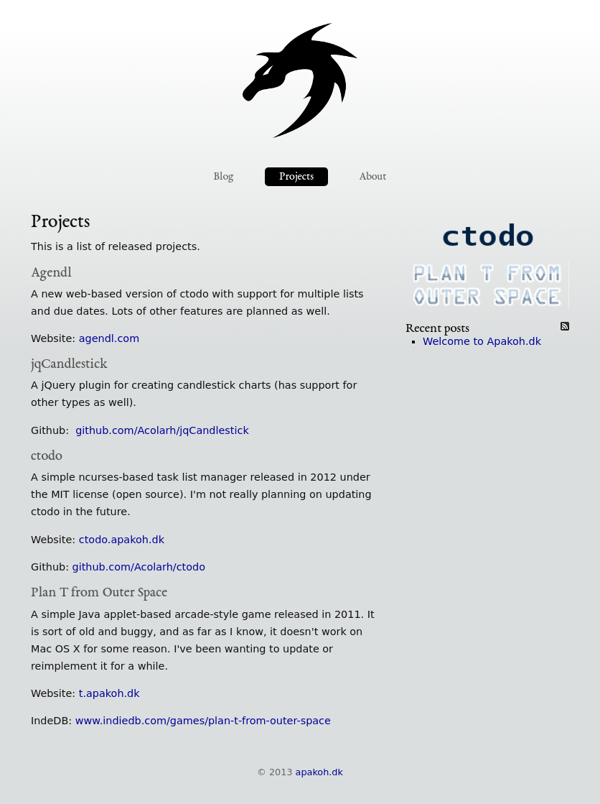
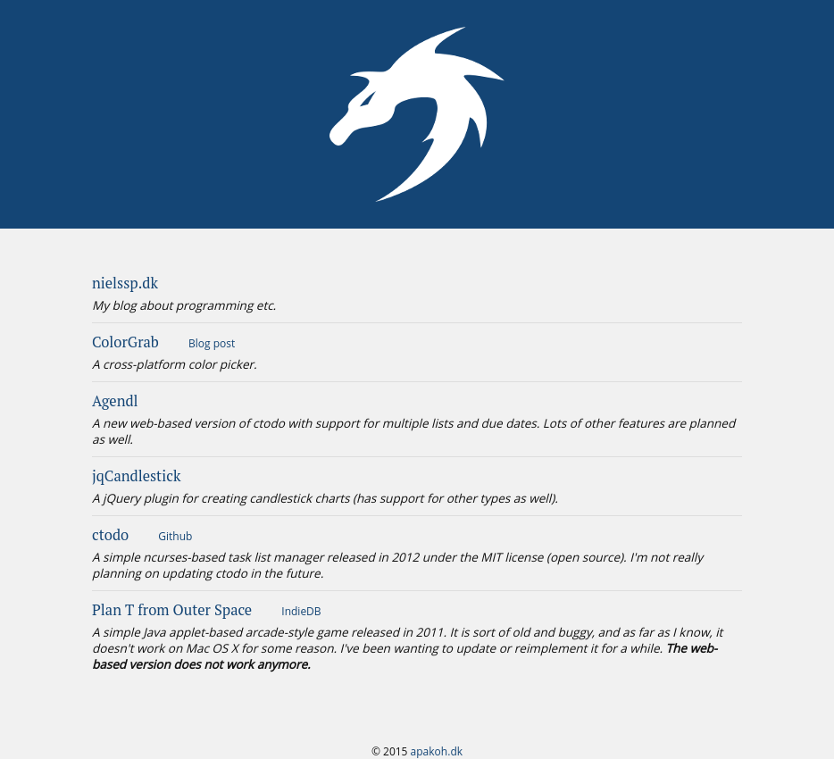
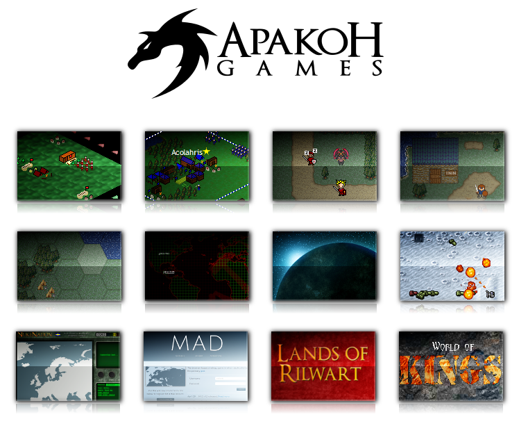

# apakoh.dk
My first domain name, registered in May of 2011. Originally only contained a single link to [Plan T from Outer Space](/things/ptfos), but I was working on several other games as well (mostly browser-based). Turned into a blog (using [PeanutCMS](/things/peanutcms)) in 2013, but I never wrote anything other than a short introduction. Removed the blog when I created [nielssp.dk](/things/nielssp-dk) in 2015. Now just a list of links.

<figure>

<figcaption>2011</figcaption>
</figure>

<figure>

<figcaption>2012 &ndash; new logo + another unfinished game</figcaption>
</figure>

<figure>

<figcaption>2013 &ndash; blog with a single post</figcaption>
</figure>

<figure>

<figcaption>2015 &ndash; just a small list of links</figcaption>
</figure>

I also have an offline version of the Apakoh-website, containing a list of all the browser-based games I have been working on at some point. Most of them were never finished.

<figure>

<figcaption>&ldquo;Apakoh Games&rdquo;</figcaption>
</figure>
