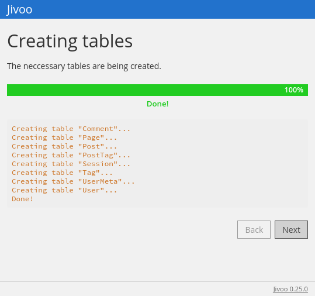
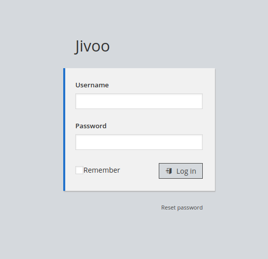
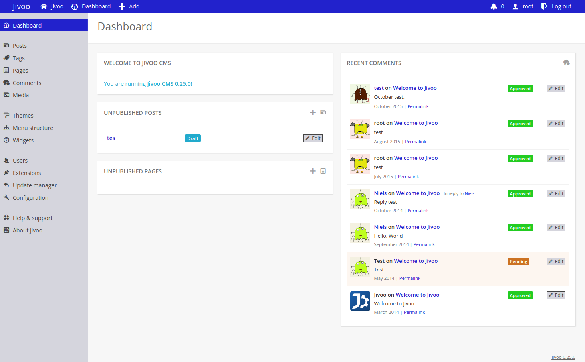
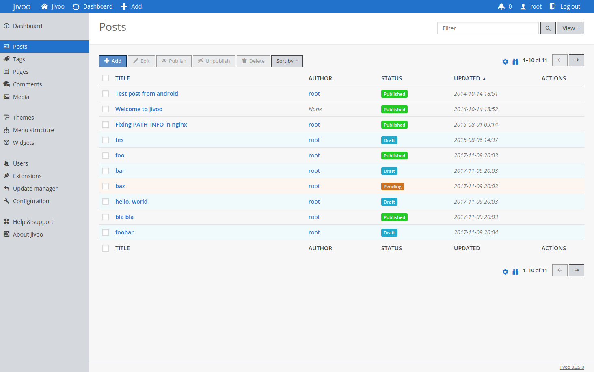
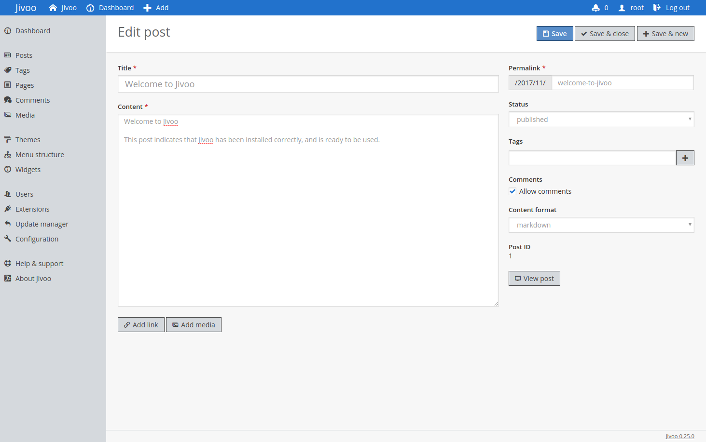
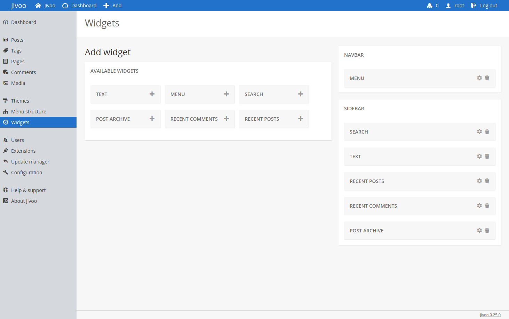
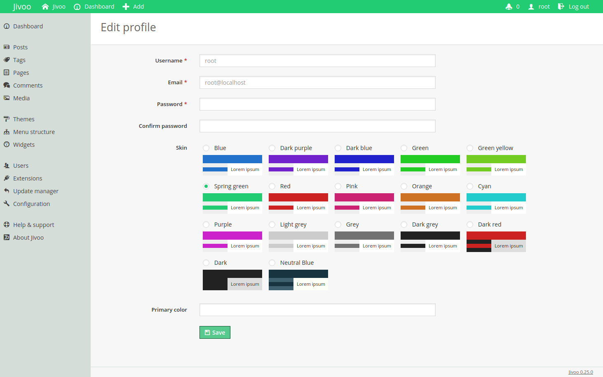
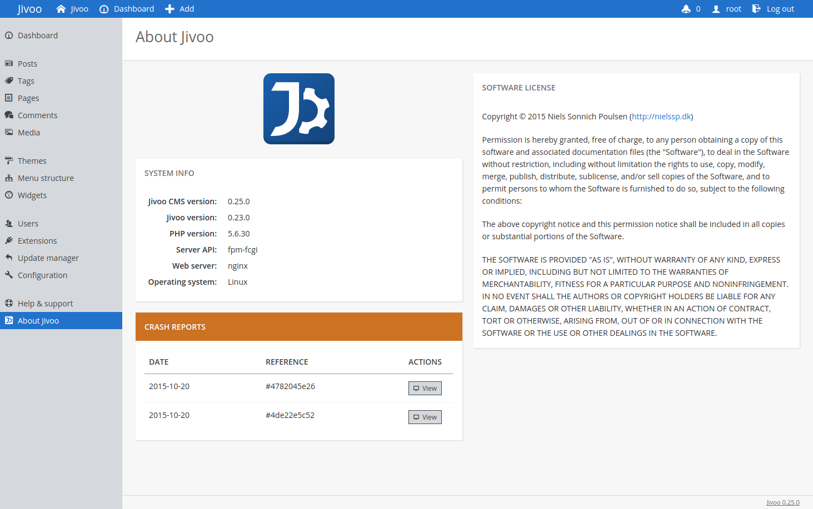
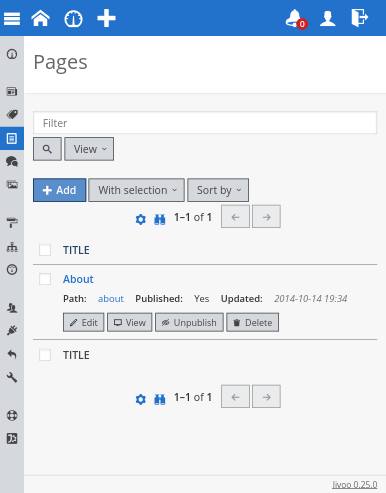
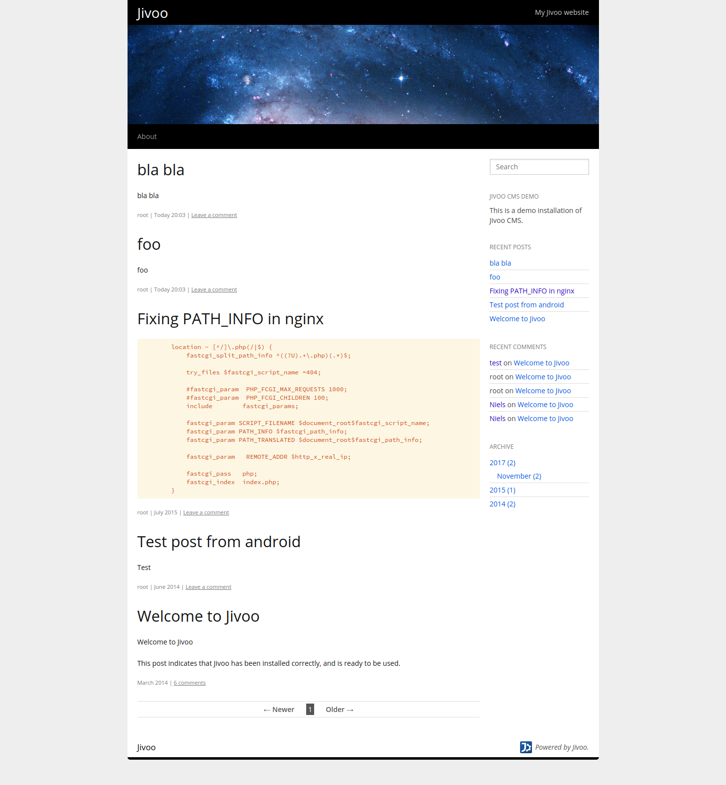

# Jivoo
See also: [PeanutCMS](bs:/things/peanutcms).

Used on: [Agendl](bs:/things/agendl), [nielssp.dk](bs:/things/nielssp-dk), [apakoh.dk](bs:/things/apakoh-dk)

<figure>

<figcaption>Installing the database. There was support for MySQL, PostgreSQL, and SQLite. Jivoo also had support for safely migrating data when updating to a newer version.</figcaption>
</figure>

<figure>

<figcaption>Log in</figcaption>
</figure>

<figure>

<figcaption>Dashboard with posts, pages and comments.</figcaption>
</figure>

<figure>

<figcaption>List of posts with sorting, filtering etc.</figcaption>
</figure>

<figure>

<figcaption>Editing a post</figcaption>
</figure>

<figure>

<figcaption>Widgets</figcaption>
</figure>

<figure>

<figcaption>Administration panel skins!</figcaption>
</figure>

<figure>

<figcaption><q>Jivoo</q> and <q>Jivoo CMS</q> versions.</figcaption>
</figure>

<figure>

<figcaption>Responsive design</figcaption>
</figure>

<figure>

<figcaption>Default frontend theme <q>extraterrestrial</q>. Originally designed in 2010 as part of my 2010 attempt at creating a CMS. Later part of <a href="bs:/things/peanutcms">PeanutCMS</a>. Inspired by the <q>Twenty Ten</q> WordPress theme, which was the default WordPress theme in 2010.  A slightly modified version was also used on <a href="bs:/things/nielssp-dk">nielssp.dk</a>.</figcaption>
</figure>