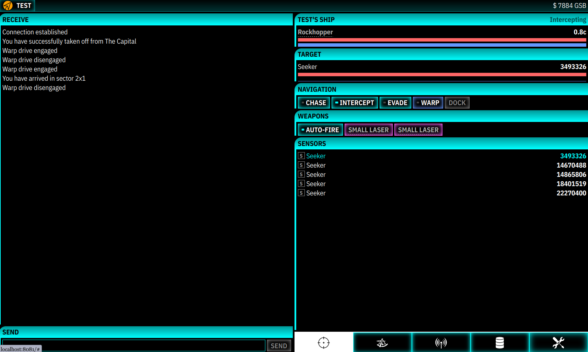
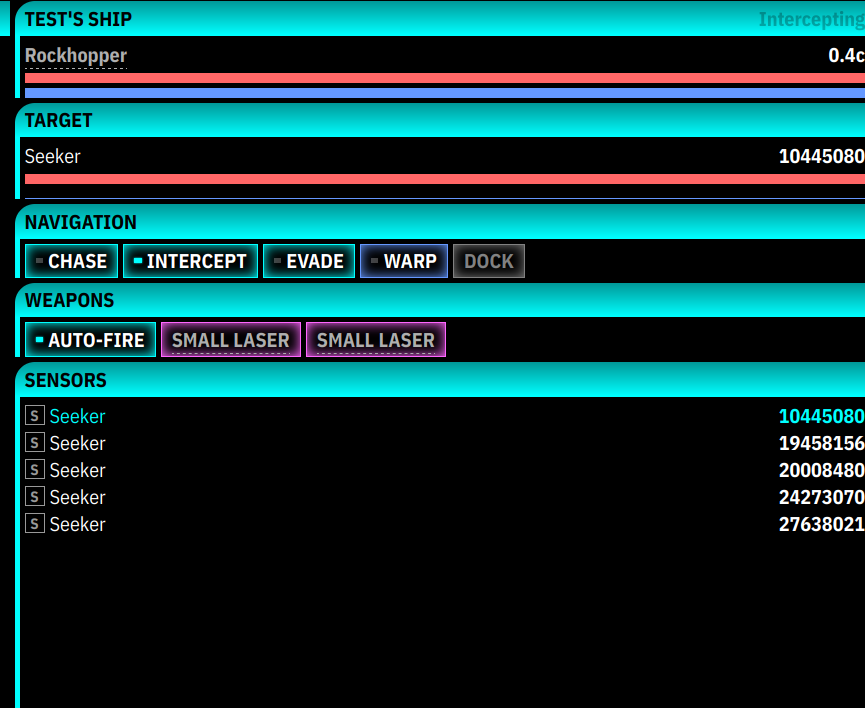
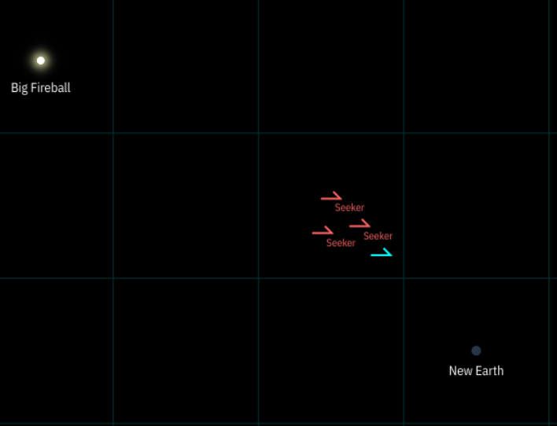
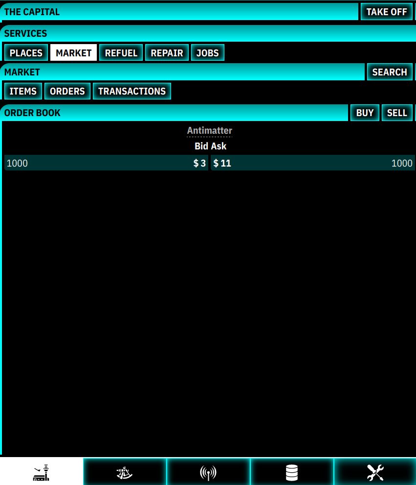
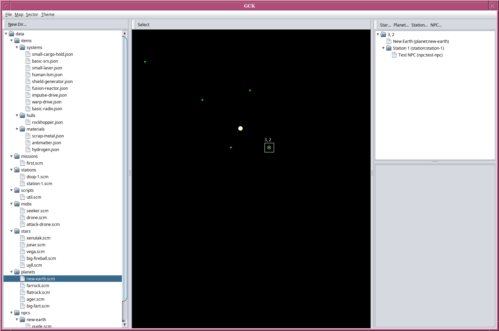
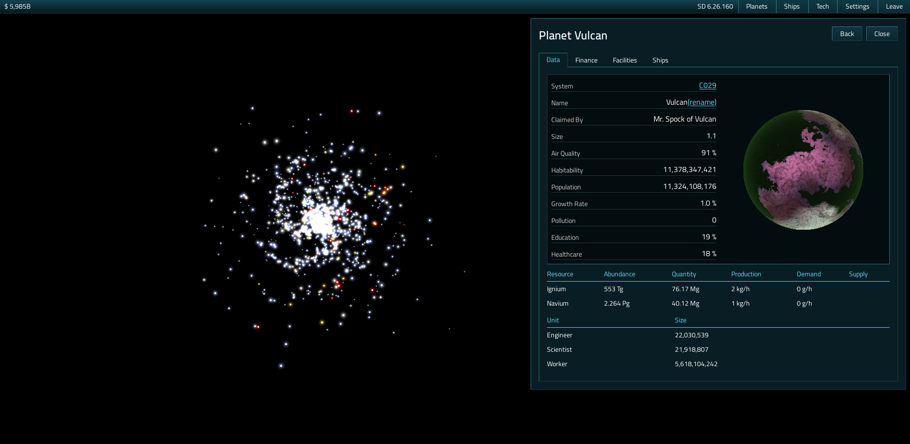

{
  tags: ['game', 'pbbg', 'mug']
}
# MUG

MUG (multi-user galaxy) is a persistent browser based multiplayer RPG that I worked on from July 2021 to February 2023.

[MUG Devlog](/mug)

## Screenshots

<figure>

<figcaption>MUG's user interface.</figcaption>
</figure>

<figure>

<figcaption>Intercepting an AI ship.</figcaption>
</figure>

<figure>

<figcaption>Map showing sectors, enemies, stars, and planets.</figcaption>
</figure>

<figure>

<figcaption>Market system with order book.</figcaption>
</figure>

<figure>

<figcaption>Internal &ldquo;Galaxy Creation Kit&rdquo;.</figcaption>
</figure>

## Older &ldquo;MUG&rdquo;s

I previously used the name MUG for multiple different iterations of an online strategy game in which the player would control one or more planets, build buildings and ships, and conqueror other players. This is what it looked like when I was working on it in 2020:

<figure>

<figcaption>UI showing zoomable map of galaxy and a selected planet.</figcaption>
</figure>

The galaxy and planets were randomly generated.

The UI framework is what eventually turned into [CSTK](https://github.com/nielssp/cstk), which I also used later for the RPG.
