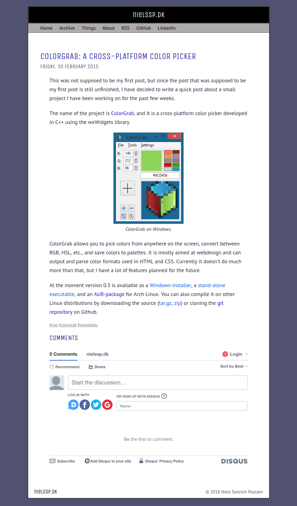
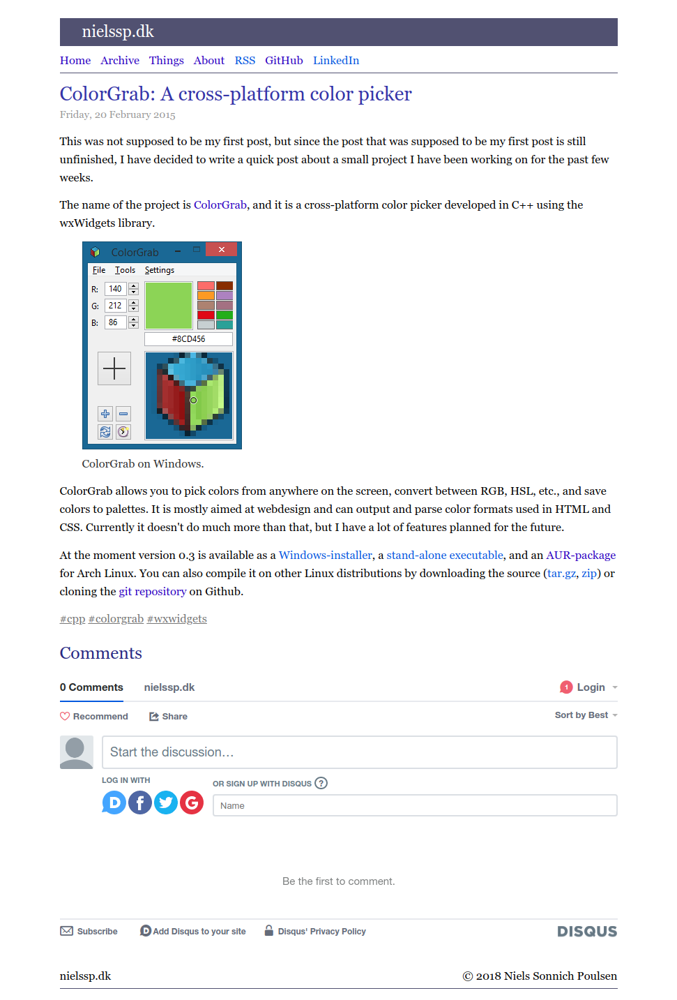

{
  modified: '2021-05-15 16:51'
}
# nielssp.dk
My personal website and blog. Created in October of 2014 using [Jivoo CMS](/things/jivoo). First [blog post](/2015/02/colorgrab-a-crossplatform-color-picker) in February 2015. Replaced Jivoo with [TEXTSTEP](textstep.md) at the end of October 2016. Redesigned (slightly) in May 2018. Started using [Plet](plet.md) as the static site generator instead of TEXTSTEP and made some more design changes in May 2021.

The source code (Plet templates and Markdown content) and all assets are available on [GitHub](https://github.com/nielssp/nielssp.dk).

<figure>

<figcaption>nielssp.dk in 2015 showing design used from October 2014 to October 2016</figcaption>
</figure>

<figure>

<figcaption>nielssp.dk in 2018 showing design used from October 2016 to May 2018</figcaption>
</figure>

<figure>

<figcaption>nielssp.dk in 2018 showing design used from May 2018 to May 2021</figcaption>
</figure>

<figure>

<figcaption>nielssp.dk in 2021 showing design used from May 2021 to April 2022 (on large screens)</figcaption>
</figure>

<figure>

<figcaption>Front page after May 2021</figcaption>
</figure>

<figure>

<figcaption>nielssp.dk in 2022 showing design used from April 2022 onward</figcaption>
</figure>
