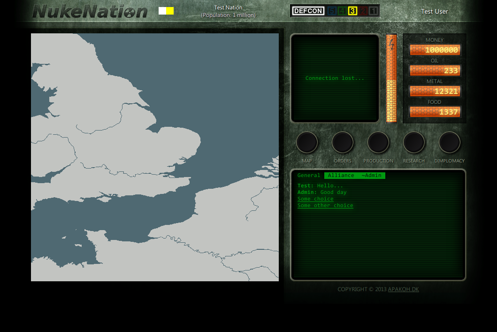
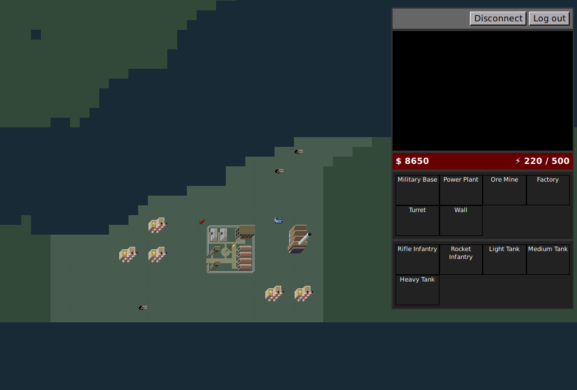
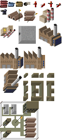
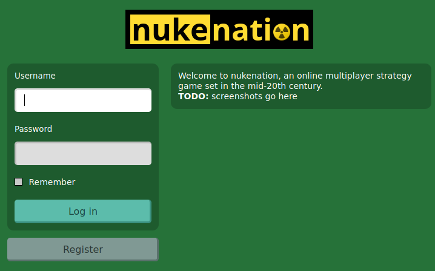
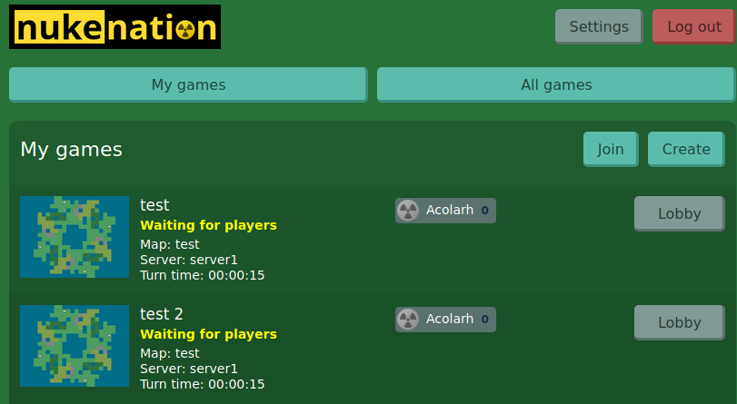
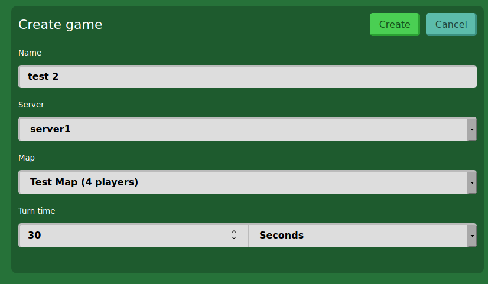
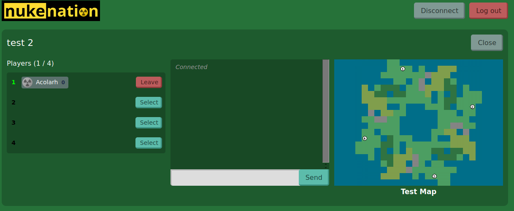
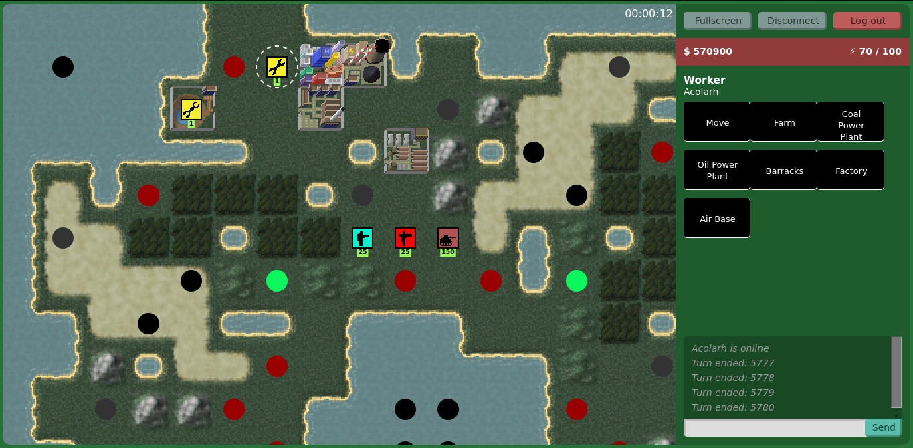
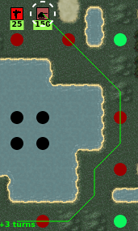
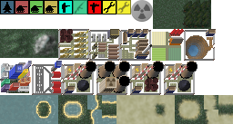

{
  tags: ['game', 'pbbg']
}
# NukeNation

&ldquo;NukeNation&rdquo; is a name I've used for several unsuccessful attempts at creating some sort of online browser-based multiplayer strategy game.

## Earliest mockup (2013–2015?)

I don't remember when exactly I first started making mockups for a game with the title &ldquo;NukeNation&rdquo;, but it seems it might have been around 2013–2015 judging by the copyright year in the below screenshot and the modification timestamps of some of the files I still have access to.

<figure>

<figcaption>NukeNation interface mockup.</figcaption>
</figure>

Other than a  zoomable map, the mockup had no functionality or gameplay. I'm not sure what my ideas for the gameplay were exactly, other than the fact that nuclear weapons would have played a role.

## nn2 (2018)

In 2018 I started from scratch on a new project reusing the same name. This time I created a WebSocket server in Scala and a JavaScript client using a canvas to draw the game map. You could build a couple of different buildings, recruit infantry, and move units around on the map.

<figure>

<figcaption>NukeNation 2</figcaption>
</figure>

My idea was to have a large persistent game world in which players would build bases, gather resources, create armies, and then conquer their neighbors (somehow including nuclear weapons in the mix as well). However, after creating the most basic gameplay, I kind of ran into a wall and didn't see a way to make a viable game.

Another problem I ran into was graphics. I'm primarily a software developer, so my abilities to create graphics for a game are fairly basic. I was never quite happy with the graphics I did create, but I guess I could eventually have paid an artist to make better graphics if I had been able to implement viable gameplay mechanics.

<figure>

<figcaption>Graphics made for NukeNation 2. Licensed under a <a rel="license" href="http://creativecommons.org/licenses/by-sa/4.0/">Creative Commons Attribution-ShareAlike 4.0 International License</a>.</figcaption>
</figure>

## nn2m (2018)

nn2m (NukeNation 2 Mini) was my attempt to rethink NukeNation as a much simpler game. This time, instead of making a single large game world, I wanted to have many small tick-based game worlds with a small number of players (e.g. 4 or more).

I spent some time designing the interface necessary for creating and joining games.

<figure>

<figcaption>Login page</figcaption>
</figure>

<figure>

<figcaption>List of games</figcaption>
</figure>

<figure>

<figcaption>Creating a new game with a short 30 second turn time.</figcaption>
</figure>

It would have been possible to have short games with a short turn time. Alternatively, the turn time could be set to something like 24 hours, in which case players would have plenty of time to log in once a day to make their moves.

<figure>

<figcaption>Waiting for players. At this point the game appears in the list of open games. The game starts when three other players have joined.</figcaption>
</figure>

When the game starts, each player starts with a single city from which workers can be recruited. Each building and unit can perform a single action per turn.

<figure>

<figcaption>Tactical map and sidebar, the circles are different types of resources available on the map (iron, coal, uranium, oil).</figcaption>
</figure>

I implemented a number of different buildings that could be built by the worker unit, and it was also possible to build tanks and recruit infantry. I also implemented path finding such that you could select a unit and order it to move to a certain spot on the map. I did not however implement combat, and ran into a bit of wall trying to decide on how exactly it should work. I couldn't decide on whether to allow multiple units to occupy the same spot on the map, whether units should have some sort of level or experience or other stats, or whether battles should be randomly decided or not.

<figure>

<figcaption>Path finding</figcaption>
</figure>

The building sprites were mostly reworked from the earlier nn2 building sprites. For the different unit types, I ended up just making very simple colored icons. I also created a tile set for the map. Again the graphics are not the best looking, but would probably have been fine for a prototype.

<figure>

<figcaption>Graphics made for NukeNation 2 Mini. Licensed under a <a rel="license" href="http://creativecommons.org/licenses/by-sa/4.0/">Creative Commons Attribution-ShareAlike 4.0 International License</a>.</figcaption>
</figure>
