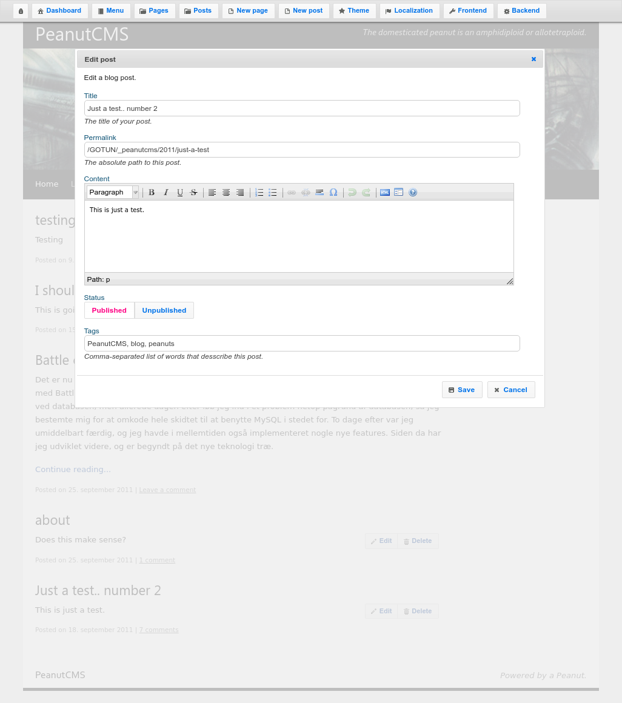
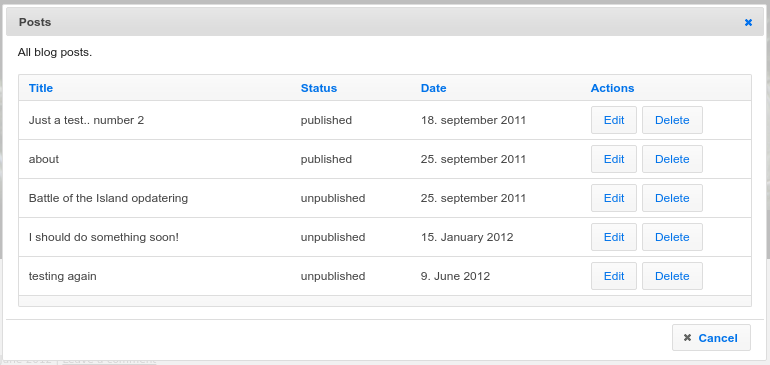
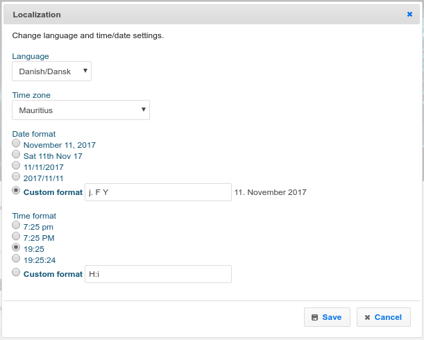
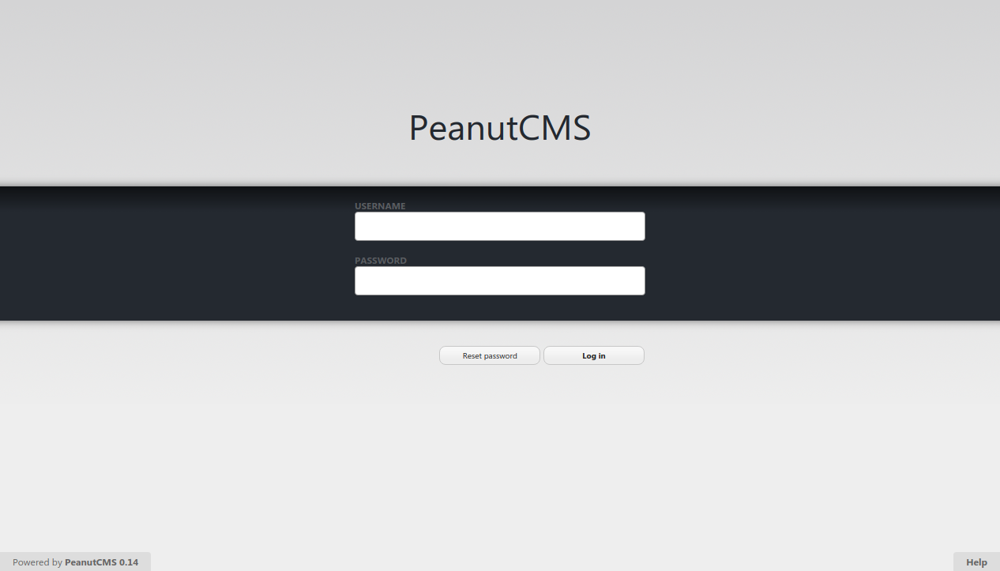
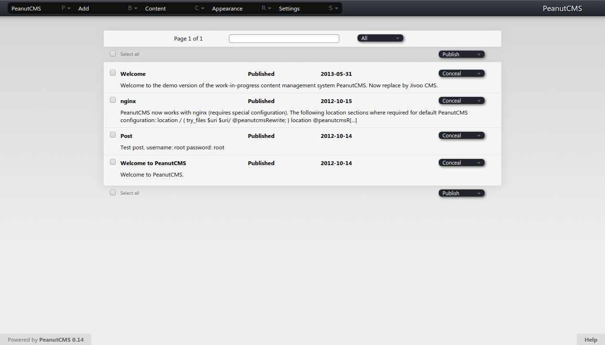
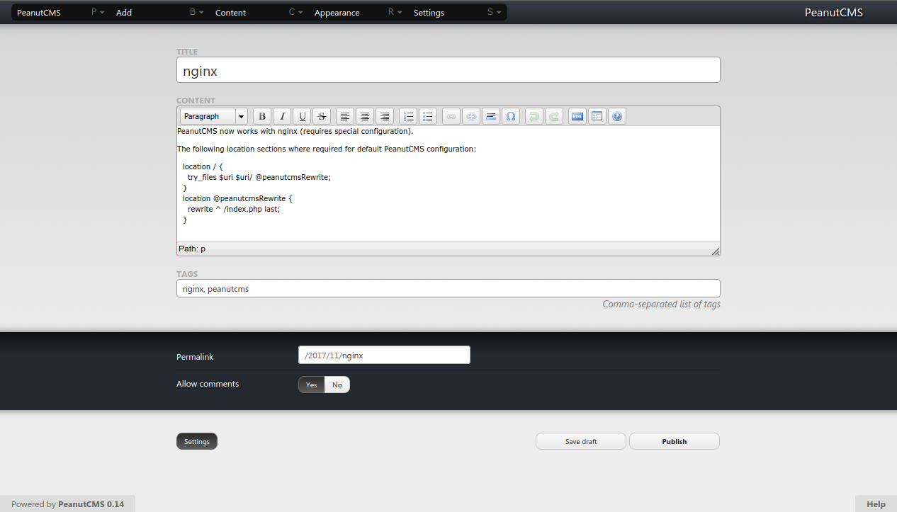
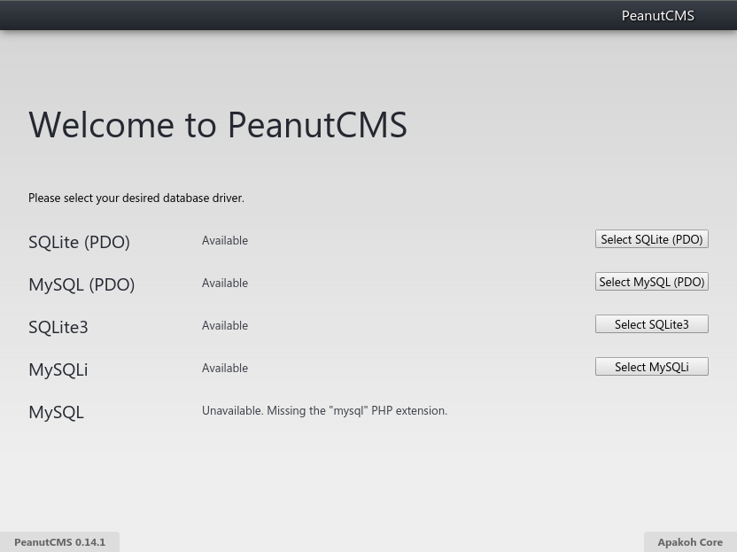

# PeanutCMS
See also: [Jivoo](/things/jivoo).

Timeline:
* 2007 – personal [unnamed blog system](/things/niels-spoweb-dk) for PHP 4, a bit of a mess
* 2010 – starting from scratch trying to make a CMS product, still a bit of a mess and doesn't get very far
* 2011 – PeanutCMS, from scratch, object-oriented, PHP 5
* 2012 – Model–View–Controller, redesign
* 2014 – renamed to [Jivoo](/things/jivoo) while trying to separate the application from the framework

The original PeanutCMS was created in a week or so at the end of August 2011. Unfortunately I wasn't using version control at the time (first commit is from the end of January 2012) so I'm not entirely sure about the details of the early history. However, I do know that the GUI was originally implemented as a page overlay styled using jQuery UI, as displayed in the following screenshots:

<figure>

<figcaption>Editing a post. PeanutCMS menu visible at the top.</figcaption>
</figure>

<figure>

<figcaption>List of posts</figcaption>
</figure>

<figure>

<figcaption>Changing date/time settings</figcaption>
</figure>

As I remember it, most of the functionality (except for theme selection, widgets and menu configuration) were actually there after the first couple of weeks of development. But instead of finishing it I ended up in a cycle of constantly reimplementing, redesigning, and renaming. Interestingly, the above date/time settings as well as all the other settings that could be configured in the GUI, were missing from every subsequent redesign, and were still missing from the last version of [Jivoo CMS](/things/jivoo) in 2015. One of the reasons for that might be that I started focusing more on extendability in later versions, which unfortunately makes everything a lot more complicated.

The first redesign started at some point during late 2011. Until the first redesign all data were stored as files in the file system. In later versions a proper database was used instead, originally with support for MySQL, then later SQLite as well (and PostgreSQL after the rename to Jivoo).
The following screenshots are from the 2012–2014 phase, after the first redesign:

<figure>

<figcaption>Log in</figcaption>
</figure>

<figure>

<figcaption>List of posts</figcaption>
</figure>

<figure>

<figcaption>Editing a post</figcaption>
</figure>

<figure>

<figcaption>Before being renamed to Jivoo, PeanutCMS had support for MySQL and SQLite.</figcaption>
</figure>
