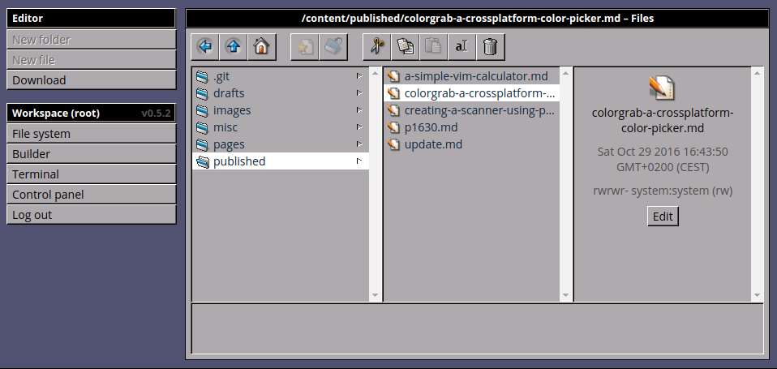
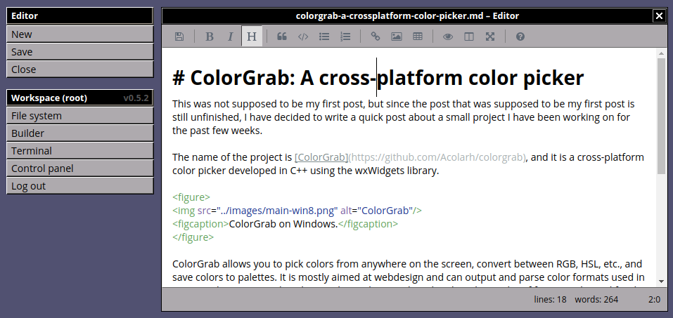
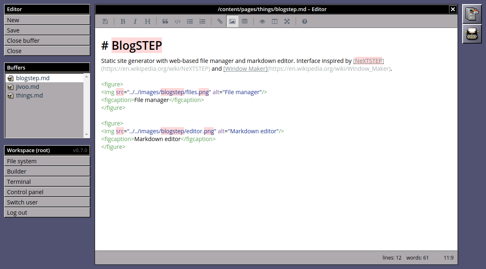
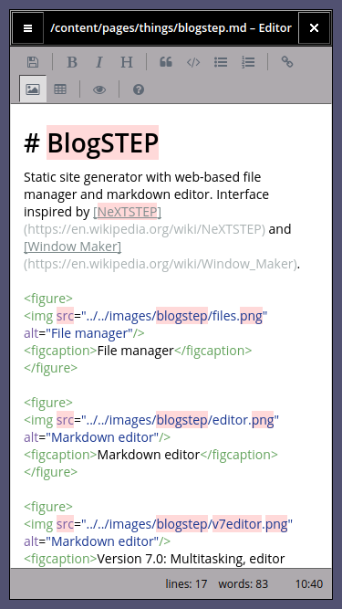
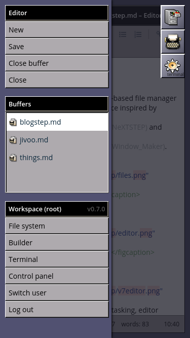
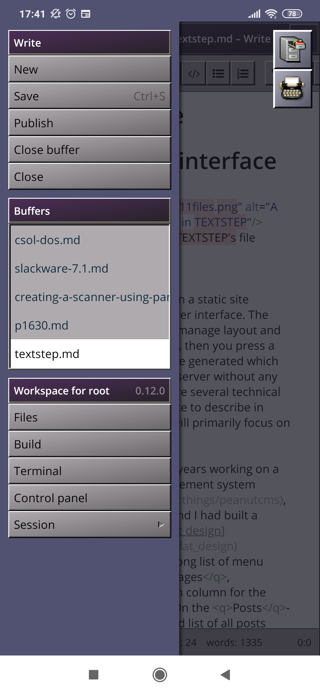

{
  tags: ['textstep', 'cms', 'php', 'static-sites']
}
# TEXTSTEP
TEXTSTEP (previously BlogSTEP) is a static site generator with a web-based file manager and markdown editor. Interface inspired by [NeXTSTEP](https://en.wikipedia.org/wiki/NeXTSTEP) and [Window Maker](https://en.wikipedia.org/wiki/Window_Maker).

Current status (as of June 2021): On hold. I've reimplmented the template language and static site generator in C as part of [Plet](plet.md), and I'm not entirely sure where that leaves TEXTSTEP. I still want to create something like TEXTSTEP in the future.

See also: [Designing the TEXTSTEP user interface](../../published/textstep.md)

<figure>

<figcaption>File manager</figcaption>
</figure>

<figure>

<figcaption>Markdown editor</figcaption>
</figure>

<figure>

<figcaption>Version 0.7 (December 2017): Multitasking, editor buffers, and other improvements.</figcaption>
</figure>

<figure>

<figcaption>Responsive design.</figcaption>
</figure>

<figure>

<figcaption>Responsive design: Menu and dock.</figcaption>
</figure>

<figure>

<figcaption>Version 0.12 (June 2020): Alternative skin: &ldquo;Purple Gradient&rdquo;</figcaption>
</figure>
