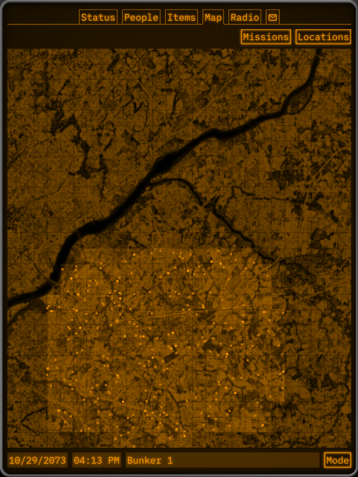
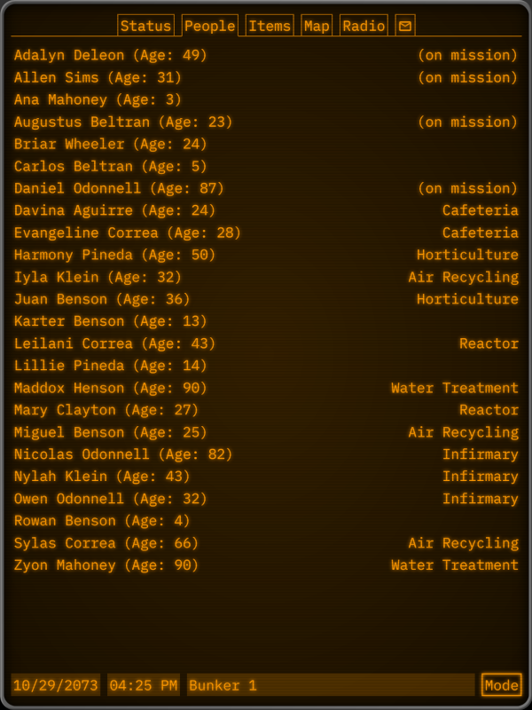

{
  tags: ['game', 'pbbg', 'mug']
}
# Underground Tomorrow

Underground Tomorrow was a persistent browser based game created for [PBBG Jam 2022](https://itch.io/jam/persistent-browser-based-game-jam-2022). The game was text-based and inspired by the Fallout games.

The frontend was implemented in TypeScript using [CSTK](https://github.com/nielssp/cstk) and the backend was implemented in Rust using Actix.

[UndergroundTomorrow.nielssp.dk](https://undergroundtomorrow.nielssp.dk/) (previously UndergroundTomorrow.com)

[Source code on GitHub](https://github.com/nielssp/undergroundtomorrow)

[itch.io page](https://nielssp.itch.io/undergroundtomorrow)

<figure>

<figcaption>World map. Locations were discovered by sending expeditions to a sector. Locations could then be searched for items and resources.</figcaption>
</figure>

<figure>

<figcaption>People.</figcaption>
</figure>
