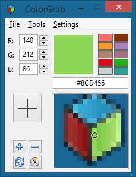

# ColorGrab: A cross-platform color picker
This was not supposed to be my first post, but since the post that was supposed to be my first post is still unfinished, I have decided to write a quick post about a small project I have been working on for the past few weeks.

The name of the project is [ColorGrab](https://github.com/Acolarh/colorgrab), and it is a cross-platform color picker developed in C++ using the wxWidgets library.

<figure>

<figcaption>ColorGrab on Windows.</figcaption>
</figure>

ColorGrab allows you to pick colors from anywhere on the screen, convert between RGB, HSL, etc., and save colors to palettes. It is mostly aimed at webdesign and can output and parse color formats used in HTML and CSS. Currently it doesn't do much more than that, but I have a lot of features planned for the future.

At the moment version 0.3 is available as a [Windows-installer](https://github.com/Acolarh/colorgrab/releases/download/v0.3/ColorGrab-0.3-setup.exe), a [stand-alone executable](https://github.com/Acolarh/colorgrab/releases/download/v0.3/ColorGrab.exe), and an [AUR-package](https://aur.archlinux.org/packages/colorgrab/) for Arch Linux. You can also compile it on other Linux distributions by downloading the source ([tar.gz](https://github.com/Acolarh/colorgrab/archive/v0.3.tar.gz), [zip](https://github.com/Acolarh/colorgrab/archive/v0.3.zip)) or cloning the [git repository](https://github.com/Acolarh/colorgrab) on Github.

<!--{
  "published": "2015-02-20 11:52",
  "tags": ["cpp", "colorgrab", "wxwidgets"]
}-->