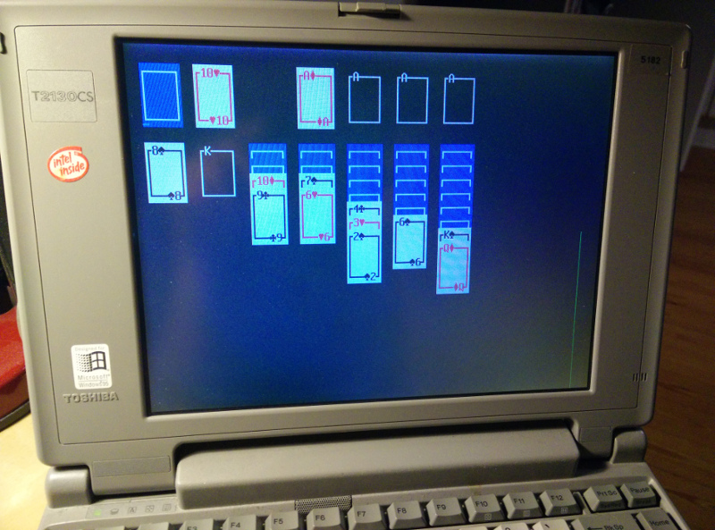

# Porting csol to DOS for no reason
<figure>

<figcaption>csol running in DOS 6.22 on an i486 Toshiba laptop from the mid-'90s.</figcaption>
</figure>

I'm not sure how the thought entered my mind, but I was suddenly curious about how easy it would be to get at somewhat simple ncurses application like csol to run on DOS. Aside from ncurses, I knew csol didn't really have any dependencies other than a C compiler, so I searched for <q>DOS curses</q> and [PDCurses](https://pdcurses.sourceforge.io/) (Public Domain Curses) showed up.

Helpfully, the [PDCurses github repository](https://github.com/wmcbrine/PDCurses/tree/master/dos) contains a list of C compilers for DOS. At first I tried to get DJGPP up and running in DOSBox, but eventually ended up using [Open Watcom](http://www.openwatcom.org/) instead because the installation was simpler. After compiling PDCurses my new DOS development environment was ready. To compile csol with Open Watcom and PDCurses I had to make a number of changes to the source:

**From C99 to ANSI C:** The first step was to remove the use of C99 features from the source code. One such feature is the ability to declare variable anywhere in a block, whereas in ANSI C all declarations must be at the top of the block. This was rather easy to fix by running each source file through `gcc -c -ansi -pedantic` which helpfully lists all incompatibilities.

**From ncurses to pdcurses:** Rather unexpectedly it was enough to just include `curses.h` instead of `ncurses.h` and change a single occurrence of `getmouse(&mouse)` to `nc_getmouse(&mouse)`.

**From POSIX to DOS:** The csol configuration file format has support for including entire directories (e.g. the `games` and `themes` directories). Unfortunately standard C doesn't have any concept of <q>directories</q> so in order to get the contents of a directory I had used the `dirent.h` header which is part of the C POSIX library. No such header is provided by Open Watcom, but I was able to recreate the functionality using the functions `_dos_findfirst()` and `_dos_findnext()` which are part of the `dos.h` header.

Similarly I had used `getopt_long()` from `getopt.h` (a GNU header) to parse command line options. I replaced this with `getopt()` from `unistd.h` (which Open Watcom does include). Unfortunately this means that long options are not currently supported.

**From Unicode to Code page 437:** The default csol theme uses several Unicode characters to draw cards and suits. Since DOS doesn't support Unicode I created a new default theme based on [Code page 437](https://en.wikipedia.org/wiki/Code_page_437) which happens to include the exact same characters I was using in the Unicode theme.

The modified source code is available on [github](https://github.com/nielssp/csol-dos). I've also uploaded a [zip-file](https://github.com/nielssp/csol-dos/releases/download/1.0.0/csol.zip) containing the compiled EXE and configuration files. It works in DOSBox, and I was also able to run it directly from a 3.5&Prime; floppy on my Toshiba T2130CS with a 486. It should also work on older 386 and 286 machines.

<!--{
  "published": "2018-04-19 19:04",
	"tags": ["c", "csol", "ncurses", "solitaire", "dos"]
}-->