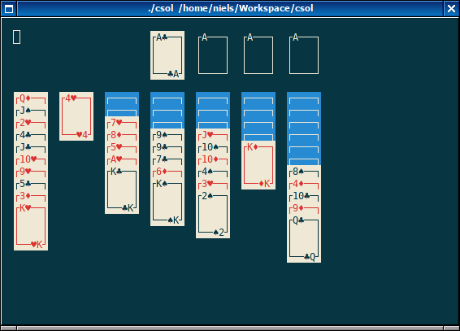

# csol – a small collection of solitaire/patience games for the terminal

There isn't much to say about this one. It started out as a desire to play Yukon in a terminal – I could only find a few implementations of Klondike. So I created [yuk](https://github.com/nielssp/yuk), a simple ncurses-based Yukon implementation in C. I then realized that most of the code could easily be reused to implement other games, such as Klondike and Freecell. The result was [csol](https://github.com/nielssp/csol).

<figure>

<figcaption>A game of Yukon in csol.</figcaption>
</figure>

At the moment, csol includes 5 different solitaire games: Yukon, Klondike, Freecell, Eigh Off (very similar to Frecell), and Russian Solitaire (very similar to Yukon). They are implemented in a simple declarative language I designed for csol. It should be possible to implement a lot more games using it, but unfortunately I don't know that many different solitaire games. csol also has support for different themes using the same declarative language.

Some more screenshots of games and themes, as well as the source code, are available on the [github repository](https://github.com/nielssp/csol). As usual, I've also created an [aur package](https://aur.archlinux.org/packages/csol/).

<!--{
  "published": "2017-11-12 16:05",
	"tags": ["c", "csol", "ncurses", "solitaire"]
}-->