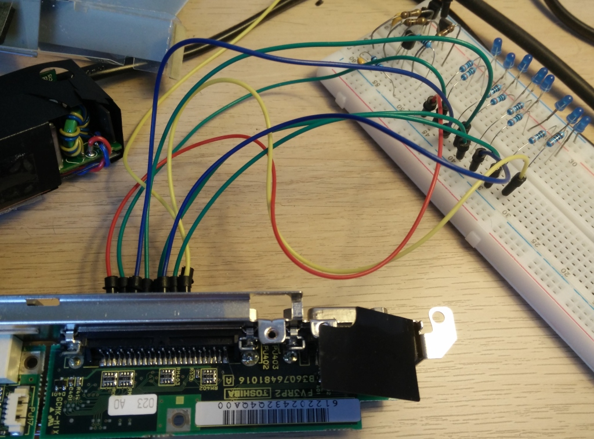
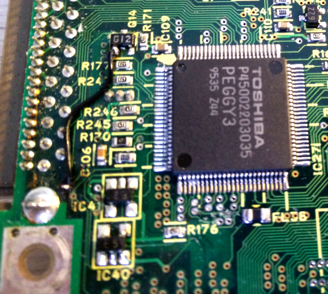
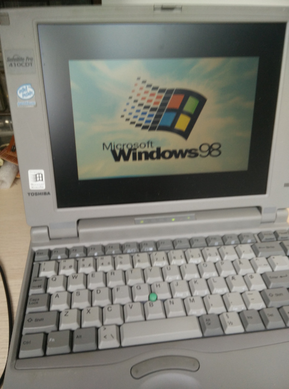

# Bringing a Toshiba Satellite Pro 410CDT back to life
I've [previously mentioned](csol-dos.md) that I have an old Toshiba T2130CS with an Intel 486 processor. With its 24 MB of RAM it will run Windows 95 and even 98, but I'm currently just using it with DOS 6.22 to play an assortment of DOS games. Unfortunately the T2130CS, with its lack of a sound card and its low-contrast [passive-matrix LCD](https://en.wikipedia.org/wiki/Liquid-crystal_display#Passive_and_active-matrix), makes for a less than stellar DOS gaming experience  (but a pretty cool text mode experience).

I also happen to have a similar looking, but slightly more powerful, Toshiba Satellite Pro 410CDT with a Pentium processor, 40 MB of RAM, an active-matrix LCD, and a SoundBlaster-compatible sound card. Sadly, it stopped working more than a year ago. It would power up, but the screen would remain blank. After connecting an external monitor, I could determine that a VGA signal was being produced, but it was completely blank. I had previously saved the laptop from a leaky backup battery (the 410CDT contains three batteries), and although I hadn't noticed any serious damage at the time, I assumed that the issue I was having was related. So I took it apart but was unable to find any visible damage to the the top of the system board. I gave up and didn't expect to ever get it running again.

Recently I took another look at the maintenance manual (which I've used previously when disassembling), and in section 2-4 there's a troubleshooting procedure that uses a special parallel port LED device to indicate status codes while the laptop is booting. I didn't have such a device, but I was able to make one with 8 LEDs+resistors, a breadboard, and some jump wires.

<figure>

<figcaption>My LED status code display connected to the parallel port of the laptop.</figcaption>
</figure>

After powering on the laptop several status codes were shown before settling on 0x18: &ldquo;PIC initialization&rdquo;. According to the manual, the next step when 0x18 is displayed is to replace the system board with a new one. Since I didn't have an easy way of getting a new system board for a more than 20 year old laptop, and since I didn't have the skills, tools, or knowledge to further debug the system board, I once again had to give up.

It was only today, after having the laptop sit partially disassembled on my workbench for a couple of weeks, that I decided to dig further. While I've disassembled the 410CDT a couple of times, I've never actually removed the system board to investigate the back of it. So today I decided to do just that. I was surprised to find a small section of the backside of the system board that was clearly damaged by battery acid. I cleaned it up with a toothbrush and some baking soda, and then started poking around with my multimeter. Initially I wasn't sure what I was looking for, but after zooming in on the area with one of those cheap USB microscopes from eBay, I was able to find a single trace that had been broken. I found the endpoints and used my multimeter to confirm that there was indeed no continuity. I then heated up my soldering iron and added a wire to bypass the broken trace.

<figure>

<figcaption>Bypassing the broken trace with a bit of wire.</figcaption>
</figure>

At first I didn't really expect this to work, but after applying power to the system board and once again connecting the LEDs to the parallel port, I was amazed to see that it no longer settled on 0x18. I quickly reassembled everything and was ecstatic to see the laptop come back to life booting into Windows 98 with the startup sound blasting from the mono speaker.

<figure>

<figcaption>Booting Windows 98 for the first time in over a year.</figcaption>
</figure>

In conclusion, I think that feeling of getting something to work after tinkering with it for several hours is pretty neat. And I guess the moral of the story is that batteries are evil.

<!--{
  "published": "2019-09-14 17:50",
	"tags": ["laptops", "computers", "dos"]
}-->
