{
  published: "2024-11-22 18:30",
  tags: ["javascript", "canvas", "dos"],
  toc_depth: 2,
}

# Notes on ray casting

These are my interactive notes on [ray casting](https://en.wikipedia.org/wiki/Ray_casting). Ray casting (not to be confused with [ray tracing](https://en.wikipedia.org/wiki/Ray_tracing_\(graphics\))) is an obsolete method for rendering 3D scenes (more like 2.5D). It was used in several games in the early 90s, probably most notably in [Wolfenstein 3D](https://en.wikipedia.org/wiki/Wolfenstein_3D). While it was quickly replaced by more sophisticated approaches to 3D rendering (no, [Doom does not use ray casting](https://en.wikipedia.org/wiki/Doom_engine), although it does share some of the same limitations as ray casting engines), it remains a pretty simple way of producing the illusion of a 3D world.

On this page, I'll present the basics of rendering simple 3D environments using ray casting. I'll also describe extensions like textures and sprites and an approach to rendering walls, floors, and ceilings at different height levels. All the examples are implemented in TypeScript (but can easily be adapted to other languages) with demos rendered onto a 2D HTML canvas. All the source code is available on [GitHub](https://github.com/nielssp/raycasting-notes).

I would also suggest reading [Lode's Computer Graphics Tutorial](https://lodev.org/cgtutor/raycasting.html) which is where I've learned the basic techniques.

<div class="toc">
<h2 data-toc-ignore>Contents</h2>
<!--toc-->
</div>

## Minimal ray casting example

First, we need to create a canvas:

```html
<canvas id="canvas"></canvas>
```

We'll then get a reference to the canvas from JavaScript:

```typescript
const canvas = document.getElementById('canvas') as HTMLCanvasElement;
canvas.width = 320;
canvas.height = 200;
canvas.style.imageRendering = 'pixelated';
```

For the demos on this page, I've used a low resolution of 320&times;200 pixels (the same as VGA's [mode 13h](https://en.wikipedia.org/wiki/Mode_13h), as used by many DOS games) both for performance reasons and because I think it looks better.

Next, we'll create the 2D rendering context:

```typescript
const ctx = canvas.getContext('2d')!;
```

The aspect ratio will be needed later to adjust the field of view:

```typescript
const aspectRatio = canvas.width / canvas.height;
```

We use `requestAnimationFrame` to schedule our render code. For each frame, we'll also calculate how much time has passed since the previous frame in seconds. We'll need that later for animations and player movement:

```typescript
let previousTime = 0;
function onAnimationFrame(time: number) {
    const dt = (time - previousTime) / 1000;
    previousTime = time;

    render();

    requestAnimationFrame(onAnimationFrame);
}

requestAnimationFrame(onAnimationFrame);
```

### Map

The map is 2-dimensional and made up of cells that are either solid (wall) or not solid (air).

```typescript
export interface Cell {
    solid: boolean;
}
```

We can initialize the map from an array of strings &ndash; in which Xs represent walls &ndash; as follows:

```typescript
export const map: Cell[][] = [
    'XXXXXXXXXXXXXXXXXXXX',
    'X        X         X',
    'X        X         X',
    'X      X X   X     X',
    'X     XX X   X     X',
    'X        X   X     X',
    'X     XXXXXXXX     X',
    'X                  X',
    'X                  X',
    'X                  X',
    'XXXXXXXXXXXXXXXXXXXX',
].map(row => row.split('').map(cell => {
    return {
        solid: cell === 'X',
    };
}));
export const mapSize: Vec2 = {
    x: map[0].length,
    y: map.length,
};
```

The player's position and orientation on the map will be represented by two vectors:

```typescript
const playerPos: Vec2 = {x: 2, y: 3};
const playerDir: Vec2 = {x: 1, y: 0};
```

The `playerDir` vector is a unit vector (i.e. length 1).

Along with the interface `Vec2`, I'll be using [a few trivial utility functions for adding, subtracting, and multiplying vectors](https://github.com/nielssp/raycasting-notes/blob/main/src/util.ts). 

### Casting rays

To cast rays we'll start at the left side of the screen, then move right one column at a time. To determine the angle of each screen column we'll need a vector that describes the orientation of the camera/screen relative to the map. If we rotate the player's direction vector clockwise by 90 degrees we get a vector that represents the direction of the screen:

```typescript
const cameraPlane = {
    x: -playerDir.y,
    y: playerDir.x,
};
```

With that, the basic loop is as follows:

```typescript
for (const x = 0; x < canvas.width; x++) {
    // TODO
}
```

For each x-coordinate of the canvas, we'll calculate how far from the center of the screen we are proportional to the width of the screen:

```typescript
const cameraX = aspectRatio * x / canvas.width - aspectRato / 2;
```

This gives us a number from `- aspectRatio / 2` to `aspectRatio / 2` where 0 represents the center of the screen. We can multiply this number by the camera plane vector and add the result to the player's direction to get the ray direction vector for the current column:

```typescript
const rayDir = add2(playerDir, mul2(cameraX, cameraPlane));
```

Note that `rayDir` is not a unit vector and its length is only 1 at the center of the screen (where `cameraX` is 0). This will become important later.

<figure>
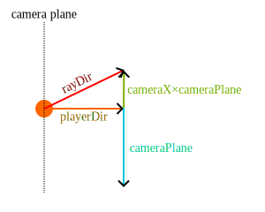
<figcaption>The relationship between the player direction, the camera plane, and the ray direction. The player position is indicated by the orange circle.</figcaption>
</figure>

We'll also need to keep track of the map position (i.e. the indices of the current cell):

```typescript
const mapPos = {
    x: Math.floor(playerPos.x),
    y: Math.floor(playerPos.y),
};
```

To move from cell to cell we'll use an approach based on [digital differential analysis](https://en.wikipedia.org/wiki/Digital_differential_analyzer_\(graphics_algorithm\)) (DDA). We'll need to calculate the following distances:

<figure>
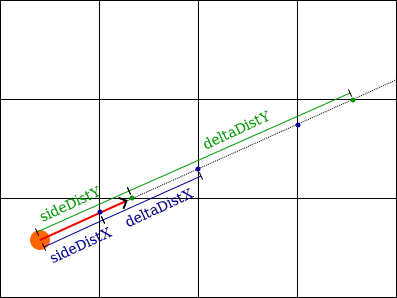
<figcaption>The relationship between the ray direction (in red) and the <code>sideDistX</code>, <code>sideDistY</code>, <code>deltaDistX</code>, and <code>deltaDistY</code> variables. Vertical cell boundary intersections are indicated by blue circles, and horizontal cell boundary intersections are indicated by green circles.</figcaption>
</figure>

`deltaDistX` is how far the ray moves every time `mapPos.x` is incremented (or decremented) while `deltaDistY` is how far the ray moves when `mapPos.y` is incremented. `sideDistX` and `sideDistY` are the initial distances to the nearest vertical and horizontal cell boundaries respectively.

We can use Pythagoras to find `deltaDistX` and `deltaDistY`, e.g. for `deltaDistX` we can see that one side of the triangle has length 1 while the other is as long as the ray travels in the y-direction with each step in the x-direction (`rayDirY / rayDirX`):

```
deltaDistX = sqrt(1 + rayDirY² / rayDirX²)
```

We can simplify this by using Pythagoras again to get an equation for the length of the `rayDir` vector and then isolate `rayDirY²`:

```
rayDirY² = |rayDir|² - rayDirX²
```

Inserted into the equation for `deltaDistX` we get the following:

```
deltaDistX = sqrt(1 + (|rayDir|² - rayDirX²) / rayDirX²)
           = sqrt(1 + |rayDir|² / rayDirX² - rayDirX² / rayDirX²)
           = sqrt(|rayDir|² / rayDirX²)
           = abs(|rayDir| / rayDirX)
```

If we do the same thing for `deltaDistY` we get:

```
deltaDistY = abs(|rayDir| / rayDirY)
```

Using the above distances while ray casting will give us the true Euclidean distance between the player's position and the individual cell boundaries. However, if we use this distance for drawing walls, we'll get a sort of [fisheye lens](https://en.wikipedia.org/wiki/Fisheye_lens) effect where walls appear to be curving away from the camera.

To correct this we can use the fact `rayDir` is not a unit vector and its length is greater the further away we are from the center of the screen. We simply divide both `deltaDistX` and `deltaDistY` by `|rayDir|` (which simplifies the equations to `deltaDistX = abs(1 / rayDirX)` and `deltaDistY = abs(1 / rayDirY)`). This does not affect the DDA process since only the ratio between `deltaDistX` and `deltaDistY` matters.

We can thus initialize the following vector:

```typescript
const deltaDist = {
    x: Math.abs(1 / rayDir.x),
    y: Math.abs(1 / rayDir.y),
};
```

For the first step, the ray only has to travel from the player's position to the nearest cell boundary.
To calculate `sideDistX` in the above example we can simply scale `deltaDistX` by the distance from the player to the nearest vertical cell boundary to the right:

```
sideDistX = (1 - (playerPosX - mapPosX)) * deltaDistX
```

If the ray had been pointing to the left instead of to the right (i.e. when `rayDirX` is negative) we would instead have used the distance to the nearest cell boundary to the left:

```
sideDistX = (playerPosX - mapPosX) * deltaDistX
```

We do the same thing for `sideDistY`. At the same time, we'll also determine whether to increment or decrement the coordinates with each step (the `step` vector): 

```typescript
const sideDist = {x: 0, y: 0};
const step = {x: 0, y: 0};
if (rayDir.x < 0) {
    // Move left with each x-step
    step.x = -1;
    sideDist.x = (playerPos.x - mapPos.x) * deltaDist.x;
} else {
    // Move right with each x-step
    step.x = 1;
    sideDist.x = (1 - playerPos.x + mapPos.X) * deltaDist.x;
}
if (rayDir.y < 0) {
    // Move up with each y-step
    step.y = -1;
    sideDist.y = (playerPos.y - mapPos.y) * deltaDist.y;
} else {
    // Move down with each y-step
    step.y = 1;
    sideDist.y = (1 - playerPos.y + mapPos.y) * deltaDist.y;
}
```

Whenever we advance the ray we'll keep track of whether we've hit a vertical (0) or a horizontal (1) cell boundary:

```typescript
let side = 0;
```

We'll also keep track of the &ldquo;perpendicular wall distance&rdquo;, which &ndash; due to the previous correction of `deltaDist` &ndash; is the distance from the camera plane to the current ray position (rather than the Euclidean distance from the player position to the ray position):

```typescript
let perpWallDist = 0;
```

We'll put all the above calculations into a `createRay` function and return the results as an object with the following type:

```typescript
export interface Ray {
    x: number;
    rayDir: Vec2;
    mapPos: Vec2;
    deltaDist: Vec2;
    sideDist: Vec2;
    step: Vec2;
    side: 0 | 1;
    perpWallDist: number;
}
```

With that, the basic ray casting loop is as follows:

```typescript
const ray = createRay(canvas, aspectRatio, playerPos, playerDir, x, cameraPlane);
while (true) {
    advanceRay(ray);
    const cell = getMapCell(map, ray.mapPos, mapSize)
    if (!cell) {
        break;
    } else if (cell.solid) {
        renderWall(canvas, ctx, ray);
        break;
    }
}
```

With each iteration, we'll advance the ray and check whether the cell at the current map position is solid. To advance the ray we need to take one step in either the x-direction or the y-direction. Te relative sizes of `sideDistX` and `sideDistY` determine this.

If `sideDistX` is less than `sideDistY` it means we've hit a vertical cell boundary. We set the `perpWallDist` to `sideDistX` and then add `deltaDistX` to `sideDistX` (which means `sideDistX` is now the distance to the next vertical cell boundary). If `sideDistY` is greater than `sideDistX` we do the same but for `sideDistY`.

This gives us the following function for advancing the ray:

```typescript
export function advanceRay(
    ray: Ray,
) {
    if (ray.sideDist.x < ray.sideDist.y) {
        ray.perpWallDist = ray.sideDist.x;
        ray.sideDist.x += ray.deltaDist.x;
        ray.mapPos.x += ray.step.x;
        ray.side = 0;
    } else {
        ray.perpWallDist = ray.sideDist.y;
        ray.sideDist.y += ray.deltaDist.y;
        ray.mapPos.y += ray.step.y;
        ray.side = 1;
    }
}
```

This way, after calling `advanceRay`, `ray.mapPos` points at the current cell while `ray.perpWallDist` is the distance to the cell.

We now have enough to create a simple 2D demonstration of the ray casting process:

<figure>
<canvas id="canvas1b" width="600" height="480" tabindex=0></canvas>
<figcaption>32 columns of ray casting.</figcaption>
</figure>

[Source code](https://github.com/nielssp/raycasting-notes/blob/main/src/demo1b.ts)

Every time the ray passes a vertical cell boundary, a blue circle is drawn. When the ray passes a horizontal cell boundary, a green circle is drawn. A red circle is drawn when a solid cell has been hit.

### Inputs and movement

Player movement is implemented by manipulating the `playerPos` and `playerDir` vectors.

#### Keyboard input

To keep track of key states, we'll use the following type:

``` typescript
interface PlayerInputs {
    moveForward: boolean;
    moveBackward: boolean;
    turnLeft: boolean;
    turnRight: boolean;
    rotationSpeed: number;
}
```

We'll create a simple keyboard listener that updates the input states:

```typescript
export function updateInputs(e: KeyboardEvent, state: boolean, playerInputs: PlayerInputs) {
    switch (e.key) {
        case 'ArrowLeft':
        case 'a':
            playerInputs.turnLeft = state;
            break;
        case 'ArrowRight':
        case 'd':
            playerInputs.turnRight = state;
            break;
        case 'ArrowUp':
        case 'w':
            playerInputs.moveForward = state;
            break;
        case 'ArrowDown':
        case 's':
            playerInputs.moveBackward = state;
            break;
        default:
            return;
    }
    e.preventDefault();
}

canvas.addEventListener('keydown', e => updateInputs(e, true, playerInputs));
canvas.addEventListener('keyup', e => updateInputs(e, false, playerInputs));
```

Then as part of our main rendering loop, we will use the previously calculated `dt` (the number of seconds since the previous frame) to update the player position. We simply multiply `dt` with a constant player speed (in this case 3 cells per second) and multiply the result with `playerDir`. If the player is moving forward we add the resulting vector to `playerPos`, otherwise we subtract it:

```typescript
if (playerInputs.moveForward || playerInputs.moveBackward) {
    const moveSpeed = dt * 3;
    const newPos = {...playerPos};
    if (playerInputs.moveForward) {
        newPos.x += moveSpeed * playerDir.x;
        newPos.y += moveSpeed * playerDir.y;
    } else {
        newPos.x -= moveSpeed * playerDir.x;
        newPos.y -= moveSpeed * playerDir.y;
    }
    setPlayerPos(newPos);
}
```

`setPlayerPos` should do some sort of collision check to prevent the player from moving through walls. A simple collision check can be implemented by finding the cell for the destination position and checking if it's solid or outside the map:

```typescript
const mapPos = {x: Math.floor(pos.x), y: Math.floor(pos.y)};
if (mapPos.x < 0 || mapPos.x >= mapSize.x || mapPos.y < 0 || mapPos.y >= mapSize.y) {
    return false;
}
return !map[mapPos.y][mapPos.x].solid;
```

Turning the camera is done by rotating the `playerDir` vector by multiplying it with a 2D rotation matrix:

```
x' = x * cos(angle) - y * sin(angle)
y' = x * sin(angle) + y * cos(angle)
```

The following example also contains some code for acceleration so that smaller adjustments can be made by tapping the arrow keys.

```typescript
if (playerInputs.turnLeft || playerInputs.turnRight) {
    // Apply acceleration to better allow for small adjustments
    const rotSpeed = dt * 3;
    const rotAccel = dt * 0.6;
    if (playerInputs.turnLeft) {
        playerInputs.rotationSpeed = Math.max(-rotSpeed,
            Math.min(0, playerInputs.rotationSpeed) - rotAccel);
    } else {
        playerInputs.rotationSpeed = Math.min(rotSpeed,
            Math.max(0, playerInputs.rotationSpeed) + rotAccel);
    }
    // Rotate direction vector
    set2(playerDir, {
        x: playerDir.x * Math.cos(playerInputs.rotationSpeed)
            - playerDir.y * Math.sin(playerInputs.rotationSpeed),
        y: playerDir.x * Math.sin(playerInputs.rotationSpeed)
            + playerDir.y * Math.cos(playerInputs.rotationSpeed),
    });
} else {
    playerInputs.rotationSpeed = 0;
}
```

##### Strafing

I didn't implement strafing in any of the demos on this page since the left and right arrow keys are used for turning. But if mouse input is used using A and D to strafe makes for a more modern feeling FPS experience. Strafing can easily be implemented by simply rotating the `playerDir` vector 90 degrees and adding the result to `playerPos`:

```typescript
if (playerInput.strafeLeft || playerInputs.strafeRight) {
    const strafeSpeed = dt * 2;
    const newPos = {...playerPos};
    if (playerInputs.strafeRight) {
        newPos.x -= strafeSpeed * playerDir.y;
        newPos.y += strafeSpeed * playerDir.x;
    } else {
        newPos.x += strafeSpeed * playerDir.y;
        newPos.y -= strafeSpeed * playerDir.x;
    }
    setPlayerPos(newPos);
}
```

Handling forward/backward movement and strafing separately like this does mean that [the player moves faster when doing both at the same time](https://en.wikipedia.org/wiki/Strafing_\(video_games\)#Strafe-running).

### Mouse input

Mouse input is also straightforward for movement and rotation (the 0.005 constant is what determines the mouse sensitivity):

```typescript
document.addEventListener('mousemove', e => {
    // Add or subtract direction vector from position when moving mouse up
    // and down
    const moveSpeed = -0.005 * e.movementY;
    const newPos = add2(playerPos, mul2(moveSpeed, playerDir));
    setPos(newPos);

    // Rotate direction vector when moving mouse left and right
    const rotSpeed = 0.005 * e.movementX;
    set2(playerDir, {
        x: playerDir.x * Math.cos(rotSpeed) - playerDir.y * Math.sin(rotSpeed),
        y: playerDir.x * Math.sin(rotSpeed) + playerDir.y * Math.cos(rotSpeed),
    });
});
```

For the true FPS-experience, you should also lock the cursor to the canvas:

```typescript
canvas.addEventListener("click", () => {
  canvas.requestPointerLock();
});
```

### Rendering walls

Now that we have ray casting and player movement in place it's time to make a simple implementation of the `renderWall` function.

The height of the wall is calculated by dividing the height of the canvas by the distance to the wall:

```typescript
const wallHeight = Math.ceil(canvas.height / ray.perpWallDist);
```

We also need to know  where on the screen the wall starts:

```typescript
const wallY = Math.floor((canvas.height - wallHeight) / 2);
```

For now, we'll just draw vertical lines to render the walls. We'll use the `ray.side` to determine the color of the wall to make sharp corners:

```typescript
ctx.strokeStyle = ray.side ? '#005566' : '#003F4C';
ctx.beginPath()
ctx.moveTo(ray.x + 0.5, Math.max(wallY, 0));
ctx.lineTo(ray.x + 0.5, Math.min(wallY + wallHeight + 1, canvas.height));
ctx.stroke();
```

The result is as follows:

<figure>
<canvas id="canvas1" width="320" height="200" tabindex=0></canvas>
<figcaption>Click to focus. Use the arrow keys or the mouse to move.
</figure>

[Source code](https://github.com/nielssp/raycasting-notes/blob/main/src/demo1.ts)

The floor and ceiling were drawn as two separate filled rectangles. These need to be rendered before the ray casting and wall rendering code:

```typescript
// Sky
ctx.fillStyle = '#333';
ctx.fillRect(0, 0, canvas.width, canvas.height / 2);

// Ground
ctx.fillStyle = '#666';
ctx.fillRect(0, canvas.height / 2, canvas.width, canvas.height / 2);
```

### Shading based on distance

To add some depth we can shade the walls based on the distance from the player. We'll create the following function for determining the brightness based on the current distance (we still use `side` to make the corners sharper):

```typescript
export function getBrightness(dist: number, side: 0 | 1 = 0) {
    return 1 - Math.min(0.8, Math.max(0, (dist - side) / 10));
}
```

The brightness is a number between `0.2` and `1`. We can use the brightness function to set the stroke style when rendering walls:

```typescript
const brightness = getBrightness(ray.perpWallDist, ray.side);
ctx.strokeStyle = `rgb(0, ${85 * brightness}, ${102 * brightness})`;
```

For the sky we'll use a gradient created using `createLinearGradient` (we only need to do this once):

```typescript
const sky = ctx.createLinearGradient(0, 0, 0, canvas.height);
sky.addColorStop(0, '#333');
sky.addColorStop(0.5, '#111');
sky.addColorStop(0.5, '#222');
sky.addColorStop(1, '#666');
```

And render it at the start of each frame:

```typescript
ctx.fillStyle = sky;
ctx.fillRect(0, 0, canvas.width, canvas.height);
```

<figure>
<canvas id="canvas2" width="320" height="200" tabindex=0></canvas>
</figure>

[Source code](https://github.com/nielssp/raycasting-notes/blob/main/src/demo2.ts)

## Texturing walls

To add textures to walls we first need to load some textures. We'll be using the following wall texture:

<figure>
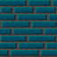
<figcaption>Wall texture.</figcaption>
</figure>

To load textures that can be efficiently used with the canvas we'll first create a function for asynchronously loading images:

```typescript
function loadImage(src: string): Promise<HTMLImageElement> {
    const img = new Image();
    img.src = src;
    return new Promise((resolve, reject) => {
        img.onload = () => resolve(img);
        img.onerror = reject;
    });
}
```

We'll use this function to load the image, then draw it onto a canvas before exporting the image data:

```typescript
async function loadTextureData(src: string): Promise<ImageData> {
    const img = await loadImage(src);
    const canvas = document.createElement('canvas');
    const ctx = canvas.getContext('2d')!;
    canvas.width = img.width;
    canvas.height = img.height;
    ctx.drawImage(img, 0, 0);
    return ctx.getImageData(0, 0, canvas.width, canvas.height);
}
```

The `ImageData` object allows us to read individual pixels from the texture.

We'll load the wall texture:

```typescript
const wallTexture: ImageData = await loadTextureData('wall.png');
```

All the textures in this demo are 64&times;64 pixels:

```typescript
const textureSize = {x: 64, y: 64};
```

We'll need to use `putImageData` to efficiently write individual pixels for each wall slice. We'll update the ray casting loop as follows:

```typescript
for (let x = 0; x < canvas.width; x++) {
    const ray = createRay(canvas, aspectRatio, playerPos, playerDir, x, cameraPlane);
    // Get image data for the current column:
    const stripe = ctx.getImageData(x, 0, 1, canvas.height);
    while (true) {
        advanceRay(ray);
        const cell = getMapCell(map, ray.mapPos, mapSize)
        if (!cell) {
            break;
        } else if (cell.solid) {
            const wall = getWallMeasurements(ray, canvas.height, playerPos);
            renderWall(canvas, stripe, ray, wall, wallTexture);
            break;
        }
    }
    // Update image data for the current column
    ctx.putImageData(stripe, x, 0);
}
```

`getWallMeasurements` is a new function that calculates `wallHeight` and `wallY` like before, but also calculates a new variable `wallX`. `wallX` determines the distance from the side of the cell wall to the intersection point of the ray. If we multiply `rayDir` by `perpWallDist` we get a vector from the player's position to the wall intersection point (because `perpWallDist` was scaled by `|rayDir|`). If we've hit a horizontal cell boundary we can add the x-coordinate of that vector to the x-coordinate of `playerPos`, then subtract the x-coordinate of `mapPos`. For vertical cell boundaries, we can do the same with the y-coordinates.

<figure>
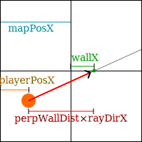
<figcaption>The relationship between the <code>wallX</code>, <code>playerPosX</code>, <code>rayDirX</code>, and <code>mapPosX</code> variables when hitting a horizontal cell boundary.</figcaption>
</figure>

```typescript
let wallX: number;
if (ray.side === 0) {
    // Vertical cell boundary
    wallX = playerPos.y + ray.perpWallDist * ray.rayDir.y - ray.mapPos.y;
} else {
    // Horizontal cell boundary
    wallX = playerPos.x + ray.perpWallDist * ray.rayDir.x - ray.mapPos.x;
}
```

We now have `wallX` as a number from 0 to 1 that determines which part of the wall we're looking at. We can multiply that by the texture width to figure out which column of the texture we need to draw:

```typescript
const texX = (wall.wallX * textureSize.x) & (textureSize.x - 1);
```

We use `& (textureSize.x - 1)` to wrap the texture offset. We could also have used `% textureSize.x` however the modulo operation is measurably slower than bitwise AND. The only limitations are that the texture size must be a power of two (64 in this case) and that all map positions are positive.

We'll also figure out the top and bottom y-coordinates of the wall (we use min and max to ensure that we only draw pixels inside the canvas):

```typescript
const yStart = Math.max(wall.wallY, 0);
const yEnd = Math.min(wall.wallY + wall.wallHeight, canvas.height);
```

For each y-coordinate of the screen, we need to keep track of the y-coordinate of the texture. We'll increment by `step` for each screen pixel. `step` is just texture height divided by the previously calculated wall height:

```typescript
const step = textureSize.y / wall.wallHeight;
```

`texPos` keeps track of the current y coordinate of the texture. If the wall starts above the top of the screen, we need to add as many steps as pixels are missing to the initial value:

```typescript
let texPos = wall.wallY < yStart ? (yStart - wall.wallY) * step : 0;
```

The brightness is calculated in the same way as for the untextured walls. We'll multiply each texture pixel by this number:

```typescript
const brightness = getBrightness(ray.perpWallDist, ray.side);
```

We'll then iterate through each pixel of the wall and copy the correct texture pixel to the canvas image data (`stripe`):

```typescript
for (let y = yStart; y < yEnd; y++) {
    // Each pixel is 4 bytes wide
    const offset = y * 4;
    const texY = texPos & (textureSize.y - 1);
    texPos += step;
    const texOffset = (texY * textureSize.x + texX) * 4;
    // Red
    stripe.data[offset] = wallTexture.data[texOffset] * brightness;
    // Green
    stripe.data[offset + 1] = wallTexture.data[texOffset + 1] * brightness;
    // Blue
    stripe.data[offset + 2] = wallTexture.data[texOffset + 2] * brightness;
    // Alpha
    stripe.data[offset + 3] = 255;
}
```

<figure>
<canvas id="canvas3" width="320" height="200" tabindex=0></canvas>
</figure>

[Source code](https://github.com/nielssp/raycasting-notes/blob/main/src/demo3.ts)

With the above code, textures are always drawn north-to-south for vertical cell boundaries and west-to-east for horizontal cell boundaries. This means that on west and south walls the texture is actually flipped horizontally. It doesn't matter for the textures used here, but the textures can easily be flipped with the following code:

```typescript
// West wall
if (ray.side === 0 && ray.rayDir.x < 0) {
    texX = textureSize.x - texX - 1;
}
// South wall
if (ray.side === 1 && ray.rayDir.y > 0) {
    texX = textureSize.x - texX - 1;
}
```

## Texturing floors 

There are several different approaches to rendering floors (and ceilings). I've picked the following approach because it makes it relatively easy to have different floor and ceiling heights for cells (implemented in a later section).

The basic idea is that while advancing a ray we'll concurrently render the floors for the cells the ray passes through. We'll keep track of how much floor we've rendered for the current column with the following variable:

```typescript
let yFloor = 0;
```

Floors start at the bottom of the screen, so here 0 actually means the bottom row of the screen.

Each time the ray hits a cell we'll calculate where the floor should stop, i.e. just below the wall (even if there isn't a wall there):

```typescript
const cellY = Math.ceil((canvas.height - wall.wallHeight) * 0.5);
```

This also means that we need to call `getWallMeasurements` every time we advance the ray, not just when we've hit a wall. 

To map the floor texture we'll use the previously calculated `wallX` to determine which part of the floor texture we should draw. `floorXWall` and `floorYWall` are the exact map coordinates for the point where the ray hits the cell boundary:

```typescript
let floorXWall: number, floorYWall: number;
if (ray.side === 0) {
    floorXWall = ray.mapPos.x;
    floorYWall = ray.mapPos.y + wallX;
    if (ray.rayDir.x < 0) {
        // West
        floorXWall += 1;
    }
} else {
    floorXWall = ray.mapPos.x + wallX;
    floorYWall = ray.mapPos.y;
    if (ray.rayDir.y < 0) {
        // North
        floorYWall += 1;
    }
}
```

We'll render floor pixels from the bottom of the screen (or the previous floor tile which ended at `yFloor`) until we reach `cellY`:

```typescript
while (yFloor < cellY) {
    const y = (canvas.height - yFloor - 1);
    mapFloorTexture(canvas, stripe, y, floor, playerPos, yFloor, perpWallDist, floorTexture);
    yFloor++;
}
```

Because `yFloor` starts from the bottom of the screen, the actual `y`-coordinate of the screen pixel must be calculated.

For each pixel we'll determine how far from the screen plane that pixel is:

```typescript
const rowDistance = canvas.height / (canvas.height - 2 * yFloor);
```

We use this to calculate a weight that determines how close we are to the cell boundary (1 means we're at the cell boundary):

```typescript
const weight = rowDistance / perpWallDist;
```

We'll use the weight to determine the exact map coordinates corresponding to the current screen pixel:

```typescript
const floorX = weight * floor.floorXWall + (1 - weight) * playerPos.x;
const floorY = weight * floor.floorYWall + (1 - weight) * playerPos.y;
```

This can then be turned into texture coordinates, and the correct texture pixel can be drawn to the screen:

```typescript
let tx = (textureSize.x * floorX) & (textureSize.x - 1);
let ty = (textureSize.y * floorY) & (textureSize.y - 1);
const texOffset = (ty * textureSize.x + tx) * 4;
const brightness = getBrightness(rowDistance);
const offset = y * 4;
stripe.data[offset] = floorTexture.data[texOffset] * brightness;
stripe.data[offset + 1] = floorTexture.data[texOffset + 1] * brightness;
stripe.data[offset + 2] = floorTexture.data[texOffset + 2] * brightness;
stripe.data[offset + 3] = 255;
```

We'll use the following floor texture:

<figure>
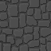
<figcaption>Floor texture.</figcaption>
</figure>

<figure>
<canvas id="canvas5" width="320" height="200" tabindex=0></canvas>
</figure>

[Source code](https://github.com/nielssp/raycasting-notes/blob/main/src/demo5.ts)

## Texturing ceilings

We can texture ceilings the same way as we textured the floors. We'll initialize the variable `yCeiling` to 0 a the start of each ray:

```typescript
let yCeiling = 0;
```

The only difference from floors is that since ceilings start from the top of the screen, we can use `yCeiling` directly:

```typescript
while (yCeiling < cellY) {
    mapFloorTexture(canvas, stripe, yCeiling, floor, playerPos, yCeiling, perpWallDist, ceilingTexture);
    yCeiling++;
}
```

We'll use the following ceiling texture:

<figure>
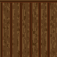
<figcaption>Ceiling texture.</figcaption>
</figure>

And here's the result:

<figure>
<canvas id="canvas6" width="320" height="200" tabindex=0></canvas>
</figure>

[Source code](https://github.com/nielssp/raycasting-notes/blob/main/src/demo6.ts)

## Cell textures

We're currently using the same texture for every wall, the same texture for every floor tile, and the same texture for every ceiling tile. We can extend the `Cell` type to include information about which texture to draw instead:

```typescript
export interface Cell {
    solid: boolean;
    wallType: string;
    floorType: string;
    ceilingType: string;
    wallTexture?: ImageData;
    floorTexture?: ImageData;
    ceilingTexture?: ImageData;
}
```

We'll extend the map format with additional information about texture types for both walls, floors, and ceilings:

```typescript
const walls = [
    'WWWWWRWWWRRRRRWWWWWW',
    'W        R         W',
    'W        R         W',
    'W      W R   R     W',
    'W     WW R   R     W',
    'W        R   R     W',
    'W     RRRRRRRR     W',
    'W                  W',
    'W                  W',
    'W                  W',
    'WWWWWWWWWWWWWWWWWWWW',
];

const floors = [
    'FFFFFFFFFFFFFFFFFFFF',
    'FFFFFFFFFFFFFFFFFFFF',
    'FFFFFFFFFFFFFFFFFFFF',
    'FFFFGGGGGGGGGFFFFFFF',
    'FFFFGGGGGGGGGFFFFFFF',
    'FFFFGGGGGGGGGFFFFFFF',
    'FFFFFFFFFFFFFFFFFFFF',
    'FFFFFFFFFFFFFFFFFFFF',
    'FFFFFFFFFFFFFFFFFFFF',
    'FFFFFFFFFFFFFFFFFFFF',
    'FFFFFFFFFFFFFFFFFFFF',
];

const ceilings = [
    'CCCCCCCCCCCCCCCCCCCC',
    'CCCCCCCFFFCCCCCCCCCC',
    'CCCCCCCFFFCCCCCCCCCC',
    'CCCCCCCCCCCCCCCCCCCC',
    'CCCCCCCCCCCCCCCCCCCC',
    'CCCCCCCCCCCCCCCCCCCC',
    'CCCCCCCCCCCCCCCCCCCC',
    'CCCCCCCCCCCCCCCCCCCC',
    'CCCCCCCCCCCCCCCCCCCC',
    'CCCCCCCCCCCCCCCCCCCC',
    'CCCCCCCCCCCCCCCCCCCC',
];
```

```typescript
export const map: Cell[][] = walls.map((row, y) => {
    const floorTypes = floors[y].split('');
    const ceilingTypes = ceilings[y].split('');
    return row.split('').map((wallType, x) => {
        return {
            solid: wallType !== ' ',
            wallType,
            floorType: floorTypes[x],
            ceilingType: ceilingTypes[x],
        };
    })
});
```

We can load and apply the textures to the map like this:

```typescript
const textures: Partial<Record<string, ImageData>> = Object.fromEntries(await Promise.all(Object.entries({
    W: loadTextureData('wall.png'),
    R: loadTextureData('wall-red.png'),
    F: loadTextureData('floor.png'),
    G: loadTextureData('floor-green.png'),
    C: loadTextureData('ceiling.png'),
}).map(async ([k, p]) => [k, await p])));
map.forEach(row => row.forEach(cell => {
    cell.wallTexture = textures[cell.wallType];
    cell.floorTexture = textures[cell.floorType];
    cell.ceilingTexture = textures[cell.ceilingType];
}));
```

The two new textures:

<figure>
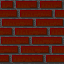
<figcaption>Red wall texture.</figcaption>
</figure>

<figure>
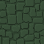
<figcaption>Green floor texture.</figcaption>
</figure>

The only difference in the ray casting loop is that we need to keep track of the floor cell. The floor cell is always the cell before the current cell. With that, we can apply the floor cell's floor and ceiling textures to the floor and ceiling, and apply the current cell's wall texture to the wall if the cell is solid:

```typescript
let floorCell = getMapCell(map, ray.mapPos, mapSize)
while (true) {
    advanceRay(ray);
    const cell = getMapCell(map, ray.mapPos, mapSize)
    if (!cell) {
        break;
    }
    const wall = getWallMeasurements(ray, canvas.height, playerPos);
    const floor = getFloorMeasurements(ray, wall.wallX);
    [yFloor, yCeiling] = renderFloorAndCeiling(canvas, stripe, wall, floor, playerPos, ray.perpWallDist,
            yFloor, yCeiling, floorCell?.floorTexture, floorCell?.ceilingTexture);

    if (cell.solid) {
        renderWall(canvas, stripe, ray, wall, cell.wallTexture);
        break;
    }
    floorCell = cell;
}
```

<figure>
<canvas id="canvas7" width="320" height="200" tabindex=0></canvas>
</figure>

[Source code](https://github.com/nielssp/raycasting-notes/blob/main/src/demo7.ts)

## Sliding doors

To add sliding doors like in Wolfenstein 3D we'll add the following type:

```typescript
export interface Door {
    sideTexture?: ImageData;
    offset: number;
    active: boolean,
}
```

A door object consists of a side texture (which we'll use to render the side of the door when it's open) and an offset describing how open the door is (0 is closed, 1 is fully open). `active` is used to indicate whether the door is currently being animated. We'll add an optional door field to the `Cell` type which will allow us to configure a cell to be a door:

```typescript
export interface Cell {
    // ...
    door?: Door;
}
```

We'll use the following wall texture for the door:

<figure>
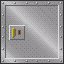
<figcaption>Door texture.</figcaption>
</figure>

When the door is opening we'll use the following 8 pixels wide texture for the side of the door:

<figure>
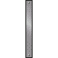
<figcaption>Door side texture. It's 64 pixels wide but only the 8 pixels in the middle will be rendered.</figcaption>
</figure>

We'll set up the following constants to determine the depth of the wall:

```typescript
const doorDepth = 1 / 8; // 64px / 8 = 8px
const doorStart = 0.5 - doorDepth / 2;
const doorEnd = doorStart + doorDepth
```

The basic idea is illustrated below. When the ray hits a cell with a door we'll check what part of the door, if any, the ray intersects. 

<figure>
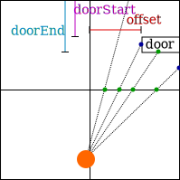
<figcaption>Four rays hitting a door cell. The door is partially open, so one ray continues through the gap between the door and the wall to the left.</figcaption>
</figure>

We'll update the wall-rendering part of the ray casting loop to call a new door-rendering function if the current cell has a door:

```typescript
if (cell.door) {
    if (renderDoor(canvas, stripe, cell, cell.door, ray, playerPos, floor, yFloor, yCeiling)) {
        break;
    }
} else if (cell.solid) {
    renderWall(canvas, stripe, ray, wall, cell.wallTexture);
    break;
}
```

Note that the new `renderDoor` function returns a boolean to tell whether we should keep advancing the ray or if the ray has hit the door part of the cell.

For the `renderDoor` implementation we'll start by saving the current `perpWallDist` since we'll need it later when rendering the floor and ceiling of the door cell. This is because we'll be partially advancing the ray and thus updating `perpWallDist`, however, `perpWallDist` is used for aligning the floor and ceiling textures so if `perpWallDist` isn't the distance to a cell boundary, the textures will be incorrectly aligned:

```typescript
const floorWallDist = ray.perpWallDist;
```

Next, we'll do a calculation very similar to the calculation we did to calculate `wallX`. We'll find what part of the door the ray intersects with by extending the ray by `doorStart` times the `deltaDist` corresponding to side of the cell that we've hit:

```typescript
let doorX: number;
if (ray.side === 0) {
    doorX = playerPos.y
        + (ray.perpWallDist + ray.deltaDist.x * doorStart) * ray.rayDir.y
        - ray.mapPos.y;
} else {
    doorX = playerPos.x
        + (ray.perpWallDist + ray.deltaDist.y * doorStart) * ray.rayDir.x
        - ray.mapPos.x;
}
```

The ray may intersect with the plane of the door outside the current cell, in which case `doorX` will be less than 0 or greater than or equal to 1. In that case, we should return false and continue advancing the ray:

```typescript
if (doorX < 0 || doorX >= 1) {
    return false;
}
```

We'll use the following variable to determine whether the texture we should render at the end is the side texture or the wall texture:

```typescript
let doorSide = false;
```

If the door is open or in the process of opening the door's offset field will be non-zero. We'll check if the intersection point is within the open gap between the side of the door and the wall. If that's the case we'll need to extend the ray further to determine whether we're hitting the side of the door or if the ray continues through the opening:

```typescript
if (doorX < door.offset) {
    // The door is partially open and we're looking through the opening
    doorSide = true;
    let doorX: number;
    // Extend ray to the nearest cell boundary (opposite to the original side)
    // then retract by (1 - offset):
    if (ray.side === 0) {
        if (ray.rayDir.y < 0) {
            // We can't see the side of the door because we're facing the other way
            return false;
        }
        doorX = playerPos.x
            + (ray.sideDist.y - ray.deltaDist.y * (1 - door.offset)) * ray.rayDir.x
            - ray.mapPos.x;
    } else {
        if (ray.rayDir.x < 0) {
            // We can't see the side of the door because we're facing the other way
            return false;
        }
        doorX = playerPos.y
            + (ray.sideDist.x - ray.deltaDist.x * (1 - door.offset)) * ray.rayDir.y
            - ray.mapPos.y;
    }
    if (doorX < doorStart || doorX > doorEnd) {
        // We didn't hit the side of the door, continue advancing ray
        return false;
    } else if (ray.side === 0) {
        // We've hit the side of the door, update the ray side and perpWallDist
        ray.side = 1;
        ray.perpWallDist = ray.sideDist.y - ray.deltaDist.y * (1 - door.offset);
    } else {
        // We've hit the side of the door, update the ray side and perpWallDist
        ray.side = 0;
        ray.perpWallDist = ray.sideDist.x - ray.deltaDist.x * (1 - door.offset);
    }
} else if (// ...
```

When we detect a hit the `perpWallDist` is updated to match the distance to part of the wall we've hit so that the door will be rendered correctly.

If `doorX` wasn't less than the door offset it means we've hit the front of the door, so we should update `perpWallDist` so that we can render the door texture at the correct size:

```typescript
} else if (ray.side === 0) {
    // We've hit the door, update the ray's perpWallDist
    ray.perpWallDist += ray.deltaDist.x * doorStart;
} else {
    // We've hit the door, update the ray's perpWallDist
    ray.perpWallDist += ray.deltaDist.y * doorStart;
}
```

Finally, if we haven't returned yet it means we've hit the door so we should render the floor and ceiling in front of the door, and then render the door itself. We select the texture based on the `doorSide` variable:

```typescript
const wall = getWallMeasurements(ray, canvas.height, playerPos);
if (!doorSide) {
    // Move the wall texture by offset
    wall.wallX -= door.offset;
}
renderFloorAndCeiling(canvas, stripe, wall, floor, playerPos, floorWallDist,
    yFloor, yCeiling, cell.floorTexture, cell.ceilingTexture);
renderWall(canvas, stripe, ray, wall, doorSide ? door.sideTexture : cell.wallTexture);
return true;
```

Returning true at the end tells the ray casting loop to break.

<figure>
<canvas id="canvas8" width="320" height="200" tabindex=0></canvas>
<figcaption>Press E or left-click to open doors.</figcaption>
</figure>

[Source code](https://github.com/nielssp/raycasting-notes/blob/main/src/demo8.ts)

## Sprites

To render sprites we'll create the following type:

```typescript
export interface Sprite {
    pos: Vec2;
    texture: ImageData;
    relPos: Vec2;
    relDist: number;
}
```

`pos` is the map position of the sprite while `texture` is the texture that should be rendered. `relPos` and `relDist` are the sprite's position and distance relative to the player, they'll be updated on every frame.

For this demonstration we'll create a global sprite array that contains all sprites on the map:

```typescript
const sprites: Sprite[] = [];
```

We'll use the following barrel sprite:

<figure>
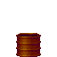
<figcaption>Barrel sprite.</figcaption>
</figure>

Then load the texture and create two sprites:

```typescript
const barrelTexture = await loadTextureData('barrel.png');
sprites.push(createSprite({x: 4, y: 3}, barrelTexture));
sprites.push(createSprite({x: 5, y: 2.75}, barrelTexture));
```

`createSprite` creates a sprite object with the given position and texture. It also initializes `relPos` to `{x: 0, y: 0}` and `relDist` to 0.

We'll update the main ray casting loop with an array as wide as the canvas to keep track of the distance to each rendered wall segment. We'll use this to determine whether a sprite is behind a wall or not:

```typescript
const zBuffer = Array(canvas.width);
for (let x = 0; x < canvas.width; x++) {
    // ...
    zBuffer[x] = ray.perpWallDist;
}
```

Then after all ray casting is done we'll iterate over all the sprites and update their position relative to the player and their distance to the player. We'll then sort the sprite array by the `relDist` field in descending order such that sprites closest to the player are rendered last:

```typescript
for (const sprite of sprites) {
    sprite.relPos = sub2(sprite.pos, playerPos);
    sprite.relDist = sprite.relPos.x * sprite.relPos.x + sprite.relPos.y * sprite.relPos.y;
}
sprites.sort((a, b) => b.relDist - a.relDist);
```

With the sprites sorted and the relative positions calculated we're ready to iterate over all the sprites:

```typescript
for (const sprite of sprites) {
    // ...
}
```

For each sprite, we'll have to determine where on the screen it should be drawn. To do that we'll transform the `relPos` vector from the map coordinate system to the screen coordinate system (where x is negative on the left side of the screen, positive on the right, and y extends into the screen):


<figure>
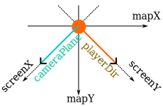
<figcaption>How the screen coordinate system relates to the player's direction and the screen plane in the map coordinate system.</figcaption>
</figure>

The `cameraPlane` is defined in terms of map coordinates and its angle relative to the map x-axis can be described in terms of the rotation matrix (because it's a unit vector):

```
[ cameraPlaneX  -cameraPlaneY ]
[ cameraPlaneY   cameraPlaneX ]
```

To transform a point from the map coordinate system to the screen coordinate system we need first to undo this rotation, we can do this simply by inverting the rotation matrix:

```
[  cameraPlaneX  cameraPlaneY ]
[ -cameraPlaneY  cameraPlaneX ]
```

We'll also see from the illustration above that the y-axis ends up pointing in the opposite direction, so we'll need to negate the y-coordinate. This gives us the final transformation of the sprite's position:

```typescript
const transform: Vec2 = {
    x: cameraPlane.x * sprite.relPos.x + cameraPlane.y * sprite.relPos.y,
    y: cameraPlane.y * sprite.relPos.x - cameraPlane.x * sprite.relPos.y,
};
```

`transform.y` is the distance to the sprite from the screen plane, so we can use it much the same as we used `perpWallDist`. First, we'll check if it's negative because that means that the sprite is behind us and shouldn't be rendered:

```typescript
if (transform.y <= 0) {
    continue;
}
```

We'll then scale and position the sprite horizontally on the canvas. The width of the sprite is simply the height of the canvas divided by the distance to the sprite (`transform.y`). We'll do the same thing to find its horizontal position while also dividing by the aspect ratio (since we multiplied by the aspect ratio back when we calculated `cameraX` to render walls):

```typescript
const spriteWidth = Math.floor(canvas.height / transform.y);
const spriteScreenX = Math.floor(
    canvas.width * (0.5 + transform.x / (aspectRatio * transform.y)));
```

`drawStartX` and `drawEndX` are used to determine where on the screen the sprite starts and ends horizontally:

```typescript
const drawStartX = Math.max(0, Math.floor(spriteScreenX - spriteWidth / 2));
const drawEndX = Math.min(canvas.width, Math.floor(spriteScreenX + spriteWidth / 2 ));
const xMax = drawEndX - drawStartX;
```

If `xMax` is less than 1, it means the sprite is outside the player's field of view and we can skip it entirely:

```typescript
if (xMax < 1) {
    continue;
}
```

Since our sprite texture is square, the height of the sprite is the same as the width. The sprite is positioned vertically in the center of the screen:

```typescript
const spriteHeight = spriteWidth;
const spriteScreenY = Math.floor(canvas.height / 2 - spriteHeight / 2);
const drawStartY = Math.max(0, spriteScreenY);
const drawEndY = Math.min(canvas.height, spriteScreenY + spriteHeight);
const yMax = drawEndY - drawStartY;
```

We'll use the same brightness function we used to shade the walls:

```typescript
const brightness = getBrightness(transform.y);
```

As for walls, we'll use `getImageData`/`putImageData` to draw the sprite:

```typescript
const imageData = ctx.getImageData(drawStartX, screenStartY, xMax, yMax);
```

We can now start drawing the sprite. For each vertical stripe of the sprite we'll compare `transform.y` (i.e. the distance from the screen plane to the sprite) to the corresponding `zBuffer`-element to determine whether that part of the sprite is behind a wall.

```typescript
for (let x = 0; x < xMax; x++) {
    const stripeX = x + drawStartX;
    const texX = Math.floor(
        (stripeX + spriteWidth / 2 - spriteScreenX) / spriteWidth * textureSize.x);

    if (transform.y >= zBuffer[stripeX]) {
        // Stripe is behind a wall, don't render
        continue;
    }
    for (let y = 0; y < yMax; y++) {
        const texYPos = Math.floor(
            (y + drawStartY - spriteScreenY) / spriteHeight * textureSize.y);
        const texOffset = (texYPos * textureSize.x + texX) * 4;
        // Only render opaque pixels of the sprite
        if (sprite.texture.data[texOffset + 3]) {
            const offset = (y * imageData.width + x) * 4;
            imageData.data[offset] = sprite.texture.data[texOffset] * brightness;
            imageData.data[offset + 1] = sprite.texture.data[texOffset + 1] * brightness;
            imageData.data[offset + 2] = sprite.texture.data[texOffset + 2] * brightness;
            imageData.data[offset + 3] = sprite.texture.data[texOffset + 3];
        }
    }
}
```

Finally, we'll apply the updated image data to the canvas:

```typescript
ctx.putImageData(imageData, drawStartX, screenStartY);
```

<figure>
<canvas id="canvas9" width="320" height="200" tabindex=0></canvas>
</figure>

[Source code](https://github.com/nielssp/raycasting-notes/blob/main/src/demo9.ts)

## Portals

A relatively simple trick we can do while ray casting is to apply a transformation to the ray when we hit a special type of cell so that we render a different part of the map. This can be used to create portals.

We'll add a portal vector and an array of sprites to the cell type:

```typescript
export interface Cell {
    // ...
    portal?: Vec2;
    sprites: Sprite[];
}
```

The portal vector, if defined, will be the coordinates of a different cell. The sprite array is necessary because we'll need to keep track of which sprites belong to which cells to apply the appropriate offset when rendering them. The demo map is defined as follows:

```typescript
'WWWWWWWWWWWWWWWWWWWW',
'W      WWWWWWWW    W',
'W      WWWWWWWW    W',
'W     WWWWWWWWWWW  W',
'W                  W',
'W                  W',
'WWWWWWWWWWWWWWWWWWWW',
```

We'll add four portals to the map to make it so that there's very short hallway on the left and a long hallway on the right leading to the same room:

```typescript
map[1][6].portal = {x: 16, y: 1};
map[2][6].portal = {x: 16, y: 2};
map[1][15].portal = {x: 5, y: 1};
map[2][15].portal = {x: 5, y: 2};
```

We'll also add two barrel sprites:

```typescript
map[3][4].sprites.push(createSprite({x: 4, y: 3}, barrelTexture));
map[2][5].sprites.push(createSprite({x: 5, y: 2.75}, barrelTexture));
```

Only a few modifications have to be made to add portals to the rendering loop. First, we'll add a map to keep track of the cells that a ray has passed through:

```typescript
const visibleCells = new Map<Cell, Vec2>();
```

To the ray casting loop we'll add `offsetPlayerPos`. `offsetPlayerPos` will replace any use of `playeePos` inside the ray casting loop and will updated whenever we hit a portal. We'll also update `visibleCell` for every step of each ray:

```typescript
for (let x = 0; x < canvas.width; x++) {
    // ...
    let offsetPlayerPos = playerPos;
    let floorCell = getMapCell(map, ray.mapPos, mapSize)
    while (true) {
        if (floorCell) {
            visibleCells.set(floorCell, offsetPlayerPos);
        }
        // ...
    }
}
```

When we hit a portal we'll update `offsetPlayerPos` and the ray's `mapPos` field to the destination coordinates:

```typescript
if (cell.portal) {
    offsetPlayerPos = add2(offsetPlayerPos, sub2(cell.portal, ray.mapPos));
    ray.mapPos = {...cell.portal};
    cell = getMapCell(map, ray.mapPos, mapSize)
} else if (cell.door) {
  // ...
} else if (cell.solid) {
  // ...
}
```

After the ray casting step is done, we'll iterate over the `visibleCells` map and calculate `relPos` relative to the `offsetPlayerPos`:

```typescript
const sprites: Sprite[] = [];
visibleCells.forEach((offsetPlayerPos, cell) => {
    cell.sprites.forEach(sprite => {
        sprite.relPos = sub2(sprite.pos, offsetPlayerPos);
        sprite.relDist = sprite.relPos.x * sprite.relPos.x + sprite.relPos.y * sprite.relPos.y;
        sprites.push(sprite);
    });
});
sprites.sort((a, b) => b.relDist - a.relDist);
```

Wall, door, and sprite rendering remains the same as in the previous demo.

<figure>
<canvas id="canvas10" width="320" height="200" tabindex=0></canvas>
</figure>

[Source code](https://github.com/nielssp/raycasting-notes/blob/main/src/demo10.ts)

To allow the player to move through the portal the `setPlayerPos` function was updated with a check to determine if the destination cell is a portal:

```typescript
const currentMapPos = {x: Math.floor(playerPos.x), y: Math.floor(playerPos.y)};
const newMapPos = {x: Math.floor(newPlayerPos.x), y: Math.floor(newPlayerPos.y)};
if (currentMapPos.x !== newMapPos.x || currentMapPos.y !== newMapPos.y) {
    const cell = getMapCell(map, newMapPos, mapSize);
    if (cell?.portal) {
        set2(playerPos, add2(newPlayerPos, sub2(cell.portal, newMapPos)));
        return;
    }
}
set2(playerPos, newPlayerPos);
```

## Different floor and ceiling heights

Until now we've been stuck on a 2D plane, even though the ray casting process creates the illusion of a 3D world. With a few modifications, it's actually possible to make the world a bit more three-dimensional.

We'll start by assigning a cell height, a floor height, and a ceiling height to each cell:

```typescript
export interface Cell {
    // ...
    cellHeight: number;
    ceilingHeight: number;
    floorHeight: number;
}
```

The basic idea is that when rendering a cell we'll draw wall texture from the bottom of the world up to the cell's floor height and from the cell's total height down to its ceiling height. Between the floor height and the ceiling height, we'll continue ray casting and render whatever is behind the cell.

For this demo, we'll use two additional arrays to describe the floor and ceiling heights. They look like the existing cell-type arrays, but instead use a base 36 number (0-9, A-Z) to describe the height:

```typescript
const floorHeights = [
    'JJJJJJJJJJJ',
    'J888888888J',
    'J889ABCD88J',
    'J888888E88J',
    'J888888F88J',
    'J8888C8G88J',
    'ZZ8ZZZZGZZZ',
    'Z88888GGJJZ',
    'Z88888GGJJZ',
    'Z88888GGJJZ',
    'ZZZZZZZZZZZ',
];
```

We'll use a constant cell height of 4 units, and divide the base 36 heights by 8:

```typescript
cellHeight: 4,
floorHeight: parseInt(floorHeightRow[x], 36) / 8,
ceilingHeight: parseInt(ceilingHeightRow[x], 36) / 8,
```

The player position vector is updated with a z-coordinate:

```typescript
const playerPos: Vec3 = {x: 2, y: 3, z: 1};
```

### Rendering the environment

Aside from `yFloor` and `yCeiling` we'll now also need to keep track of where walls and floors are obscured by parts of a wall. We'll initialize each to half of the canvas height:

```typescript
let yFloorMax = canvas.height / 2;
let yCeilingMax = canvas.height / 2;
```

We'll also introduce a `heightMultiplier`. This is the same way we previously calculated the wall height, however now it's just used to determine the height of a single unit of wall:

```typescript
const heightMultiplier = canvasHeight / ray.perpWallDist;
```

We also need a new 2-dimensional `zBuffer` since sprites can now be partially obscured by both floors, ceiling, and walls:

```typescript
const zBuffer = Array(canvas.width * canvas.height);
```

#### Floor and ceiling

Because of the way we previously implemented floors and ceilings, we don't have to change much to introduce a z-coordinate.

We'll calculate `cellY` as before, but we'll now need to calculate a separate `floorCellY` and `ceilingCellY` based on the floor height and ceiling height respectively. Both also need to be adjusted based on the player's z-coordinate:

```typescript
const floorCellY = Math.ceil(cellY - playerPos.z * wall.heightMultiplier
    + cell.floorHeight * wall.heightMultiplier);
const ceilingCellY = Math.ceil(cellY + playerPos.z * wall.heightMultiplier
    - (cell.ceilingHeight - 1) * wall.heightMultiplier);
```

The floor and ceiling texture mapping remains almost the same, but we'll need to adjust the `rowDistance` variable based on the player's z-coordinate. For floors this adjustment is calculated as follows:

```typescript
const zMultiplier = 2 * playerPos.z - 2 * cell.floorHeight + 1;
```

For ceilings it's negated:
    
```typescript
const zMultiplier = -2 * playerPos.z + 2 * cell.ceilingHeight - 1;
```

We apply it to the row distance for each pixel:

```typescript
const rowDistance = canvas.height * zMultiplier / (canvas.height - 2 * yFloor);
```

We'll also need to update the `zBuffer` for each pixel:

```typescript
zBuffer[x * canvas.height + y] = rowDistance;
```

#### Walls

Wall rendering is similar to before, except we need to extend the wall's height to the full cell height and skip rendering the part of the wall between the cell's floor height and ceiling height.

The new wall height is calculated by multiplying the old height with the height of the cell:

```typescript
const wallHeight = Math.ceil(wall.heightMultiplier * cell.cellHeight);
```

For the vertical positioning of the wall, we apply the player's z-coordinate as an offset:

```typescript
const wallY = Math.floor(canvas.height / 2
    + playerPos.z * wall.heightMultiplier
    + (0.5 - cell.cellHeight) * wall.heightMultiplier);
```

We'll also calculate where the floor and ceiling start based on the floor height and ceiling height of the cell:

```typescript
const ceilingY = Math.ceil(wallY + (cell.cellHeight - cell.ceilingHeight) * wall.heightMultiplier);
const floorY = Math.ceil(wallY + (cell.cellHeight - cell.floorHeight) * wall.heightMultiplier);
```

`yStart` and `yEnd` are now limited based on previously rendered floors and ceilings in front of the wall:

```typescript
const yStart = Math.max(wallY, yCeiling);
const yEnd = Math.min(wallY + wallHeight + 1, canvas.height - yFloor);
```

The rest is the same as before except we need to update `zBuffer` for each pixel:

```typescript
if (yStart <= ceilingY || yEnd >= floorY) {
    const brightness = getBrightness(ray.perpWallDist, ray.side);
    let texX: number = (wall.wallX * textureSize.x) & (textureSize.x - 1);

    const step = textureSize.y * ray.perpWallDist / canvas.height;
    let texPos = wallY < yStart ? (yStart - wallY) * step : 0;

    for (let y = yStart; y < yEnd; y++) {
        const texY = texPos & (textureSize.y - 1);
        texPos += step;
        if (y > ceilingY && y < floorY) {
            continue;
        }
        const offset = y * 4;
        // ...
        zBuffer[x * canvas.height + y] = ray.perpWallDist;
    }
}
```

After rendering both parts of the wall, the floor and ceiling limits are updated:

```typescript
yFloor = Math.max(yFloor, canvas.height - floorY),
yCeiling = Math.max(yCeiling, ceilingY),
yFloorMax = Math.min(yFloorMax, canvas.height - ceilingY),
yCeilingMax = Math.min(yCeilingMax, floorY),
```

This prevents floors and ceilings from being rendered on top of the already rendered wall.

#### Doors

We'll handle door cells by treating the space between `floorHeight` and `ceilingHeight` as the door, while the rest is rendered as a regular wall cell:

```typescript
[yFloor, yCeiling, yFloorMax, yCeilingMax] = renderWall(/* ... */);
if (cell.door) {
    if (renderDoor(/* ... */)) {
        break;
    }
}
```

Otherwise, the door ray casting code remains pretty much unchanged.

### Rendering sprites

Only two things need to be changed in the sprite rendering code. First, the vertical positioning of the sprite needs to be adjusted based on the z-coordinates of both the player and the sprite:

```typescript
const spriteScreenY = Math.floor(canvas.height / 2
    - spriteHeight / 2
    - (sprite.pos.z - playerPos.z) * spriteHeight);
```

Second, we need to check the `zBuffer` when rendering each pixel of the sprite:

```typescript
for (let x = 0; x < xMax; x++) {
    // ...
    for (let y = 0; y < yMax; y++) {
        const zOffset = ((x + drawStartX) * canvas.height + y + drawStartY);
        if (transform.y >= zBuffer[zOffset]) {
            continue;
        }
        // ...
    }
}
```

### Inputs and movement

We need to update the movement code to handle the new dimension. We'll introduce the following constants:

```typescript
const maxStepSize = 1/8;
const playerHeight = 5/8;
const gravity = 9.82;
```

`maxStepSize` determines how big of a step the player can ascend without jumping. `playerHeight` determines the height of the player character used when calculating collision with the ceiling. `gravity` is applied to the player when they're not standing on the floor.

To implement jumping and gravity, a player velocity vector is needed:

```typescript
const playerVel: Vec3 = {x: 0, y: 0, z: 0};
```

A jump can be performed by assigning a positive velocity to the z-axis:

```typescript
canvas.addEventListener('keypress', e => {
    if (e.key === ' ') {
        e.preventDefault();
        const cell = map[Math.floor(playerPos.y)][Math.floor(playerPos.x)];
        if (cell && playerPos.z === cell.floorHeight) {
            playerVel.z = 3;
        }
    }
});
```

To apply gravity we check if either the players z-velocity is greater than zero or if the player's current z-position is above the floor height of the current cell:

```typescript
const cell = map[Math.floor(playerPos.y)][Math.floor(playerPos.x)];
if (cell && (playerVel.z !== 0 || playerPos.z > cell.floorHeight)) {
    playerPos.z += playerVel.z * dt;
    playerVel.z -= gravity * dt;
    if (playerPos.z <= cell.floorHeight) {
        // Player is below the floor, push them up
        playerPos.z = cell.floorHeight;
        playerVel.z = 0;
    } else if (playerPos.z > cell.ceilingHeight - playerHeight) {
        // Player has hit the ceiling, push them down
        playerPos.z = cell.ceilingHeight - playerHeight;
        playerVel.z = 0;
    }
}
```

We'll also update the `setPlayerPos` function to allow the player to walk up floors lower than or equal to `maxStepSize` relative to the current position:

```typescript
if (cell.floorHeight <= playerPos.z + maxStepSize
        && cell.ceilingHeight > Math.max(playerPos.z, cell.floorHeight) + playerHeight) {
    playerPos.x = newPlayerPos.x;
    playerPos.y = newPlayerPos.y;
    if (playerPos.z < cell.floorHeight) {
        playerPos.z = cell.floorHeight;
    }
}
```

### Demo

<figure>
<canvas id="canvas11" width="320" height="200" tabindex=0></canvas>
<figcaption>Press space or right-click to jump.</figcaption>
</figure>

[Source code](https://github.com/nielssp/raycasting-notes/blob/main/src/demo11.ts)

## Optimization

So far we've been rendering our canvas from left to right one column at a time and reading textures the same way. However, due to the nature of CPU caches it may be more efficient to rotate the entire thing 90 degrees and render horizontally line by line instead to preserve [spatial locality](https://en.wikipedia.org/wiki/Locality_of_reference).

The demo below renders to a rotated canvas then draws that canvas to the original canvas using a transformation that flips the x- and y-coordinates:

```typescript
ctx.transform(0, 1, 1, 0, 0, 0);
```

Textures are loaded using the same transformation. `getImageData` and `putImageData` are unaffected by transformations, so x and y must be swapped in every call to those functions.

<figure>
<canvas id="canvas12" width="320" height="200" tabindex=0></canvas>
</figure>

[Source code](https://github.com/nielssp/raycasting-notes/blob/main/src/demo12.ts)

If you open the developer console (Ctrl+Shift+K in Firefox, Ctrl+Shift+J in Chrome) you'll see the average frame rendering time printed every second while a canvas is in focus. In my testing, the performance does improve by almost 50% in the optimized version but there are many factors that play into HTML Canvas performance, so your mileage may vary.

<script id="raycasting" type="text/javascript" src="../misc/raycasting.js" data-basepath="/assets/content/misc/textures/"></script>
