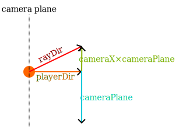

{
  published: "2024-10-19 18:07",
  tags: [],
  toc_depth: 2,
}

# Notes on ray casting

These are my interactive notes on [ray casting](https://en.wikipedia.org/wiki/Ray_casting). Ray casting is an obsolete method for rendering 3D scenes (more like 2.5D). It was used probably most notably in [Wolfenstein 3D](https://en.wikipedia.org/wiki/Wolfenstein_3D).

On this page I'll be presenting the basics of rendering simple 3D environments using ray casting. I'll also describe extensions like textures and sprites, as well as an approach to rendering walls, floor, and ceiling at different height levels. All the examples are implemented in TypeScript (but can easily be adapted to other languages) with demos rendered onto a 2D HTML canvas. All the source code is available on [GitHub](https://github.com/nielssp/raycasting-notes).

I would also suggest reading [Lode's Computer Graphics Tutorial](https://lodev.org/cgtutor/raycasting.html) which is where I've learned the basic techniques.

<div class="toc">
<h2 data-toc-ignore>Contents</h2>
<!--toc-->
</div>

## Casting rays

First we need to create a canvas:

```html
<canvas id="canvas"></canvas>
```

We'll then get a reference to the canvas from JavaScript:

```typescript
const canvas = document.getElementById('canvas') as HTMLCanvasElement;
canvas.width = 320;
canvas.height = 200;
canvas.style.imageRendering = 'pixelated';
```

```typescript
const ctx = canvas.getContext('2d')!;
ctx.imageSmoothingEnabled = false;
```

We'll calculate the aspect ratio as well:

```typescript
const aspectRatio = canvas.width / canvas.height;
```

```typescript
function onAnimationFrame(time: number) {
    const dt = (time - previousTime) / 1000;
    previousTime = time;

    render();

    requestAnimationFrame(onAnimationFrame);
}
```

### Map

The map is 2-dimensional and made up of cells that are either solid or not.

```typescript
export interface Cell {
    solid: boolean;
}
```

We can initialize the map from an array of strings &ndash; in which Xs represent walls &ndash; as follows:

```typescript
export const map: Cell[][] = [
    'XXXXXXXXXXXXXXXXXXXX',
    'X        X         X',
    'X        X         X',
    'X      X X   X     X',
    'X     XX X   X     X',
    'X        X   X     X',
    'X     XXXXXXXX     X',
    'X                  X',
    'X                  X',
    'X                  X',
    'XXXXXXXXXXXXXXXXXXXX',
].map(row => row.split('').map(cell => {
    return {
        solid: cell === 'X',
    };
}));
export const mapSize: Vec2 = {
    x: map[0].length,
    y: map.length,
};
```

The players position and orientation in the map will be represented by two vectors:

```typescript
const playerPos: Vec2 = {x: 2, y: 3};
const playerDir: Vec2 = {x: 1, y: 0};
```

The `playerDir` vector is a unit vector (i.e. length 1).

Along with the interface `Vec2`, I'll be using [a few very simple utility functions for adding, subtracting, and multiplying vectors](https://github.com/nielssp/raycasting-notes/blob/main/src/util.ts). 

### Casting rays

To cast rays we'll start at the left side of the screen, then move right one column at the time. To determine the angle of each screen column we'll need a vector that describes the orientation of the camera/screen relative to the map. If we rotate the player's direction vector clockwise by 90 degrees we get a vector that represents the direction of the screen:

```typescript
const cameraPlane = {
    x: -playerDir.y,
    y: playerDir.x,
};
```

With that, the basic loop is as follows:

```typescript
for (const x = 0; x < canvas.width; x++) {
    // TODO
}
```

For each x-coordinate of the canvas we'll calculate how far from the center of the screen we are proportional to the width of the screen:

```typescript
const cameraX = aspectRatio * x / canvas.width - aspectRato / 2;
```

This gives us a number from `- aspectRatio / 2` to `aspectRatio / 2` where 0 represents the center of the screen. We can multiply this number by the camera plane vector and add the result to the player's direction to get the ray direction vector for the current column:

```typescript
const rayDir = add2(playerDir, mul2(cameraX, cameraPlane));
```

Note that `rayDir` is not a unit vector and its length is only 1 at the center of the screen (where `cameraX` is 0). This will become important later.

<figure>

<figcaption>The relationship between the player direction, the camera plane, and the ray direction. The player position is indicated by the orange circle.</figcaption>
</figure>

We'll also need to keep track of the map position (i.e. the indices of the current cell):

```typescript
const mapPos = {
    x: Math.floor(playerPos.x),
    y: Math.floor(playerPos.y),
};
```

To move from cell to cell we'll use an approach based on [digital differential analysis](https://en.wikipedia.org/wiki/Digital_differential_analyzer_\(graphics_algorithm\)) (DDA). We'll need to calculate the following distances:

<figure>

<figcaption>The relationship between the ray direction (in red) and the <code>sideDistX</code>, <code>sideDistY</code>, <code>deltaDistX</code>, and <code>deltaDistY</code> variables. Vertical cell boundary intersections are indicated by blue circles, and horizontal cell boundary intersections are indicated by green circles.</figcaption>
</figure>

`deltaDistX` is how far the ray moves every time `mapPos.x` is incremented (or decremented) while `deltaDistY` is how far the ray moves when `mapPos.y` is incremented. `sideDistX` and `sideDistY` are the initial distances to the nearest vertical and horizontal cell boundaries respectively.

We can use Pythagoras to find `deltaDistX` and `deltaDistY`, e.g. for `deltaDistX` we can see that one side of the triangle has length 1 while the other is as long as the ray travels in the y-direction with each step in the x-direction (`rayDirY / rayDirX`):

```
deltaDistX = sqrt(1 + rayDirY² / rayDirX²)
```

We can simplify this by using Pythagoras again to get an equation for the length of the `rayDir` vector and then isolate `rayDirY²`:

```
rayDirY² = |rayDir|² - rayDirX²
```

Inserted into the equation for `deltaDistX` we get the following:

```
deltaDistX = sqrt(1 + (|rayDir|² - rayDirX²) / rayDirX²)
           = sqrt(1 + |rayDir|² / rayDirX² - rayDirX² / rayDirX²)
           = sqrt(|rayDir|² / rayDirX²)
           = abs(|rayDir| / rayDirX)
```

If we do the same thing for `deltaDistY` we get:

```
deltaDistY = abs(|rayDir| / rayDirY)
```

Using the above distances while ray tracing will give use the true Euclidean distance between the player's position and the individual cell boundaries, however if we use this distance for drawing walls we'll actually get a sort of [fisheye lens](https://en.wikipedia.org/wiki/Fisheye_lens) effect where walls appear to be curving away from the camera.

To correct this we can use the fact `rayDir` is not a unit vector and its length is greater the further away we are from the center of the screen. We simply divide both `deltaDistX` and `deltaDistY` by `|rayDir|` (which simplifies the equations to `deltaDistX = abs(1 / rayDirX)` and `deltaDistY = abs(1 / rayDirY)`). This does not affect the DDA process since only the ratio between `deltaDistX` and `deltaDistY` matters.

We can thus initialize the following vector:

```typescript
const deltaDist = {
    x: Math.abs(1 / rayDir.x),
    y: Math.abs(1 / rayDir.y),
};
```

For the first step the ray only has to travel from the player's position to the nearest cell boundary.
To calculate `sideDistX` in the above example we can simply scale `deltaDistX` by the distance from the player to the nearest vertical cell boundary to the right:

```
sideDistX = (1 - (playerPosX - mapPosX)) * deltaDistX
```

If the ray was pointing to the left instead of to the right (i.e. when `rayDirX` is negative) we would instead use the distance to the nearest cell boundary to the left:

```
sideDistX = (playerPosX - mapPosX) * deltaDistX
```

We do the same thing for `sideDistY`. At the same time we'll also determine whether to increment or decrement the coordinates with each step (the `step` vector): 

```typescript
const sideDist = {x: 0, y: 0};
const step = {x: 0, y: 0};
if (rayDir.x < 0) {
    // Move left with each x-step
    step.x = -1;
    sideDist.x = (playerPos.x - mapPos.x) * deltaDist.x;
} else {
    // Move right with each x-step
    step.x = 1;
    sideDist.x = (1 - playerPos.x + mapPos.X) * deltaDist.x;
}
if (rayDir.y < 0) {
    // Move up with each y-step
    step.y = -1;
    sideDist.y = (playerPos.y - mapPos.y) * deltaDist.y;
} else {
    // Move down with each y-step
    step.y = 1;
    sideDist.y = (1 - playerPos.y + mapPos.y) * deltaDist.y;
}
```

Whenever we advance the ray we'll keep track of whether we've hit a vertical (0) or a horizontal (1) cell boundary:

```typescript
let side = 0;
```

We'll also keep track of the &ldquo;perpendicular wall distance&rdquo;, which &ndash; due to the previous correction of `deltaDist` &ndash; is the distance from the camera plane to the current ray position (rather than the Euclidean distance from the player position to the ray position):

```typescript
let perpWallDist = 0;
```

We'll put all the above calculations into a `createRay` function and return the results as an object with the following type:

```typescript
export interface Ray {
    x: number;
    rayDir: Vec2;
    mapPos: Vec2;
    deltaDist: Vec2;
    sideDist: Vec2;
    step: Vec2;
    side: 0 | 1;
    perpWallDist: number;
}
```

With that the basic ray casting loop is as follows:

```typescript
const ray = createRay(canvas, aspectRatio, playerPos, playerDir, x, cameraPlane);
while (true) {
    advanceRay(ray);
    const cell = getMapCell(map, ray.mapPos, mapSize)
    if (!cell) {
        break;
    } else if (cell.solid) {
        renderWall(canvas, ctx, ray);
        break;
    }
}
```

With each iteration we'll advance the ray, then check if the cell at the current map position is solid or not. To advance the ray we need to take one step in either the x-direction or the y-direction. This is determined by the relative sizes of `sideDistX` and `sideDistY`.

If `sideDistX` is less than `sideDistY` it means we've hit a vertical cell boundary. We set the `perpWallDist` to `sideDistX` and then add `deltaDistX` to `sideDistX` (which means `sideDistX` is now the distance to the next vertical cell boundary). If `sideDistY` is greater than `sideDistX` we do the same but for `sideDistY`.

This gives us the following function for advancing the ray:

```typescript
export function advanceRay(
    ray: Ray,
) {
    if (ray.sideDist.x < ray.sideDist.y) {
        ray.perpWallDist = ray.sideDist.x;
        ray.sideDist.x += ray.deltaDist.x;
        ray.mapPos.x += ray.step.x;
        ray.side = 0;
    } else {
        ray.perpWallDist = ray.sideDist.y;
        ray.sideDist.y += ray.deltaDist.y;
        ray.mapPos.y += ray.step.y;
        ray.side = 1;
    }
}
```

This way, after calling `advanceRay`, `ray.mapPos` points at the current cell while `ray.perpWallDist` is the distance to the cell.

We now have enough to create a simple 2D demonstration of the ray casting process:

<figure>
<canvas id="canvas1b" width="600" height="480" tabindex=0></canvas>
<figcaption>32 columns of ray casting.</figcaption>
</figure>

[Source code](https://github.com/nielssp/raycasting-notes/blob/main/src/demo1b.ts)

Every time the ray passes a vertical cell boundary, a blue circle is drawn. When the ray passes a horizontal cell boundary, a green circle is drawn. A red circle is drawn when a solid cell has been hit.

### Inputs and movement

Player movement is implemented by manipulating the `playerPos` and `playerDir` vectors.

#### Keyboard input

To keep track of key states, we'll use the following type:

``` typescript
interface PlayerInputs {
    moveForward: boolean;
    moveBackward: boolean;
    turnLeft: boolean;
    turnRight: boolean;
    rotationSpeed: number;
}
```

We'll create a simple keyboard listener that updates the input states:

```typescript
export function updateInputs(e: KeyboardEvent, state: boolean, playerInputs: PlayerInputs) {
    switch (e.key) {
        case 'ArrowLeft':
        case 'a':
            playerInputs.turnLeft = state;
            break;
        case 'ArrowRight':
        case 'd':
            playerInputs.turnRight = state;
            break;
        case 'ArrowUp':
        case 'w':
            playerInputs.moveForward = state;
            break;
        case 'ArrowDown':
        case 's':
            playerInputs.moveBackward = state;
            break;
        default:
            return;
    }
    e.preventDefault();
}

canvas.addEventListener('keydown', e => updateInputs(e, true, playerInputs));
canvas.addEventListener('keyup', e => updateInputs(e, false, playerInputs));
```

Then as part of out main rendering loop will use the previously calculated `dt` (the number of seconds since the previous frame) to update the player position. We simply multiply `dt` with a constant player speed (in this case 3 cells per second) and multiple the result with the `playerDir`. If the player is moving forward we add the resulting vector the `playerPos`, otherwise we subtract it:

```typescript
if (playerInputs.moveForward || playerInputs.moveBackward) {
    const moveSpeed = dt * 3;
    const newPos = {...playerPos};
    if (playerInputs.moveForward) {
        newPos.x += moveSpeed * playerDir.x;
        newPos.y += moveSpeed * playerDir.y;
    } else {
        newPos.x -= moveSpeed * playerDir.x;
        newPos.y -= moveSpeed * playerDir.y;
    }
    setPlayerPos(newPos);
}
```

`setPlayerPos` should do some sort of collision check to prevent the player from moving through walls. A simple collision check can be implemented by finding the cell for the destination position and checking if it's solid or outside the map:

```typescript
const mapPos = {x: Math.floor(pos.x), y: Math.floor(pos.y)};
if (mapPos.x < 0 || mapPos.x >= mapSize.x || mapPos.y < 0 || mapPos.y >= mapSize.y) {
    return false;
}
return !map[mapPos.y][mapPos.x].solid;
```

Turning the camera is done by rotating the `playerDir` vector by multiplying it with a 2D rotation matrix:

```
x' = x * cos(angle) - y * sin(angle)
y' = x * sin(angle) + y * cos(angle)
```

The following example also contains some code for acceleration so that smaller adjustments can be made by tapping the arrow keys.

```typescript
if (playerInputs.turnLeft || playerInputs.turnRight) {
    // Apply acceleration to better allow for small adjustments
    const rotSpeed = dt * 3;
    const rotAccel = dt * 0.6;
    if (playerInputs.turnLeft) {
        playerInputs.rotationSpeed = Math.max(-rotSpeed,
            Math.min(0, playerInputs.rotationSpeed) - rotAccel);
    } else {
        playerInputs.rotationSpeed = Math.min(rotSpeed,
            Math.max(0, playerInputs.rotationSpeed) + rotAccel);
    }
    // Rotate direction vector
    set2(playerDir, {
        x: playerDir.x * Math.cos(playerInputs.rotationSpeed)
            - playerDir.y * Math.sin(playerInputs.rotationSpeed),
        y: playerDir.x * Math.sin(playerInputs.rotationSpeed)
            + playerDir.y * Math.cos(playerInputs.rotationSpeed),
    });
} else {
    playerInputs.rotationSpeed = 0;
}
```

##### Strafing

I didn't implement strafing in any of the examples since the left and right arrow keys are used for turning. But if mouse input is used using A and D to strafe makes for a more modern feeling FPS experience. Strafing can easily be implemented by simply rotating the `playerDir` vector 90 degrees and adding the result to `playerPos`:

```typescript
if (playerInput.strafeLeft || playerInputs.strafeRight) {
    const strafeSpeed = dt * 2;
    const newPos = {...playerPos};
    if (playerInputs.strafeRight) {
        newPos.x -= strafeSpeed * playerDir.y;
        newPos.y += strafeSpeed * playerDir.x;
    } else {
        newPos.x += strafeSpeed * playerDir.y;
        newPos.y -= strafeSpeed * playerDir.x;
    }
    setPlayerPos(newPos);
}
```

Handling forward/backward movement and strafing separately like this does mean that [the player moves faster when doing both at the same time](https://en.wikipedia.org/wiki/Strafing_\(video_games\)#Strafe-running).

### Mouse input

Mouse input is also straightforward for movement and rotation (the 0.005 constant is what determines the mouse sensitivity):

```typescript
document.addEventListener('mousemove', e => {
    // Add or subtract direction vector from position when moving mouse up
    // and down
    const moveSpeed = -0.005 * e.movementY;
    const newPos = add2(playerPos, mul2(moveSpeed, playerDir));
    setPos(newPos);

    // Rotate direction vector when moving mouse left and right
    const rotSpeed = 0.005 * e.movementX;
    set2(playerDir, {
        x: playerDir.x * Math.cos(rotSpeed) - playerDir.y * Math.sin(rotSpeed),
        y: playerDir.x * Math.sin(rotSpeed) + playerDir.y * Math.cos(rotSpeed),
    });
});
```

For the true FPS-experience you should also lock the cursor to the canvas:

```typescript
canvas.addEventListener("click", () => {
  canvas.requestPointerLock();
});
```

### Rendering walls

Now that we have ray casting and player movement in place it's time to make a simple implementation of the `renderWall` function.

The height of the wall is calculated by dividing the height of the canvas by the distance to the wall:

```typescript
const wallHeight = Math.ceil(canvas.height / ray.perpWallDist);
```

We also need to know  where on the screen the wall starts:

```typescript
const wallY = Math.floor((canvas.height - wallHeight) / 2);
```

For now we'll simply draw vertical lines to render the walls. We'll use the `ray.side` to determine the color of the wall to make sharp corners:

```typescript
ctx.strokeStyle = ray.side ? '#005566' : '#003F4C';
ctx.beginPath()
ctx.moveTo(ray.x + 0.5, Math.max(wallY, 0));
ctx.lineTo(ray.x + 0.5, Math.min(wallY + wallHeight + 1, canvas.height));
ctx.stroke();
```

The result is as follows:

<figure>
<canvas id="canvas1" width="320" height="200" tabindex=0></canvas>
<figcaption>Click to focus. Use the arrow keys or the mouse to move.
</figure>

[Source code](https://github.com/nielssp/raycasting-notes/blob/main/src/demo1.ts)

The floor and ceiling were drawn as two separate filled rectangles. These need to be rendered before the ray casting and wall rendering code:

```typescript
// Sky
ctx.fillStyle = '#333';
ctx.fillRect(0, 0, canvas.width, canvas.height / 2);

// Ground
ctx.fillStyle = '#666';
ctx.fillRect(0, canvas.height / 2, canvas.width, canvas.height / 2);
```

### Shading based on distance

To add some more depth we can shade the walls based on the distance from the player. We'll create the following function for determining the brightness based on the current distance (we still use `side` to make the corners sharper):

```typescript
export function getBrightness(dist: number, side: 0 | 1 = 0) {
    return 1 - Math.min(0.8, Math.max(0, (dist - side) / 10));
}
```

The brightness is a number between `0.2` and `1`. We can use the brightness function to set the stroke style when rendering walls:

```typescript
const brightness = getBrightness(ray.perpWallDist, ray.side);
ctx.strokeStyle = `rgb(0, ${85 * brightness}, ${102 * brightness})`;
```

For the sky we'll use a gradient created using `createLinearGradient` (we only need to do this once):

```typescript
const sky = ctx.createLinearGradient(0, 0, 0, canvas.height);
sky.addColorStop(0, '#333');
sky.addColorStop(0.5, '#111');
sky.addColorStop(0.5, '#222');
sky.addColorStop(1, '#666');
```

And render it at the start of each frame:

```typescript
ctx.fillStyle = sky;
ctx.fillRect(0, 0, canvas.width, canvas.height);
```

<figure>
<canvas id="canvas2" width="320" height="200" tabindex=0></canvas>
</figure>

[Source code](https://github.com/nielssp/raycasting-notes/blob/main/src/demo2.ts)

## Texturing walls

To add textures to walls we first need to load some textures. We'll be using the following wall texture:

<figure>

<figcaption>Wall texture.</figcaption>
</figure>

To load textures that can be efficiently used with the canvas we'll first create a function for asynchronously loading images:

```typescript
function loadImage(src: string): Promise<HTMLImageElement> {
    const img = new Image();
    img.src = src;
    return new Promise((resolve, reject) => {
        img.onload = () => resolve(img);
        img.onerror = reject;
    });
}
```

We'll use this function to load the image, then draw it onto a canvas before exporting the image data:

```typescript
async function loadTextureData(src: string): Promise<ImageData> {
    const img = await loadImage(src);
    const canvas = document.createElement('canvas');
    const ctx = canvas.getContext('2d')!;
    canvas.width = img.width;
    canvas.height = img.height;
    ctx.drawImage(img, 0, 0);
    return ctx.getImageData(0, 0, canvas.width, canvas.height);
}
```

The `ImageData` object allows us to read individual pixels from the texture.

We'll load the wall texture:

```typescript
const wallTexture: ImageData = await loadTextureData('wall.png');
```

All the textures in this demo are 64&times;64 pixels:

```typescript
const textureSize = {x: 64, y: 64};
```

We'll need to use `putImageData` to efficiently write individual pixels for each wall slice. We'll update the ray casting loop as follows:

```typescript
for (let x = 0; x < canvas.width; x++) {
    const ray = createRay(canvas, aspectRatio, playerPos, playerDir, x, cameraPlane);
    // Get image data for the current column:
    const stripe = ctx.getImageData(x, 0, 1, canvas.height);
    while (true) {
        advanceRay(ray);
        const cell = getMapCell(map, ray.mapPos, mapSize)
        if (!cell) {
            break;
        } else if (cell.solid) {
            const wall = getWallMeasurements(ray, canvas.height, playerPos);
            renderWall(canvas, stripe, ray, wall, wallTexture);
            break;
        }
    }
    // Update image data for the current column
    ctx.putImageData(stripe, x, 0);
}
```

`getWallMeasurements` is a new function that calculates `wallHeight` and `wallY` like before, but also calculates a new variable `wallX`. `wallX` determines the distance from the side of the cell wall to the intersection point of the ray. If we multiply `rayDir` by `perpWallDist` we get a vector from the player's position to the wall intersection point (because `perpWallDist` was scaled by `|rayDir|`). If we've hit a horizontal cell boundary we can add the x-coordinate of that vector to the x-coordinate of `playerPos`, then subtract the x-coordinate of `mapPos`. For vertical cell boundaries we can do the same with the y-coordinates.

<figure>

<figcaption>The relationship between the <code>wallX</code>, <code>playerPosX</code>, <code>rayDirX</code>, and <code>mapPosX</code> variables when hitting a horizontal cell boundary.</figcaption>
</figure>

```typescript
let wallX: number;
if (ray.side === 0) {
    // Vertical cell boundary
    wallX = playerPos.y + ray.perpWallDist * ray.rayDir.y - ray.mapPos.y;
} else {
    // Horizontal cell boundary
    wallX = playerPos.x + ray.perpWallDist * ray.rayDir.x - ray.mapPos.x;
}
```

We now have `wallX` as a number from 0 to 1 that determines which part of the wall we're looking at. We can multiply that by the texture width to figure out which column of the texture we need to draw:

```typescript
const texX: number = Math.floor(wall.wallX * textureSize.x);
```

We'll also figure out the top and bottom y-coordinates of the wall (we use min and max to ensure that we only draw pixels inside the canvas):

```typescript
const yStart = Math.max(wall.wallY, 0);
const yEnd = Math.min(wall.wallY + wall.wallHeight, canvas.height);
```

For each y-coordinate we need to keep track of the y-coordinate of the texture. We'll increment by `step` for each screen pixel. `step` is just texture height divided by the previously calculated wall height:

```typescript
const step = textureSize.y / wall.wallHeight;
```

`texPos` is what keeps track of the current y coordinate of the texture. If the wall starts above the top of the screen, we need to add as many steps as there are pixels missing to the initial value:

```typescript
let texPos = wall.wallY < yStart ? (yStart - wall.wallY) * step : 0;
```

The brightness is calculated the same as for the untextured walls. We'll multiple each texture pixel by this number:

```typescript
const brightness = getBrightness(ray.perpWallDist, ray.side);
```

We'll then iterate through each pixel of the wall and copy the correct texture pixel to the canvas image data (`stripe`):

```typescript
for (let y = yStart; y < yEnd; y++) {
    // Each pixel is 4 bytes wide
    const offset = y * 4;
    const texY = Math.floor(texPos) % textureSize.y;
    texPos += step;
    const texOffset = (texY * textureSize.x + texX) * 4;
    // Red
    stripe.data[offset] = wallTexture.data[texOffset] * brightness;
    // Green
    stripe.data[offset + 1] = wallTexture.data[texOffset + 1] * brightness;
    // Blue
    stripe.data[offset + 2] = wallTexture.data[texOffset + 2] * brightness;
    // Alpha
    stripe.data[offset + 3] = 255;
}
```

<figure>
<canvas id="canvas3" width="320" height="200" tabindex=0></canvas>
</figure>

[Source code](https://github.com/nielssp/raycasting-notes/blob/main/src/demo3.ts)

With the above code textures are always drawn north-to-south for vertical cell boundaries and west-to-east for horizontal cell boundaries. This means that on west and south walls the texture is actually flipped horizontally. It doesn't matter for the textures used here, but the textures can easily be flipped with the following code:

```typescript
// West wall
if (ray.side === 0 && ray.rayDir.x < 0) {
    texX = textureSize.x - texX - 1;
}
// South wall
if (ray.side === 1 && ray.rayDir.y > 0) {
    texX = textureSize.x - texX - 1;
}
```

## Skybox

<figure>

</figure>

<figure>
<canvas id="canvas4" width="320" height="200" tabindex=0></canvas>
</figure>

## Texturing floors 

There are several different approaches to rendering floors (and ceilings). I've picked the following approach because it makes it relatively easy to have different floor and ceilings heights for cells (implemented in a later section).

The basic idea is that while advancing a ray we'll concurrently render the floors for the cells the ray passes through. We'll keep track of how much floor we've rendered for the current column with the following variable:   

```typescript
let yFloor = 0;
```

Each time the ray hits a cell we'll calculate where the floor should stop, i.e. just below the wall (even if there isn't actually a wall there):

```typescript
const cellY = (canvas.height - wall.wallHeight) * 0.5;
const floorCellY = Math.ceil(cellY);
```

```typescript
let floorXWall: number, floorYWall: number;
if (ray.side === 0 && ray.rayDir.x > 0) {
    floorXWall = ray.mapPos.x;
    floorYWall = ray.mapPos.y + wallX;
} else if (ray.side === 0 && ray.rayDir.x < 0) {
    floorXWall = ray.mapPos.x + 1;
    floorYWall = ray.mapPos.y + wallX;
} else if (ray.side === 1 && ray.rayDir.y > 0) {
    floorXWall = ray.mapPos.x + wallX;
    floorYWall = ray.mapPos.y;
} else {
    floorXWall = ray.mapPos.x + wallX;
    floorYWall = ray.mapPos.y + 1;
}
```

```typescript
while (yFloor < floorCellY) {
    const y = (canvas.height - yFloor - 1);
    mapFloorTexture(canvas, stripe, y, floor, playerPos, yFloor, perpWallDist, floorTexture);
    yFloor++;
}
```

```typescript
const rowDistance = canvas.height / (canvas.height - 2 * yFloor);
const weight = rowDistance / perpWallDist;
const floorX = weight * floor.floorXWall + (1 - weight) * playerPos.x;
const floorY = weight * floor.floorYWall + (1 - weight) * playerPos.y;
let tx = ((textureSize.x * floorX) | 0) & (textureSize.x - 1);
let ty = ((textureSize.y * floorY) | 0) & (textureSize.y - 1);
const texOffset = (ty * textureSize.x + tx) * 4;
const brightness = getBrightness(rowDistance);
const offset = y * 4;
stripe.data[offset] = floorTexture.data[texOffset] * brightness;
stripe.data[offset + 1] = floorTexture.data[texOffset + 1] * brightness;
stripe.data[offset + 2] = floorTexture.data[texOffset + 2] * brightness;
stripe.data[offset + 3] = 255;
```

<figure>

<figcaption>Floor texture.</figcaption>
</figure>

<figure>
<canvas id="canvas5" width="320" height="200" tabindex=0></canvas>
</figure>

## Texturing ceilings

We can texture ceilings the exact same way as we textured the floors. We'll initialize the variable `yCeiling` to 0 a the start of each ray:

```typescript
let yCeiling = 0;
```

```typescript
const ceilingCellY = Math.ceil(cellY);
```

The only difference from floors is that since ceilings start from the top of the screen, we can use `yCeiling` directly:

```typescript
while (yCeiling < ceilingCellY) {
    mapFloorTexture(canvas, stripe, yCeiling, floor, playerPos, yCeiling, perpWallDist, ceilingTexture);
    yCeiling++;
}
```

We'll use the following ceiling texture:

<figure>

<figcaption>Ceiling texture.</figcaption>
</figure>

And here's the result:

<figure>
<canvas id="canvas6" width="320" height="200" tabindex=0></canvas>
</figure>

## Cell textures

```typescript
export interface Cell {
    solid: boolean;
    wallType: string;
    floorType: string;
    ceilingType: string;
    wallTexture?: ImageData;
    floorTexture?: ImageData;
    ceilingTexture?: ImageData;
}
```

```typescript
const walls = [
    'WWWWWRWWWRRRRRWWWWWW',
    'W        R         W',
    'W        R         W',
    'W      W R   R     W',
    'W     WW R   R     W',
    'W        R   R     W',
    'W     RRRRRRRR     W',
    'W                  W',
    'W                  W',
    'W                  W',
    'WWWWWWWWWWWWWWWWWWWW',
];

const floors = [
    'FFFFFFFFFFFFFFFFFFFF',
    'FFFFFFFFFFFFFFFFFFFF',
    'FFFFFFFFFFFFFFFFFFFF',
    'FFFFGGGGGGGGGFFFFFFF',
    'FFFFGGGGGGGGGFFFFFFF',
    'FFFFGGGGGGGGGFFFFFFF',
    'FFFFFFFFFFFFFFFFFFFF',
    'FFFFFFFFFFFFFFFFFFFF',
    'FFFFFFFFFFFFFFFFFFFF',
    'FFFFFFFFFFFFFFFFFFFF',
    'FFFFFFFFFFFFFFFFFFFF',
];

const ceilings = [
    'CCCCCCCCCCCCCCCCCCCC',
    'CCCCCCCFFFCCCCCCCCCC',
    'CCCCCCCFFFCCCCCCCCCC',
    'CCCCCCCCCCCCCCCCCCCC',
    'CCCCCCCCCCCCCCCCCCCC',
    'CCCCCCCCCCCCCCCCCCCC',
    'CCCCCCCCCCCCCCCCCCCC',
    'CCCCCCCCCCCCCCCCCCCC',
    'CCCCCCCCCCCCCCCCCCCC',
    'CCCCCCCCCCCCCCCCCCCC',
    'CCCCCCCCCCCCCCCCCCCC',
];
```

```typescript
export const map: Cell[][] = walls.map((row, y) => {
    const floorTypes = floors[y].split('');
    const ceilingTypes = ceilings[y].split('');
    return row.split('').map((wallType, x) => {
        return {
            solid: wallType !== ' ',
            wallType,
            floorType: floorTypes[x],
            ceilingType: ceilingTypes[x],
        };
    })
});
```

<figure>

<figcaption>Red wall texture.</figcaption>
</figure>

<figure>

<figcaption>Green floor texture.</figcaption>
</figure>

<figure>
<canvas id="canvas7" width="320" height="200" tabindex=0></canvas>
</figure>

## Sliding doors

```typescript
export interface Door {
    sideTexture?: ImageData;
    offset: number;
    active: boolean,
}
```

```typescript
export interface Cell {
    // ...
    door?: Door;
}
```

```typescript
if (cell.door) {
    if (renderDoor(canvas, stripe, cell, cell.door, ray, playerPos, floor, yFloor, yCeiling)) {
        break;
    }
} else if (cell.solid) {
    renderWall(canvas, stripe, ray, wall, cell.wallTexture);
    break;
}

```

```typescript
export function renderDoor(
    canvas: HTMLCanvasElement,
    stripe: ImageData,
    cell: Cell,
    door: Door,
    ray: Ray,
    playerPos: Vec2,
    floor: FloorMeasurements,
    yFloor: number,
    yCeiling: number,
): boolean {
    const floorWallDist = ray.perpWallDist;
    let doorX: number;
    if (ray.side === 0) {
        doorX = playerPos.y + (ray.sideDist.x - ray.deltaDist.x * doorEnd) * ray.rayDir.y;
    } else {
        doorX = playerPos.x + (ray.sideDist.y - ray.deltaDist.y * doorEnd) * ray.rayDir.x;
    }
    let doorMapX = Math.floor(doorX);
    let doorSide = false;
    if (doorX - doorMapX < door.offset) {
        // The door is partially open and we're looking through the opening
        doorSide = true;
        if (ray.side === 0) {
            doorX = playerPos.x + (ray.sideDist.y - ray.deltaDist.y * (1 - door.offset)) * ray.rayDir.x;
        } else {
            doorX = playerPos.y + (ray.sideDist.x - ray.deltaDist.x * (1 - door.offset)) * ray.rayDir.y;
        }
        let doorMapX = Math.floor(doorX);
        if (doorX - doorMapX < doorStart || doorX - doorMapX > doorEnd) {
            return false;
        } else if (ray.side === 1 && doorMapX === ray.mapPos.y && ray.rayDir.x > 0) {
            ray.side = 0;
            ray.perpWallDist = ray.sideDist.x - ray.deltaDist.x * (1 - door.offset);
            ray.sideDist.x += ray.deltaDist.x * door.offset;
        } else if (ray.side === 0 && doorMapX === ray.mapPos.x && ray.rayDir.y > 0) {
            ray.side = 1;
            ray.perpWallDist = ray.sideDist.y - ray.deltaDist.y * (1 - door.offset);
            ray.sideDist.y += ray.deltaDist.y * door.offset;
        } else {
            return false;
        }
    } else if (ray.side === 0 && doorMapX === ray.mapPos.y) {
        ray.perpWallDist = ray.sideDist.x - ray.deltaDist.x * doorEnd;
        ray.sideDist.x += ray.deltaDist.x * doorStart;
    } else if (ray.side === 1 && doorMapX === ray.mapPos.x) {
        ray.perpWallDist = ray.sideDist.y - ray.deltaDist.y * doorEnd;
        ray.sideDist.y += ray.deltaDist.y * doorStart;
    } else {
        return false;
    }
    const wall = getWallMeasurements(ray, canvas.height, playerPos);
    if (!doorSide) {
        wall.wallX -= door.offset;
    }
    renderFloorAndCeiling(canvas, stripe, wall, floor, playerPos, floorWallDist,
        yFloor, yCeiling, cell.floorTexture, cell.ceilingTexture);
    renderWall(canvas, stripe, ray, wall, doorSide ? door.sideTexture : cell.wallTexture);
    return true;
}

```

<figure>

<figcaption>Door texture.</figcaption>
</figure>

<figure>

<figcaption>Door side texture.</figcaption>
</figure>

<figure>
<canvas id="canvas8" width="320" height="200" tabindex=0></canvas>
<figcaption>Press E or left click to open doors.</figcaption>
</figure>


## Sprites

```typescript
export interface Sprite {
    pos: Vec2;
    texture: ImageData;
    relPos: Vec2;
    relDist: number;
}
```

```typescript
const sprites: Sprite[] = [];
const barrelTexture = await loadTextureData('/assets/content/misc/textures/barrel.png');
sprites.push(createSprite({x: 4, y: 3}, barrelTexture));
sprites.push(createSprite({x: 5, y: 2.75}, barrelTexture));
```

```typescript
const zBuffer = Array(canvas.width);
for (let x = 0; x < canvas.width; x++) {
    // ...
    zBuffer[x] = ray.perpWallDist;
}
```

```typescript
export function renderSprites(
    canvas: HTMLCanvasElement,
    ctx: CanvasRenderingContext2D,
    aspectRatio: number,
    sprites: Sprite[],
    zBuffer: number[],
    playerPos: Vec2,
    playerDir: Vec2,
    cameraPlane: Vec2,
) {
    for (const sprite of sprites) {
        sprite.relPos = sub2(sprite.pos, playerPos);
        sprite.relDist = sprite.relPos.x * sprite.relPos.x + sprite.relPos.y * sprite.relPos.y;
    }
    sprites.sort((a, b) => b.relDist - a.relDist);

    const invDet = 1 / (cameraPlane.x * playerDir.y - playerDir.x * cameraPlane.y);
    for (const sprite of sprites) {
        const transformX = invDet * (playerDir.y * sprite.relPos.x - playerDir.x * sprite.relPos.y);
        const transformY = invDet * (-cameraPlane.y * sprite.relPos.x + cameraPlane.x * sprite.relPos.y);
        const spriteScreenX = canvas.width / aspectRatio * (aspectRatio / 2 + transformX / transformY) | 0;
        const spriteHeight = Math.abs(canvas.height / transformY | 0);
        const drawStartY = (-spriteHeight / 2 + canvas.height / 2) | 0;
        const spriteWidth = Math.abs(canvas.height / transformY | 0);
        const drawStartX = Math.max(0, -spriteWidth / 2 + spriteScreenX) | 0;
        const drawEndX = Math.min(canvas.width - 1, spriteWidth / 2 + spriteScreenX) | 0;
        const texY = 0;
        const xMax = drawEndX - drawStartX;
        if (xMax < 1 || transformY <= 0) {
            continue;
        }
        const screenStartY = Math.max(0, Math.min(canvas.height - 1, drawStartY));
        const spriteYOffset = drawStartY < 0 ? drawStartY : 0;
        const yMax = Math.min(canvas.height, screenStartY + spriteHeight) - screenStartY;
        const brightness = getBrightness(transformY);
        const imageData = ctx.getImageData(drawStartX, screenStartY, xMax, yMax);
        for (let x = 0; x < xMax; x++) {
            const stripe = x + drawStartX;
            const texX = Math.floor(64 * (stripe - (-spriteWidth / 2 + spriteScreenX)) * textureSize.x / spriteWidth / 64);

            if (stripe > 0 && stripe < canvas.width) {
                for (let y = 0; y < yMax; y++) {
                    if (transformY >= zBuffer[x + drawStartX]) {
                        continue;
                    }
                    const texYPos = texY + Math.floor((y - spriteYOffset) / spriteHeight * textureSize.y);
                    const offset = (y * imageData.width + x) * 4;
                    const texOffset = (texYPos * textureSize.x + texX) * 4;
                    if (sprite.texture.data[texOffset + 3]) {
                        imageData.data[offset] = sprite.texture.data[texOffset] * brightness;
                        imageData.data[offset + 1] = sprite.texture.data[texOffset + 1] * brightness;
                        imageData.data[offset + 2] = sprite.texture.data[texOffset + 2] * brightness;
                        imageData.data[offset + 3] = sprite.texture.data[texOffset + 3];
                    }
                }
            }
        }
        ctx.putImageData(imageData, drawStartX, screenStartY);
    }
}

```

<figure>

<figcaption>Barrel sprite.</figcaption>
</figure>

<figure>
<canvas id="canvas9" width="320" height="200" tabindex=0></canvas>
</figure>

## Portals

<figure>
<canvas id="canvas10" width="320" height="200" tabindex=0></canvas>
</figure>

## Different floor and ceiling heights


<figure>
<canvas id="canvas11" width="320" height="200" tabindex=0></canvas>
<figcaption>Press space or right click to jump.</figcaption>
</figure>

## Optimization

<figure>
<canvas id="canvas12" width="320" height="200" tabindex=0></canvas>
</figure>

<script type="text/javascript" src="../misc/raycasting.js"></script>


