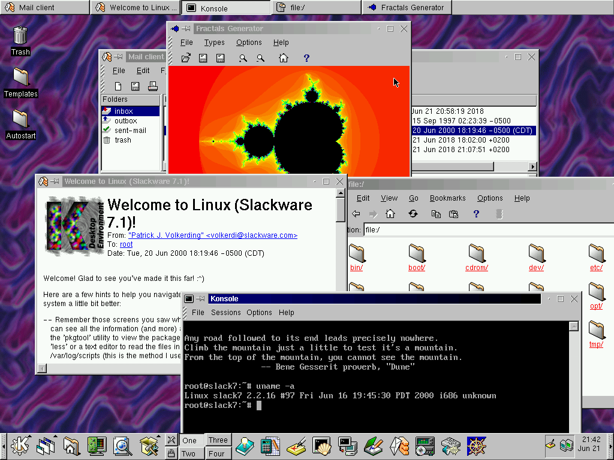

{
  published: "2018-07-03 14:55",
  tags: ["linux", "slackware", "kde", "gnome", "xfce"]
}
# Slackware Linux 7.1: A time capsule

<figure>

<figcaption>KDE 1.1.2 on Slackware Linux 7.1</figcaption>
</figure>

I'm a big fan of websites like [GUIdebook](https://guidebookgallery.org) and the [toastytech GUI gallery](http://toastytech.com/guis/index.html) that collect screenshots of old desktop GUIs. I think it's interesting to travel back in time and take a look at how GUI design has changed over the years. I'm particularly interested in early Linux desktop environments and window managers.

One such desktop environment is KDE, which had its 1.0 release almost 20 years ago on 12 July 1998. Sadly, KDE 1 and other early KDE (as well as GNOME and XFCE) releases are missing from GUIdebook and toastytech. So I tasked myself with finding, installing, and documenting those old releases. It seemed the easiest way to do that was to find an old release of a Linux distribution that includes one or more desktop environments. As it turns out, it's not exactly easy to figure out which contemporary distributions included which versions of which desktop environments. 

I ended up picking [Slackware](http://slackware.com) since it began including KDE 1.1 from version 7.0 (and also included early versions of GNOME and XFCE in later releases). I've previously used Slackware 12.0 with KDE 3.5, so I'm already somewhat familiar with the installation process which hasn't changed much over the years. Additionally it's fairly easy to find ISOs for early Slackware releases online (e.g. just search for &ldquo;slackware 7.1 iso&rdquo; and you'll find it on several mirrors). 

I'm now in the process of gathering screenshots of desktop environments and applications from several different Slackware releases that I've downloaded and installed in VirtualBox. The screenshots will (eventually) be available in [the new GUI section](/guis) of my website. So far I've added a page full of screenshots from [KDE 1.1.2 on Slackware 7.1](/guis/kde-1.1.2/screenshots).
