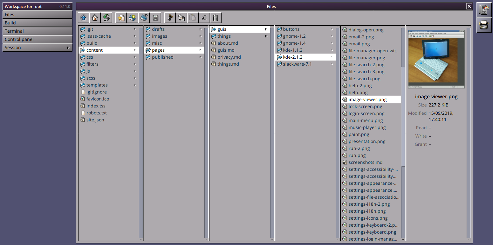

# Designing the TEXTSTEP user interface
<figure>

<figcaption>Miller columns in TEXTSTEP's file manager.</figcaption>
</figure>

Since 2016 I've been working on a static site generator with a web-based user interface. The idea is that you can log in and manage layout and content as in a traditional CMS, then you press a button and static HTML files are generated which can be served raw by the web server without any additional processing. There are several technical aspects of TEXTSTEP I would like to describe in detail, but for this blog post I will primarily focus on the design of the GUI.

I had previously spent several years working on a WordPress-like content management system (initially called [PeanutCMS](bs:things/peanutcms), later [Jivoo](bs:things/jivoo)), and I had built a typical CMS interface using [flat design](https://en.wikipedia.org/wiki/Flat_design) consisting of a sidebar with a long list of menu items (e.g. <q>Posts</q>, <q>Pages</q>, <q>Media</q>, etc.) and a main column for the content of the selected page. On the <q>Posts</q>-page you would get a paginated list of all posts stored in the database table, and you could change the ordering or search for specific posts. Clicking on the <q>Add</q>-button would open a new page on which the title and content (and other metadata) of a new blog post could be entered. Similar [CRUD](https://en.wikipedia.org/wiki/Create,_read,_update_and_delete) UI existed for the other content types. I don't think there's necessarily anything wrong with that design, after all that's how most content management systems work. And while it's definitely possible to design a similar GUI for a static site generator backed by a database, I wanted something much more conceptually simple for TEXTSTEP. My idea was to instead implement a hierarchical file system like traditional operating systems, and then have separate <q>applications</q> for managing, viewing, and editing files. On the backend, all the data would be stored as plain text files and could easily be moved/copied/backed up (the templates and content used to generate this website for instance is on [GitHub](https://github.com/nielssp/nielssp.dk)). Thus, in October 2016, I started using the first somewhat usable version of TEXTSTEP (initially called BlogSTEP) and retired my old CMS project.

Now, the reason I specifically mentioned that my previous CMS project used a flat design, was that by mid-2016 I was getting fairly tired of flat design. I realized that I found much more enjoyment in the designs of classic '90s era operating systems like Windows 95, Classic Mac OS, and NeXTSTEP. Back when [buttons](bs:guis/buttons) still looked and felt like buttons. Just before I started working on TEXTSTEP I had experimented a bit with recreating this sort of design with CSS, initially recreating the Windows 95 look and feel, however it was the NeXTSTEP-inspired design that eventually made its way into TEXTSTEP.

The TEXTSTEP user interface consists of the main window in the center (the active <q>application</q>), a sidebar on the left containing application menus and tool windows as well as the workspace menu, and a dock on the right with an icon for each running application. The sidebar dynamically changes depending on the active application; the <q>Write</q>-application (a Markdown editor) for instance has a main menu (<q>New</q>, <q>Save</q>, &hellip;) and a tool window that lists open files (<q>Buffers</q>, similar to tabs in some text editors). The workspace menu – from which for instance the file manager or control panel can be opened – is always visible at the bottom of the sidebar. Having a vertical dock and menu/tool system like this instead of a horizontal menu like in Windows and Mac OS has some advantages: 1) Most desktop and laptop monitors today are widescreen, so there is way more horizontal space than vertical space available, and 2) when using the UI on a phone or small screen the menu and dock can be hidden behind a menu button (see the screenshots on [this page](bs:things/textstep) for an example of this behavior).

When you log in to TEXTSTEP, the first application that runs is the <q>Files</q>-application, which is the file manager. The file manager borrows another concept from NeXTSTEP: [Miller columns](https://en.wikipedia.org/wiki/Miller_columns). Miller columns allow multiple levels of the file hierarchy to be visible at once. They also work well on multiple different screen sizes since columns can be added and removed depending on how much horizontal space is available (e.g. on a phone screen it may only be possible to show a single column). From the file manager you can create/upload/download/copy/move/delete directories and files. Double clicking on a file will open the associated application, e.g. <q>Write</q> for Markdown-files, and there is also an image viewer for image files, and a video player for videos. While editing a file you can switch to another running application and back again without losing any work. Additionally, opening another Markdown-file will create a new buffer in the existing instance of the <q>Write</q>-application, so that you can also switch between several different files within the editor.

The design is still very much work in progress, and many improvements can still be made. For instance, all applications are currently maximized and can't be resized or moved. This might change in the future, since I realize it could make sense to be able to tile several applications next to or on top of each other on larger screens (nothing in the architecture technically prevents that at the moment, it's just a question of what the interface would look like). It could even make sense to have draggable/resizable windows, although I'm not usually a fan of that type of interaction in web applications. Another place that can also still be improved is the file manager. I personally like Miller columns, but if everyone liked them then there would probably be more file managers today that use them, so my plan is to also have more traditional large icon and detailed list views available as options. Additionally, I'm still not set on whether there should be a preview-column or not, or whether it requires a double click to open a file. You'll also notice that none of what I've been describing actually has much to do with static site generation, since most of the current applications in TEXTSTEP are fairly general. So in the future I'd also like to add one or more applications that specifically deal with the TEXSTEP template files, perhaps some sort of WYSIWIG theme designer.

Lately I've also been experimenting with something I call [Classic stylesheets for web applications](https://nielssp.github.io/classic-stylesheets), which is a set of stylesheets that mimic the look and feel of some '90s user interfaces. I don't exactly have a plan with it, but I was toying with the idea of somehow combining it with TEXTSTEP's GUI toolkit to make some sort of '90s GUI toolkit for the web. They will probably still be two separate projects though, as I don't like when I have several personal projects that depend on each other (my previous CMS project [Jivoo](bs:things/jivoo) only got harder to develop when I decided that it was also a web application framework). It's also worth noting that while I've been pretty hooked on the '90s aesthetic, it's definitely possible – using the power of CSS – to create an alternative <q>modern</q> flat design for TEXTSTEP.

<!--{
  "published": "2020-07-24 17:20",
	"tags": ["cms", "textstep", "css", "classic-stylesheets", "design"]
}-->