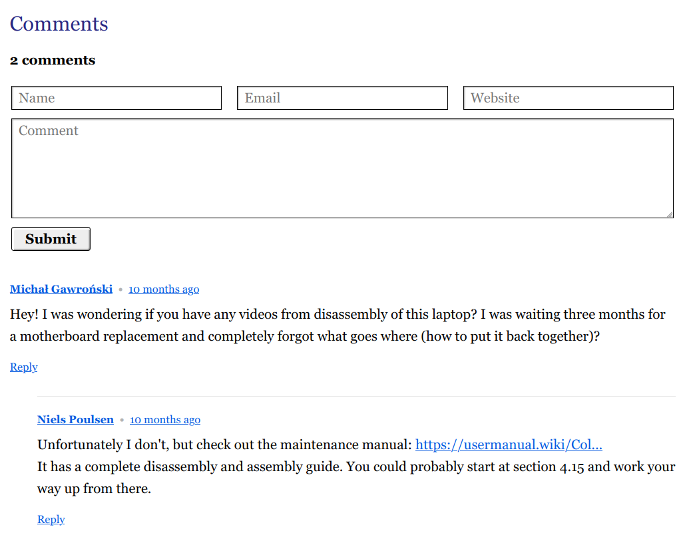
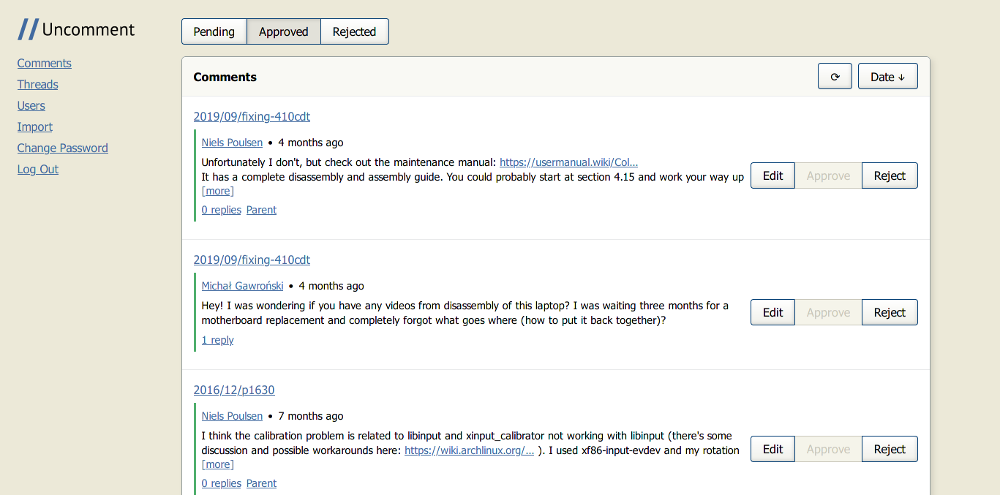

{
  published: "2022-03-15 18:07",
  tags: ["blog", "uncomment", "rust", "static-sites"]
}

# Uncomment &ndash; a lightweight comment system for static websites


Around June last year I decided to try to find alternatives for two third-party components I was using on this website: Google Analytics and Disqus. Both because of possible GDPR concerns, but also &ndash; in the case of Disqus &ndash; because of performance.

I started out by trying a few different self-hosted alternatives to Analytics, and ended up picking [Shynet](https://github.com/milesmcc/shynet) (after also trying out Plausible and Umami), which so far has worked pretty well for my needs. It doesn't offer the extreme level of detail and filtering as Google Analytics, but it does give a decent overview of the number of users, types of devices, etc.

To find an alternative to Disqus, I tried several different self-hosted options: Isso, Schnack, and Commento. None of them really ticked all of my boxes, so I decided to instead try to make my own.

Thus on 27 July I was able to replace Disqus with [Uncomment](https://github.com/nielssp/uncomment), my own embeddable self-hosted open source comment system for static sites made using Rust for the backend and TypeScript for the frontend.

It can be installed as a Docker image from [Docker Hub](https://hub.docker.com/r/nielssp/uncomment). Further setup and configuration is explained in the [README](https://github.com/nielssp/uncomment).

## The client

<figure>

<figcaption>Comment form and thread embedded on this website via the Uncomment client.</figcaption>
</figure>

The client is a single lightweight minified JavaScript file that can be included on a page to enable comments:

```html
<div id="comments"></div>
<script data-uncomment
    data-uncomment-target="#comments"
    src="https://uncomment.your-website.com/en-GB/embed.js"></script>
```

It's written in TypeScript using vanilla DOM operations without any runtime dependencies. The different languages (currently only English and Danish) are precompiled into separate bundles, so that only a single JavaScript file has to be loaded at runtime.

A minimal default stylesheet is also bundled. It provides only the basic layout necessary for displaying nested comments. The look of the text fields, buttons, links, etc. are all up to the host page. It has been one of my primary goals with the project to make the comments look like they're part of the page they're on and not like some third-party widget.

It's also possible to include a smaller bundle called `count.js`, which can be used to show comment counts on pages that don't have comments (like the front page of a blog).

## The control panel

<figure>

<figcaption>Comment moderation system.</figcaption>
</figure>

To allow a website owner to easily moderate comments, I've also written a simple single page application in TypeScript that allows an admin to login and view/modify/delete comments. Additionally there's a page for importing comments exported from Disqus.

## The server

The server, which serves both the client and the control panel, is implemented in Rust using [Actix Web](https://actix.rs/). Even though I've had very little experience with Rust before Uncomment, Actix Web has been a really good experience, and it was relatively quick and painless to set up the first few endpoints.

Database integration on the other hand was a bit of of an issue. From the start I wanted the default database system to be SQLite, because it's very easy to set up and because [<q cite="https://posativ.org/isso/faq/">comments are not big data</q>](https://posativ.org/isso/faq/). But because Uncomment is an application aimed at people with servers, I also didn't want to make the choice for them (e.g. if you already have a PostgreSQL database, why not use it?). This is something that is often abstracted away in ORMs and query builders by other web frameworks and ecosystems (like JPA for Java), so for small applications it can often be trivial to switch between database systems, even at runtime. This turned out to be relatively hard with the database libraries available in Rust. All of them seem to require you to pick a database driver at compile time. Initially I focused on SQLite and used rusqlite, but when it came to adding support for PostgreSQL, I didn't want to have to write every query again, so I switched everything over to [Quaint](https://github.com/prisma/quaint). After running into several issues using Quaint, I switched to using [SQLx](https://github.com/launchbadge/sqlx) with [SeaQuery](https://github.com/SeaQL/sea-query). This meant however that I had to use [features](https://doc.rust-lang.org/cargo/reference/features.html) to switch between SQLite and PostgreSQL, which made for some somewhat ugly code, but thankfully most of the query code is reusable thanks to SeaQuery. In the end, it's possible to use both SQLite and PostgreSQL, but the decision has to be made at compile time.

## Deployment

Because of my previous experience deploying both Shynet and the other systems I tried out, I could really see the value in using Docker for deployment. My biggest concern was that a lot of common base images are very large. Additionally, it's not uncommon to build the application in the same container that you later deploy, which &ndash; for Rust at least &ndash; leaves you with a very large image containing a lot of dependencies and build files that are not required at runtime.

My solution to both of these problems was to use a multistage Dockerfile ([it can be seen here](https://github.com/nielssp/uncomment/blob/master/Dockerfile)). First the server binary is built on top of a Rust base image. Then the client and control panel are built on top of a Node base image. Finally the server binary and the client bundles are copied to an empty container based on a small Alpine base image. This leaves us with an Uncomment image that weighs in at roughly 28 MiB uncompressed.

Because of the need for a feature flag to select the database system, it's also necessary to build separate images for SQLite and PostgreSQL.

The end result is that Uncomment can be deployed to a server simply by using `docker pull nielssp/uncomment:sqlite` or `docker pull nielssp/uncomment:postgres` and creating an environment file with the necessary connection information.

## Future work

Although Uncomment is certainly useable now, and I haven't worked on it much since I started using it on this website, I do have few features in mind that I would like to implement at some point:

**Authentication:** I would like to add one or more methods for authenticating commenters (like Schnack) as an alternative to the current anonymous-only comments (like Isso). Whether to use this or not would of course be up to the website owner, but I think it would be a good feature to have as an option to combat spam.

**Notifications:** Currently there's no way to get notified as a website owner when someone comments. There's also no way for commenters to get notified of replies to their comments. I would like to at least have the option of enabling email notifications, but push notifications of some sort could also be a possibility.

**Spam protection:** I haven't had any spam yet, but from experience I know that it will come at some point. The only defence currently available in Uncomment is the ability to require approval of all comments. I would like to add some additional tools, like maybe some custom rules for automatic moderation, or just straight up integrating with [Akismet](https://akismet.com/) or similar.

Aside from that there's probably still some improvements that can be made to the installation and configuration process. I think it should be possible to change some configuration values at runtime in the control panel for instance.
