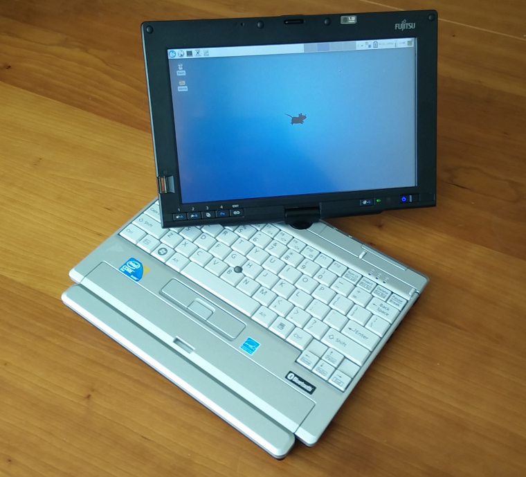

# A LifeBook P1630 and Arch Linux
<figure>

<figcaption>**(placeholder)** A Fujitsu LifeBook P1630 running Arch Linux with XFCE.</figcaption>
</figure>

I recently bought a somewhat old convertible tablet PC for $65 USD on eBay. The Fujitsu LifeBook P1630, which was originally sold for more than $2,000 USD back in 2008, is a small laptop/tablet PC with a 1.2GHz Intel Core 2 Duo and an 8.9" resistive touchscreen display (1280x768). Size-wise it is similar to the netbooks (like the Asus Eee PC) that were starting to get popular at the time, but it is definitely much more powerful than the early netbooks (and also much more expensive at the time of its release). Although it was originally sold with Windows Vista (and mine came with Windows XP Tablet PC Edition), I immediately decided that I would put Linux on it, partially because I was curious about how well Linux would work with a touchscreen &ndash; Android doesn't really count. Speaking of Android, the P1630 is a bit different from modern tablets: Like other older tablet PCs it has a resistive touchscreen instead of the capacitive touchscreen found in smartphones and most post-iPad tablets. This means that the

The unit I got was in pretty much perfect condition, and doesn't have any visible scratches or marks on the case. It certainly doesn't look like an 8 year old computer, so it probably hasn't been used much. The only problem listed in the eBay listing was a BIOS password unknown to the seller. I decided to buy it despite the BIOS password, since I assumed it could be reset one way or another (and I was right). It also didn't come with an AC adapter, so I had to throw in another $10 for an unoriginal AC adapter from China.

<div class="break"></div>

## Resetting the BIOS password

Getting rid of the BIOS password turned out to be much easier than expected. After a quick Google-search I found the solution in [this Super User question](http://superuser.com/questions/913650/remove-fujitsu-lifebook-bios-password-on-startup). These were the steps I followed:

1. Press F2 while booting.
2. Type an incorrect password three times. A hash code is then displayed.
3. Type the hash code into [bios-pw.org](https://bios-pw.org/) and get the master password.
4. Reboot and press F2 again, then type the master password.
5. Change/remove the password in the BIOS setup.

## Installing Arch Linux and XFCE

Installing Arch Linux was also painless. I started by downloading the newest Arch iso and dd'ing it to a USB flash drive. Then I booted from the USB flash drive, went through the [usual setup steps](https://wiki.archlinux.org/index.php/Installation_guide), installed syslinux as the boot loader, and booted into the new Arch Linux installation. Nothing was really out of the ordinary, as all of the hardware seemed to work pretty much out of the box (I guess that one of the advantages when installing Linux on 8 year old hardware).

After installing Xorg I decided to go with XFCE as the desktop environment. I also installed lightdm and enabled automatic login.

There are a number of buttons below the screen 

The buttons below the screen from left to right: XF86ScrollDown, XF86ScrollUp, XF86RotateWindows, Ctrl, and Alt
and left of the power button: c:252.

xbindkeys
```
"xte 'mouseclick 5'"
  XF86ScrollDown

"xte 'mouseclick 4'"
  XF86ScrollUp

"systemctl suspend"
  c:252
```

The P1630 also has a fingerprint reader, which can be used instead of a password when logging in or unlocking the screen. I'm not going to use it since I prefer to not have any authentication at all on a tablet, but I did test it, and it does work with Linux ([fingerprint-gui](https://wiki.archlinux.org/index.php/Fingerprint-gui) can be used to register fingerprints).

<figure>

<figcaption>Scanning fingerprints with fingerprint-gui.</figcaption>
</figure>

## Setting up the touchscreen

To get the touchscreen working in Xorg, I installed xf86-input-libinput.

/etc/X11/xorg.conf.d/99-calibration.conf
```
Section "InputClass"
	Identifier	"calibration"
	MatchProduct	"Fujitsu Component USB Touch Panel"
	Option	"Calibration"	"102 3908 340 3974"
	Option "EmulateThirdButton" "1"
	Option "EmulateThirdButtonTimeout" "500"
EndSection
```

* calibration (xinput_calibrator)
* rotating screen, [rot.sh](../misc/p1630/rot.sh)
* long click to right click
* xorg.conf ?
* additional keymappings

<figure>

<figcaption>**(placeholder)** In tablet-mode with rotated screen.</figcaption>
</figure>

## A selection of input methods

* draw letters thing (CellWriter)
* florence
* unity keyboard (Onboard) <- best

## Other touchscreen-friendly software

* krita, mypaint, xournal
* chrome extension for drag scrolling (Scrollbar Anywhere)

## Conclusion

* cool little machine, probably too expensive at the time though
* decent performance, XFCE works good on old laptop, and works good with a stylus touch
* GNOME also runs (+ image), but a bit slower (compare idle ram usage)
* windows probably has the better tablet pc tools, e.g. hand writing recognition, math input etc.


<!--{
  "published": "2016-11-?? ??:??",
	"tags": ["laptops", "computers", "linux", "arch-linux", "ebay"]
}-->