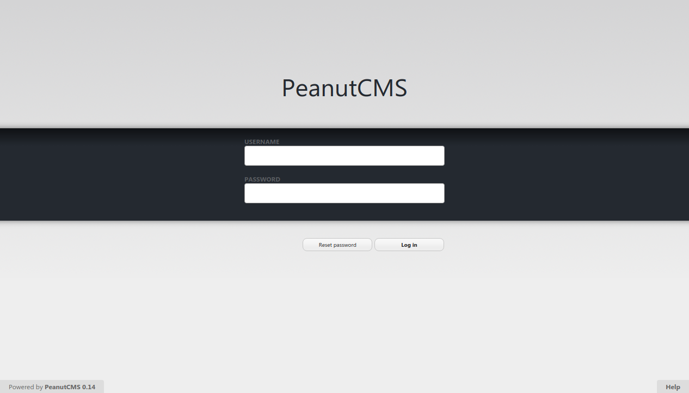
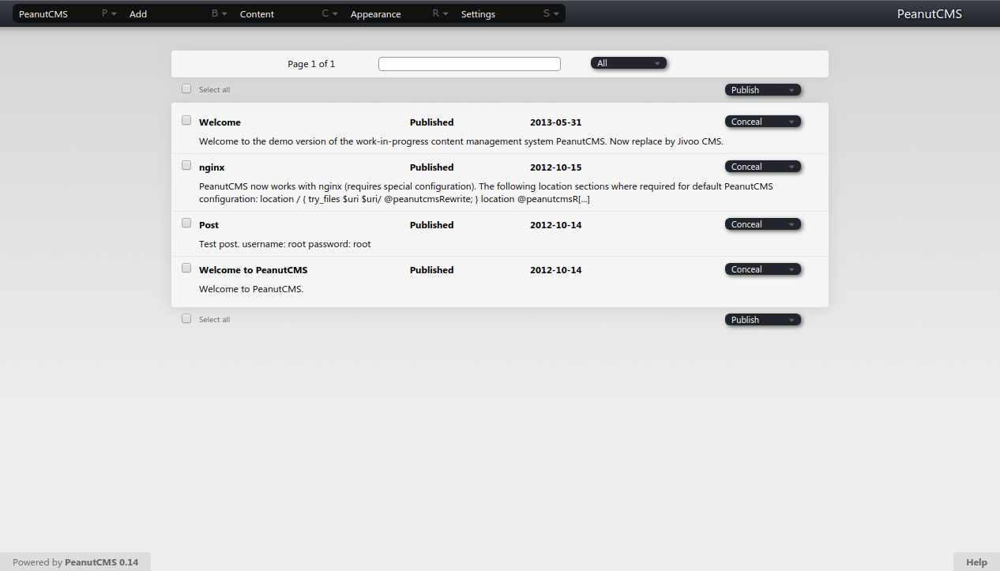
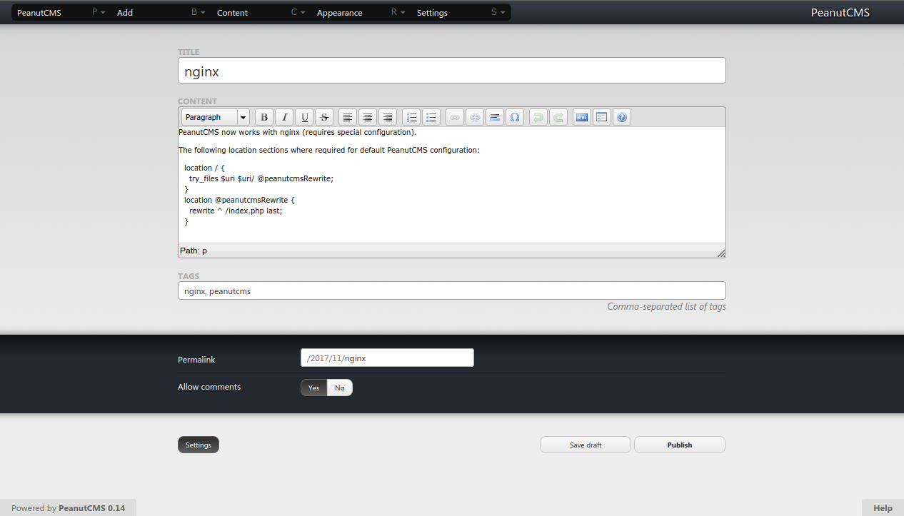

# PeanutCMS
See also: [Jivoo](bs:/things/jivoo).

* 2007 &ndash; personal unnamed blog system for PHP 4, a bit of a mess
* 2010 &ndash; starting from scratch, still a bit of a mess
* 2011 &ndash; PeanutCMS, from scratch, object-oriented, PHP 5
* 2012 &ndash; Model&ndash;View&ndash;Controller
* 2014 &ndash; renamed to [Jivoo](bs:/things/jivoo) while trying to separate the application from the framework

Screenshots below are from the 2012&ndash;2014 phase:

