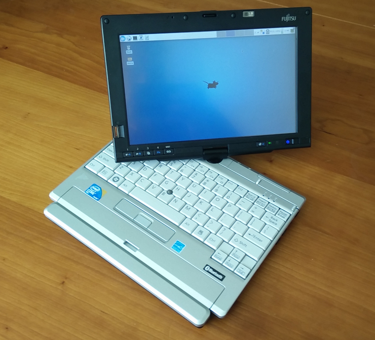
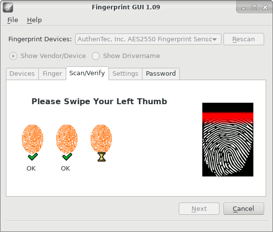
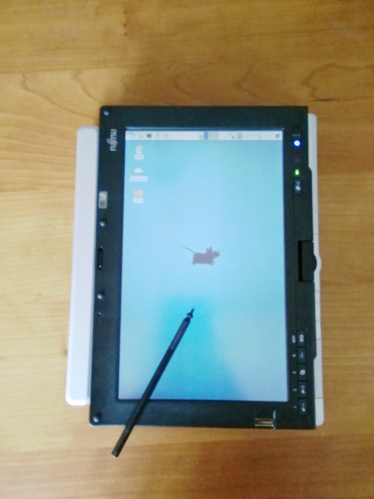
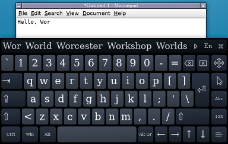
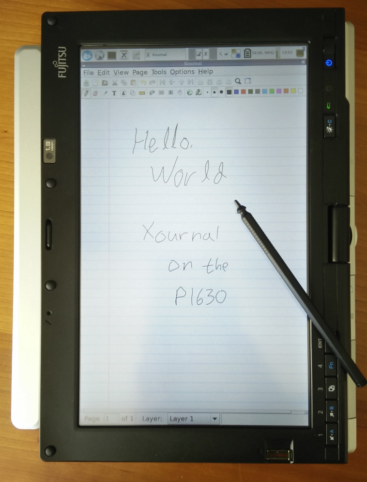

# A LifeBook P1630 and Arch Linux
<figure>

<figcaption>A Fujitsu LifeBook P1630 running Arch Linux with Xfce.</figcaption>
</figure>

I recently bought a somewhat old convertible tablet PC for $65 USD on eBay. The Fujitsu LifeBook P1630, which was originally sold for more than $2,000 USD back in 2008, is a small laptop/tablet PC with a 1.2GHz Intel Core 2 Duo and an 8.9" resistive touchscreen display (1280x768). Size-wise it is similar to the netbooks (like the Asus Eee PC) that were starting to get popular at the time, but it is definitely much more powerful than the early netbooks (and also much more expensive at the time of its release). Although it was originally sold with Windows Vista (and mine came with Windows XP Tablet PC Edition), I immediately decided that I would put Linux on it, partially because I was curious about how well Linux would work with a touchscreen (Android doesn't really count). Speaking of Android, the P1630 is a bit different from modern tablets: Like other older tablet PCs it has a resistive touchscreen instead of the capacitive touchscreen found in smartphones and most post-iPad tablets. This means that the touchscreen can only be used with sharp objects, like the plastic stylus that comes with it (or fingernails, but that feels a bit awkward).

The unit I got was in pretty much perfect condition, and doesn't have any visible scratches or marks on the case. It certainly doesn't look like an 8 year old computer, so it probably hasn't been used much. The only problem listed in the eBay listing was a BIOS password unknown to the seller. I decided to buy it despite the BIOS password, since I assumed it could be reset one way or another (and I was right). It also didn't come with an AC adapter, so I had to throw in another $10 for an unoriginal AC adapter from China.

<div class="break"></div>

## Resetting the BIOS password

Getting rid of the BIOS password turned out to be much easier than expected. After a quick Google-search I found the solution in [this Super User question](http://superuser.com/questions/913650/remove-fujitsu-lifebook-bios-password-on-startup). These were the steps I followed:

1. Press F2 while booting.
2. Type an incorrect password three times. A hash code is then displayed.
3. Type the hash code into [bios-pw.org](https://bios-pw.org/) and get the master password.
4. Reboot and press F2 again, then type the master password.
5. Change/remove the password in the BIOS setup.

## Installing Arch Linux and Xfce

Installing Arch Linux was also painless. I started by downloading the newest Arch iso and dd'ing it to a USB flash drive. Then I booted from the USB flash drive, went through the [usual setup steps](https://wiki.archlinux.org/index.php/Installation_guide), installed syslinux as the boot loader, and booted into the new Arch Linux installation. Nothing was really out of the ordinary, as all of the hardware seemed to work pretty much out of the box (I guess that's one of the advantages of installing Linux on 8 year old hardware).

After installing Xorg I decided to go with Xfce as the desktop environment. I also installed lightdm and enabled automatic login.

There are a number of buttons below the screen on the P1630 that you can map to various things using xbindkeys or the Xfce keyboard settings. On the bottom left the buttons map to:  XF86ScrollDown, XF86ScrollUp, XF86RotateWindows, Ctrl, and Alt. On the bottom right there's a power button, and next to that a brightness-button referred to as `c:252` by xbindkeys.

The XF86ScrollDown and XF86ScrollUp keys didn't seem to have any function by default, so I mapped them to mouseclicks 5 and 4 (scroll wheel down and up) using xbindkeys and xte. I also mapped the brightness-button to suspend. My `.xbindkeys` looks like the following:
```
"xte 'mouseclick 5'"
  XF86ScrollDown

"xte 'mouseclick 4'"
  XF86ScrollUp

"systemctl suspend"
  c:252
```

The P1630 also has a fingerprint reader on the side of the screen, which can be used instead of a password when logging in or unlocking the screen. I'm not going to use it since I prefer not having any authentication at all on the tablet, but I did test it, and it does work with Linux ([fingerprint-gui](https://wiki.archlinux.org/index.php/Fingerprint-gui) can be used to register fingerprints).

<figure>

<figcaption>Scanning fingerprints with fingerprint-gui.</figcaption>
</figure>

## Setting up the touchscreen

To get the touchscreen working in Xorg, I installed xf86-input-evdev. Before using the touchscreen, it needs to be calibrated. This can be done easily using a graphical tool: [xinput_calibrator](https://aur.archlinux.org/packages/xinput_calibrator/) available on AUR. After finishing calibrating, the coordinates can be put into `/etc/X11/xorg.conf.d/99-calibration.conf`:
```nohighlight
Section "InputClass"
	Identifier	"calibration"
	MatchProduct	"Fujitsu Component USB Touch Panel"
	Option "Calibration"	"102 3908 340 3974"
	Option "EmulateThirdButton" "1"
	Option "EmulateThirdButtonTimeout" "500"
EndSection
```
I also enabled the option "EmulateThirdButton", which allows me to right click by long pressing for 500 milliseconds.

When used in tablet mode, I like to rotate the screen and use it in portrait orientation. This presents a problem however. When rotating the screen with either `xrandr` or the Xfce display settings, the touchscreen calibration values are no longer correct, and it becomes necessary to recalibrate. This is of course annoying, so instead I use a shell script that both rotates the screen with xrandr and updates the xinput calibration. The script can be found [here](../misc/p1630/rot.sh). Executing the script rotates the screen 90 degrees clockwise, so you can switch between all four orientations by repeatedly executing the script. I configured the XF86RotateWindows-button on the bottom of the screen to execute this script.

<figure>

<figcaption>In tablet-mode running MyPaint with rotated screen.</figcaption>
</figure>

## A selection of input methods

There are not really that many tablet input methods available on Linux. The best on-screen keyboard I've tried is called [onboard](https://launchpad.net/onboard) (`pacman -S onboard`), which I think is also part of Unity. Onboard has a decent amount of configuration options available, doesn't look bad, and has support for word suggestions similar to keyboards on Android and iOS. It can even be configured to automatically hide when not editing text (although that doesn't always seem to work in my experience). I also tried florence (available on AUR) and kvkbd (`pacman -S kvkbd`), but didn't like those two as much as onboard.

<figure>

<figcaption>Onboard with word suggestions.</figcaption>
</figure>

An interesting alternative to an on-screen keyboard is [CellWriter](http://risujin.org/cellwriter/) (`pacman -S cellwriter`), which instead uses handwriting recognition. When first started, it asks you to draw each character in the configured Unicode blocks, which it then uses to learn your particular writing style. After you've done that, you just draw characters into the cells and press "Enter" to insert them at the current cursor position. I played around with it for a bit, and while it's probably the best handwriting recognition program available on Linux (maybe even the only one?), I couldn't quite get used to writing individual characters into evenly spaced cells; it didn't really feel natural. It also seemed to have problems distinguishing my I's from my l's and my 1's.

<figure>
<video src="../images/p1630/cellwriter.webm" autoplay loop></video>
<figcaption>Writing with CellWriter.</figcaption>
</figure>

## Other touchscreen-friendly software

[Xournal](http://xournal.sourceforge.net/) (`pacman -S xournal`) is the obvious choice for notetaking using a stylus on Linux. There's not much to say about Xournal; it allows you to write notes on a white page (I personally like the graph paper option), and has a couple of options for color and thickness. Oh, and it also allows you to annotate PDF documents.

<figure>

<figcaption>Xournal.</figcaption>
</figure>

Although I don't consider myself an artist, I didn't think it would be appropriate to own a tablet without some sort of drawing program. I first tried Krita, which seems quite advanced. Unfortunately it also seems a bit too heavy for the P1630. Another good option is [MyPaint](http://mypaint.org/) (`pacman -S mypaint`) which is more lightweight than Krita and runs fine on the P1630. It's worth noting that the P1630 is pretty basic when used for drawing; unlike dedicated graphics tablets and modern high-end tablets, it doesn't support things like pressure sensitivity and tilt, and the stylus is essentially just a piece of plastic and doesn't have eraser functionality or any programmable buttons. Despite that I think it's still pretty good for a bit of doodling, and it's still better than using a finger.

Another common use for modern tablets is web browsing, which is obviously pretty easy on Linux too; just install Chrome or FIrefox. I did however find a pretty useful [Chrome extension](https://chrome.google.com/webstore/detail/scrollbar-anywhere/namcaplenodjnggbfkbopdbfngponici?hl=en) that allows you to scroll by dragging with the stylus anywhere on the page.

## Conclusion

The P1630 is an awesome little laptop/tablet hybrid that I would have loved to own as my primary laptop back in 2008 (but definitely couldn't afford). It still runs decently fast, especially with Linux and Xfce, and while Xfce is not really designed with touch input in mind, it still works fine with a stylus. I also tried GNOME (given that the direction since GNOME 3 seems to have been focused more on touch friendliness), however it didn't run quite as fast as Xfce, and while it does have some features and configuration options focused on touchscreens, I didn't find it that much more usable than Xfce.

When it comes to handwriting recognition, Linux seems to be far behind Windows. The handwriting recognition baked into Windows for generations (and maybe even all the way back in 1992 with "Windows for Pen Computing" for Windows 3.1, although I haven't tried that) is just really good compared to what's available on Linux.

<!--{
  "published": "2016-12-03 14:04",
	"tags": ["laptops", "computers", "linux", "arch-linux", "ebay"]
}-->